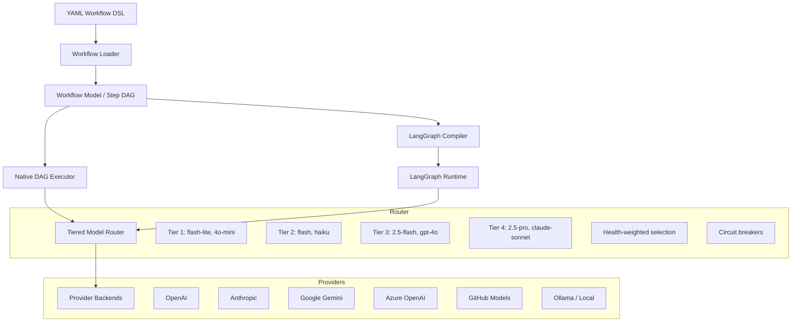

<div align="center">

# Agentic Runtime Platform

**Multi-agent AI orchestration with a fail-closed governance layer — circuit-breaker model routing, human-in-the-loop approval gates, bias-aware LLM-as-judge evaluation, and a default-on SSRF guard. Works with 8+ LLM providers.**

[](https://github.com/tafreeman/agentic-runtime-platform/actions/workflows/ci.yml)
[](https://github.com/tafreeman/agentic-runtime-platform/actions/workflows/nightly.yml)
[](https://www.python.org/downloads/)

[](LICENSE)
[](https://tafreeman.github.io/agentic-runtime-platform/)

[Documentation](https://tafreeman.github.io/agentic-runtime-platform/) • [Quick Start](https://tafreeman.github.io/agentic-runtime-platform/ONBOARDING/) • [Architecture](https://tafreeman.github.io/agentic-runtime-platform/ARCHITECTURE/) • [Docs Site](https://tafreeman.github.io/agentic-runtime-platform/)

</div>

---

Agentic Runtime Platform orchestrates multi-agent AI pipelines where each agent occupies a specific role (planner, coder, reviewer) and operates at a defined capability tier. Workflows are authored as YAML files and compiled into DAGs with automatic parallel scheduling, conditional branching, iterative loops, and failure cascade propagation.   

| Component | What it does |
|-----------|-------------|
| **DAG Executor** | Kahn's algorithm scheduling with `asyncio` parallel dispatch — diamond dependencies, conditional execution, iterative refinement |
| **Circuit-Breaker Model Router** | Bulkhead-isolated, health-weighted selection across 8+ providers with adaptive exponential cooldowns and HALF_OPEN single-probe circuit breakers — no single-provider lock-in |
| **HITL Approval Gate** | Human-in-the-loop approval for high-impact tools (shell, `build_app` build/test runners, file-write, HTTP); **fails closed** — a gated tool is denied when no approval provider is registered, never silently allowed. The shipped server does not register a provider by default, so gated calls stay denied until one is wired in — see [Known Limitations §4.3](docs/KNOWN_LIMITATIONS.md#43-human-approval-gates-are-programmatic-only-no-ui-pauseresume-yet) |
| **Bias-Aware LLM-as-Judge** | Seeded criterion-shuffle positional-bias mitigation, swapped-order consistency checks, and MAE calibration against human-labeled fixtures |
| **Non-Compensatory Gated Evaluation** | YAML-defined rubrics, DORA-inspired Elite/High/Medium/Low tiers, gated on a non-compensatory floor across all scoring dimensions |
| **SSRF Guard (DNS-rebinding pinning)** | Default-on egress guard — resolves DNS, validates every returned address, and pins the connection to defeat rebinding, incl. cloud-metadata blocklisting |
| **Self-Consistency Ensembling** | Majority-vote / self-consistency consensus across sampled completions for higher-stakes outputs |
| **Structured Human-Escalation** | Dead-letter-style handoff path that routes unresolved or out-of-policy cases to a human reviewer instead of failing silently |
| **React Dashboard** | Live DAG visualization with SSE/WebSocket streaming, OpenTelemetry-traced token usage tracking, historical runs |
| **MCP Client** | [Model Context Protocol](agentic-workflows-v2/agentic_v2/integrations/mcp/README.md) client — stdio and WebSocket transports, capability discovery, and LLM-facing tool/prompt/resource adapters |
| **Zero-credential dev mode** | `AGENTIC_NO_LLM=1` runs end-to-end with placeholder backends — the full test suite passes without API keys |

**Engine defaults:** CLI, server, and dashboard requests use the LangGraph adapter (`adapter=langchain`) for named YAML workflows during the migration window. Use `--adapter native` or request `adapter: "native"` for the dependency-light native DAG/Pipeline path. Runtime-generated DAGs use the native engine by default. `AGENTIC_NO_LLM=1` changes provider calls to deterministic placeholders; it does not change engine selection.

## Quick Start

> **`just` is required for `just setup`.** Install: `winget install --id Casey.Just` (Windows), `brew install just` (macOS), `apt install just` (Ubuntu 22.04+). See [the onboarding guide](docs/ONBOARDING.md) for a manual install path if you prefer to skip `just`.

```bash
# Clone and setup
git clone https://github.com/tafreeman/agentic-runtime-platform.git
cd agentic-runtime-platform
just setup

# Run your first workflow — no API key required
# The --input flag accepts a JSON file path (not inline JSON)
echo '{"input_text": "Hello World"}' > /tmp/test-input.json
AGENTIC_NO_LLM=1 agentic run test_deterministic --input /tmp/test-input.json

# Windows PowerShell:
# '{"input_text": "Hello World"}' | Out-File -Encoding utf8 test-input.json
# $env:AGENTIC_NO_LLM = "1"
# agentic run test_deterministic --input test-input.json

# To use LLM-powered workflows, add a provider key:
cp .env.example .env
# Add at least one LLM provider API key to .env

# Start the dashboard
uvicorn agentic_v2.server.app:create_app --factory --reload --port 8010
# In another terminal:
cd ui && npm run dev
```

See [the full onboarding guide](https://tafreeman.github.io/agentic-runtime-platform/ONBOARDING/) for detailed setup instructions.

## Built with AI Assistance

This project uses AI development tools as part of its engineering workflow. Architecture, implementation choices, tests, and public documentation are owned and reviewed by the maintainer; the tooling is used as an accelerator for an agentic-runtime project rather than as a substitute for design review or validation.

## Workflow Example

```yaml
# workflows/definitions/code_review.yml
steps:
  - name: parse_code
    agent: tier2_parser
    description: Extract structure and dependencies
    tools: [file_read, ast_parse]
    inputs:
      code_path: ${inputs.code_path}
    outputs:
      structure: structure

  - name: review_architecture    # Runs in parallel
    agent: tier3_architect         # with review_quality
    depends_on: [parse_code]
    inputs:
      structure: ${steps.parse_code.outputs.structure}
    outputs:
      architecture_report: report

  - name: review_quality          # Runs in parallel
    agent: tier3_reviewer           # with review_architecture
    depends_on: [parse_code]
    inputs:
      structure: ${steps.parse_code.outputs.structure}
    outputs:
      quality_report: report

  - name: synthesize
    agent: tier4_synthesizer
    depends_on: [review_architecture, review_quality]
    inputs:
      reports: [
        ${steps.review_architecture.outputs.architecture_report},
        ${steps.review_quality.outputs.quality_report}
      ]
    outputs:
      final_report: report
```

Run it:

```python
from agentic_v2.workflows import run_workflow

result = await run_workflow(
    "code_review",
    code_path="src/api/handlers.py"
)

print(result.final_output["final_report"])  # Consolidated review
print(result.metadata["agents_used"])  # ["tier2_parser", "tier3_architect", "tier3_reviewer", "tier4_synthesizer"]
print(result.total_duration_ms)             # Total execution time in milliseconds
```

## Architecture



An [MCP client](agentic-workflows-v2/agentic_v2/integrations/mcp/README.md) — stdio and WebSocket transports, capability discovery, and LLM-facing tool/prompt/resource adapters — lives under `agentic-workflows-v2/agentic_v2/integrations/mcp/` for connecting to external Model Context Protocol servers.

## Key Design Decisions

### Why DAG over Pipeline?

Multi-agent workflows rarely execute linearly. After planning, two specialist analysts run **in parallel** over the same evidence. Their outputs merge into verification, which conditionally triggers another research round. A pipeline would serialize unnecessarily; a DAG with `asyncio.wait(FIRST_COMPLETED)` maximizes throughput.

### Why Tiered Model Routing?

Mapping workflow steps to models by name creates brittleness: model names change, endpoints go down, pricing shifts. Instead, each agent is assigned a **capability tier** (e.g., `tier3_analyst`). The router resolves this to the best available model at runtime, with fallback chains like:

```
Tier 3: gemini-2.5-flash → gh:gpt-4o → openai:gpt-4o → anthropic:claude-sonnet
```

The `SmartModelRouter` extends this with health-weighted selection, adaptive cooldowns (exponential backoff on failures), and circuit breaker patterns.

### asyncio Orchestrator vs. SDK-`Task` Orchestration

`OrchestratorAgent` decomposes a task, scores agents against a capability set, and fans subtasks out with `asyncio.gather`. The **SDK-native counterpart** — using the real Claude Agent SDK `Task` tool with `AgentDefinition` subagents, dynamic model-driven selection, and parallel `Task` calls in one turn — lives in [`examples/sdk_task_orchestrator.py`](examples/sdk_task_orchestrator.py). The tradeoff (deterministic capability-routed fan-out vs. open-ended model-driven delegation) is documented in [ADR-025](docs/adr/ADR-025-sdk-task-orchestration.md).

### Why Rubric-Based Scoring?

LLM outputs resist binary pass/fail evaluation. The scoring system uses YAML-defined rubrics with weighted criteria, score normalization, and explicit handling of missing criteria. For complex evaluations, a multidimensional scoring engine classifies outputs across five orthogonal dimensions (coverage, source quality, agreement, verification, recency) into DORA-inspired performance tiers (Elite, High, Medium, Low), gating on a non-compensatory High floor across all dimensions.

## Workflow Definitions

The engine ships with **6 production workflow definitions**:

| Workflow | Pattern | Description |
|----------|---------|-------------|
| `code_review` | Fan-out / fan-in | Parse code → parallel architecture + quality reviews → synthesis |
| `bug_resolution` | Sequential with verification | Reproduce → root cause → fix → test → verify |
| `fullstack_generation` | Parallel sub-steps | API design → frontend + backend in parallel → integration |
| `iterative_review` | Multi-loop with bounded iteration | Review → feedback → revise until quality gates pass |
| `conditional_branching` | Conditional DAG | Steps execute or skip based on runtime conditions |
| `consensus_review` | Ensemble with majority vote | Three independent reviewers vote; summarize only on agreement |

## Project Structure

```
agentic-runtime-platform/
├── agentic-workflows-v2/          # Core runtime package
│   ├── agentic_v2/
│   │   ├── engine/                # DAG executor, step runner, expression engine
│   │   ├── models/                # Tiered routing, provider backends
│   │   ├── agents/                # Agent implementations
│   │   ├── workflows/definitions/ # 6 YAML workflow definitions
│   │   ├── langchain/             # LangGraph integration
│   │   ├── server/                # FastAPI backend
│   │   ├── rag/                   # Full RAG pipeline
│   │   ├── contracts/             # Pydantic I/O models
│   │   └── integrations/mcp/      # MCP client (stdio + websocket transports, discovery, adapters)
│   ├── ui/                        # React 19 dashboard
│   └── tests/                     # Full runtime test suite (unit, integration, E2E)
│
├── agentic-v2-eval/               # Evaluation framework
│   └── src/agentic_v2_eval/
│       ├── evaluators/            # Rubric-based evaluators
│       ├── scoring/               # Scoring utilities
│       └── reporters/             # Result reporting
│
└── tools/                         # Shared utilities
    └── llm/                       # Multi-provider LLM client
```

## Features

- **Dual execution engine**: LangGraph for default named YAML workflow runs; native DAG/Pipeline execution for explicit `--adapter native` runs and runtime-generated DAGs
- **8+ LLM providers**: OpenAI, Anthropic, Gemini, Azure OpenAI, Azure Foundry, GitHub Models, Ollama, local ONNX
- **Tiered model routing** with health-weighted selection and circuit breakers
- **Observable execution**: SSE/WebSocket streaming to React dashboard
- **Rubric-based evaluation** with YAML-defined criteria and LLM-as-judge
- **Zero-credential dev mode**: Run all tests and workflows without API keys
- **Type-safe interfaces**: Full Pydantic v2 contracts; `mypy --strict` is enforced for `agentic-v2-eval`, with broader runtime coverage in progress
- **Core coverage**: The DAG executor, model router, and evaluation framework run under pre-commit hooks (black, ruff, mypy for `agentic-v2-eval`), the full runtime test suite (see [CI](https://github.com/tafreeman/agentic-runtime-platform/actions/workflows/ci.yml) for current pass/fail and coverage), and an 80%+ gated coverage floor. RAG, Redis state, and some provider adapters are explicitly in-progress — see [KNOWN_LIMITATIONS.md](docs/KNOWN_LIMITATIONS.md)
- **Rate limiting + 401 throttle**: `slowapi` global limiter (`AGENTIC_RATE_LIMIT_DEFAULT`, default `60/minute`); per-IP sliding-window lockout after repeated auth failures (`AGENTIC_AUTH_LOCKOUT_THRESHOLD`, `AGENTIC_AUTH_LOCKOUT_WINDOW_SECONDS`, `AGENTIC_AUTH_LOCKOUT_DURATION_SECONDS`)
- **DAG executor timeout watchdog**: pass `timeout=` to the executor; in-flight tasks are cancelled structurally, downstream steps are cascade-skipped, and a `workflow.timeout_exceeded` OTEL span attribute is emitted

## Documentation

Full documentation is published at **https://tafreeman.github.io/agentic-runtime-platform/**.

- [Quick Start](https://tafreeman.github.io/agentic-runtime-platform/ONBOARDING/) — 5-minute to 1-hour first-run path
- [Architecture Overview](https://tafreeman.github.io/agentic-runtime-platform/ARCHITECTURE/) — System map and load-bearing mechanisms
- [Workflow Authoring](https://tafreeman.github.io/agentic-runtime-platform/WORKFLOW_AUTHORING/) — YAML DSL guide
- [Pattern Catalog](https://tafreeman.github.io/agentic-runtime-platform/PATTERN_CATALOG/) — Agentic pattern reference
- [API Reference](https://tafreeman.github.io/agentic-runtime-platform/api-contracts-runtime/) — REST endpoints and contracts
- [Development Guide](https://tafreeman.github.io/agentic-runtime-platform/development-guide/) — Setup, testing, CLI

## Development

### Prerequisites

- Python 3.11+
- Node.js 20+ (for UI)
- At least one LLM provider API key (or use `AGENTIC_NO_LLM=1` for placeholder mode)

### Installation

```bash
# Clone the repository
git clone https://github.com/tafreeman/agentic-runtime-platform.git
cd agentic-runtime-platform

# One-command bootstrap (installs all packages and dependencies)
just setup

# Or install manually:
cd agentic-workflows-v2
pip install -e ".[dev,server,langchain]"

# Configure environment
cp ../.env.example ../.env
# Edit .env with your API keys
```

### Running Tests

```bash
# Runtime tests (full suite)
cd agentic-workflows-v2
pytest tests/ -v --cov=agentic_v2

# Evaluation framework tests
cd ../agentic-v2-eval
pytest tests/ -v

# UI tests
cd ../agentic-workflows-v2/ui
npm test
```

### Code Quality

This project enforces code quality through pre-commit hooks:

```bash
# Install pre-commit hooks
pre-commit install

# Run all hooks manually
pre-commit run --all-files
```

| Tool | Purpose |
|------|---------|
| **black** | Code formatting (88 char line length) |
| **isort** | Import sorting (black-compatible) |
| **ruff** | Fast linting with auto-fix |
| **mypy** | Static type checking for `agentic-v2-eval` |
| **docformatter** | Docstring formatting |
| **pydocstyle** | Google-style docstring enforcement |

## Relationship to ExecutionKit

ExecutionKit and Agentic Runtime Platform occupy different layers of the same stack:

| | ExecutionKit | Agentic Runtime Platform |
|---|---|---|
| **Role** | Pattern library | Orchestration runtime |
| **Scope** | Single LLM call patterns | Multi-agent DAG workflows |
| **Workflow authoring** | Python functions | Declarative YAML |
| **Dependencies** | Zero (stdlib only) | FastAPI, LangGraph, Pydantic |
| **Use when** | You need reasoning primitives | You need to orchestrate many agents |

**Agentic Runtime Platform uses ExecutionKit for step delegation when it is installed** — the optional `[ek]` extra (`pip install -e "agentic-workflows-v2[ek]"`); without it, the platform falls back to its native runtime.

## Standards & Governance

| Area | Artifact | Description |
|------|----------|-------------|
| Architecture decisions | [ADR Index](docs/adr/ADR-INDEX.md) | Full decision log with lineage chains and implementation tracking |
| AI evidence | [AI_EVIDENCE_STANDARD.md](AI_EVIDENCE_STANDARD.md) | Dated, adversarially-verified self-audit scoring the repo against the AI Implementation Evidence Standard — open items and all |
| Known debt | [KNOWN_LIMITATIONS.md](docs/KNOWN_LIMITATIONS.md) | Honest accounting with severity, workaround, and upstream-fix fields |
| Security | [SECURITY.md](agentic-workflows-v2/SECURITY.md) | Coordinated disclosure policy and hardening guidance; includes rate-limit and per-IP 401 lockout configuration |
| Supply chain | [Dependabot](.github/dependabot.yml) | Automated updates for pip, npm, and GitHub Actions |
| Roadmap | [ROADMAP.md](docs/ROADMAP.md) | Shipped epics, in-flight sprint, and proposed work |
| Migrations | [MIGRATIONS.md](docs/MIGRATIONS.md) | Breaking changes since v0.3.0 |

## Contributing

See [CONTRIBUTING.md](CONTRIBUTING.md) for monorepo-wide contribution guidelines — local gates, commit format, when an ADR is required, and the PR checklist.

## License

This project is licensed under the MIT License — see [LICENSE](LICENSE) for details.
