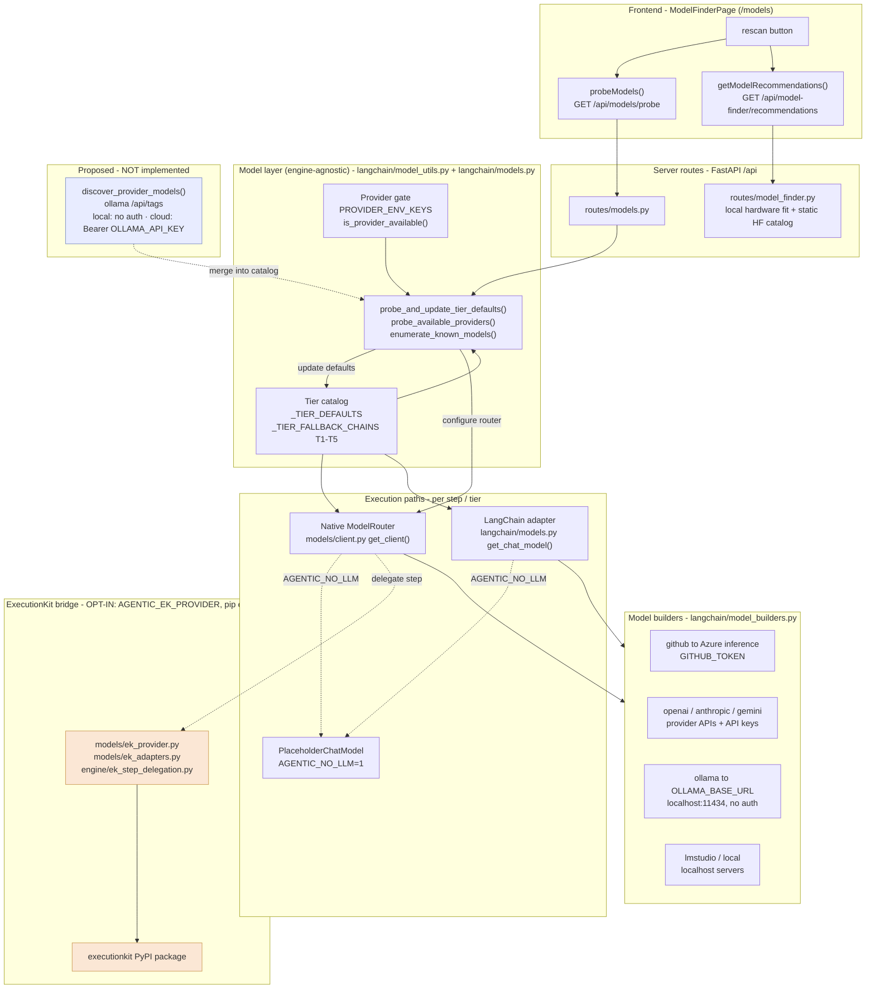
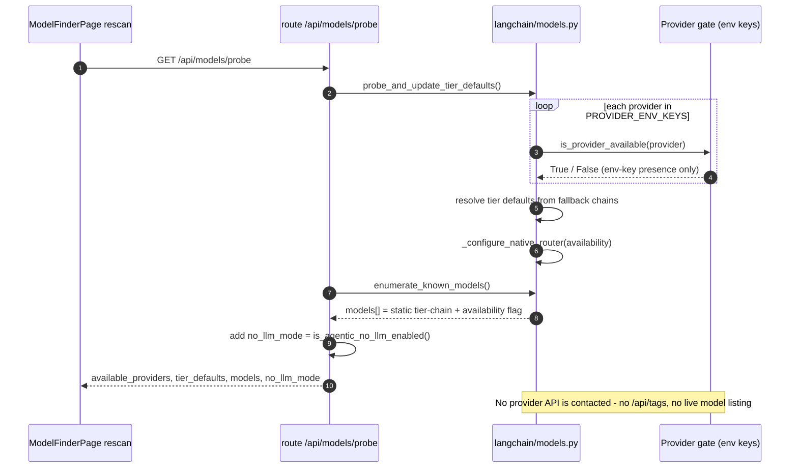

# Model Layer & Provider Probe — Current Setup

> Scope: how the runtime decides **which provider/model** to use, how the
> `/api/models/probe` "rescan" works today, and where it sits relative to the
> execution engines (native / LangChain / ExecutionKit). Written as the baseline
> before adding **live per‑provider model discovery** (see
> [Proposed: live discovery](#proposed-live-discovery)).

## TL;DR

- The **probe is credential‑presence + a static catalog**, *not* live discovery.
  It checks which providers have env keys and echoes the hard‑coded tier‑fallback
  chains. It never calls a provider's list‑models API (no Ollama `/api/tags`, no
  remote catalog).
- It is **engine‑agnostic** and lives in the native/LangChain **model layer**
  (`langchain/models.py` + `langchain/model_utils.py`). It is **not** an
  ExecutionKit feature — ExecutionKit is a separate, opt‑in *execution* bridge.
- "Ollama" is modeled as a **local, unauthenticated** provider
  (`OLLAMA_BASE_URL`, default `http://localhost:11434`). It does **not** use the
  Ollama Cloud Bearer‑key method.

## System diagram



## Probe request flow (`rescan`)



## Provider gate — `PROVIDER_ENV_KEYS` (`langchain/model_utils.py`)

`is_provider_available(provider)` returns `True` when **any** required env var is
set, or when the provider needs **no** key (local providers always pass).

| Provider | Required env key(s) | Endpoint (builder) | Auth |
|----------|---------------------|--------------------|------|
| `gemini` | `GOOGLE_API_KEY` / `GEMINI_API_KEY` | Google Generative AI | API key |
| `anthropic` | `ANTHROPIC_API_KEY` | api.anthropic.com | API key |
| `openai` | `OPENAI_API_KEY` (+ optional `OPENAI_BASE_URL`) | api.openai.com | API key |
| `gh` | `GITHUB_TOKEN` | `models.inference.ai.azure.com` | Bearer token |
| `ollama` | _(none)_ | `OLLAMA_BASE_URL` → `localhost:11434` | **none (local)** |
| `lmstudio` | _(none)_ | `LMSTUDIO_HOST` → `127.0.0.1:12340/v1` | none (local) |
| `local` / `local_api` | _(none)_ | local ONNX / local server | none (local) |

> **Misconception guard:** a green **"ready"** in the UI means *"a key is present
> (or none is required)"* — **not**, in general, that a model‑list/health call
> succeeded. The credential probe makes no network call. The **exception is
> Ollama**: `enumerate_known_models()` performs a live `/api/tags` (+`/api/ps`)
> read to surface real local/cloud models (ADR‑037).

## Tier catalog (`langchain/models.py`)

- `_TIER_DEFAULTS` — one resolved default model per tier **1–5**.
- `_TIER_FALLBACK_CHAINS` — an ordered list per tier; the **first available**
  provider in the chain wins during a probe (e.g. T1 →
  `gemini-2.0-flash-lite` → `gh:gpt-4o-mini` → `openai:gpt-4o-mini` →
  `anthropic:claude-haiku` → `ollama:gemma3:4b`).
- `enumerate_known_models()` returns the static chain **union** as
  `{ id, provider, tier (lowest tier it appears in), available }`, **merged with
  live‑discovered Ollama models** (ADR‑037). Discovered models carry
  `cloud` / `capabilities` / `running`; those absent from every chain appear at
  `tier 0`. This is the full "catalog" the `/models` page shows.

### `get_chat_model()` resolution order (LangChain path)

1. Explicit per‑step model override.
2. `AGENTIC_MODEL_TIER_<n>` env override.
3. Probed tier default (`_TIER_DEFAULTS`, set by the probe).
4. Tier fallback chain (`_TIER_FALLBACK_CHAINS`).

## `/api/models/probe` response shape (`routes/models.py`)

```jsonc
{
  "available_providers":   ["anthropic", "gh", "ollama", ...],
  "unavailable_providers": ["gemini", "openai"],
  "tier_defaults":         { "1": "gh:openai/gpt-4o-mini", "2": "...", ... },
  "models": [ { "id": "anthropic:claude-...", "provider": "anthropic",
                "tier": 2, "available": true },
              // live-discovered Ollama models also carry cloud/capabilities/running
              { "id": "ollama:gpt-oss:120b-cloud", "provider": "ollama",
                "tier": 0, "available": true, "cloud": true,
                "capabilities": ["tools"], "running": false }, ... ],
  "no_llm_mode": false
}
```

- `ImportError` (LangChain extra not installed) → **503**; any other error → **500**.
- `no_llm_mode` = `is_agentic_no_llm_enabled()` (`AGENTIC_NO_LLM`). When true,
  **every** tier is routed to `PlaceholderChatModel` regardless of keys.
- A **separate** system, `/api/model-finder/*` (`routes/model_finder.py`), powers
  the same page's hardware‑fit section: it profiles the local machine and ranks a
  hard‑coded HuggingFace catalog. It is unrelated to the provider probe.

## ExecutionKit boundary (it is *not* the probe)

ExecutionKit is an **opt‑in execution bridge** (per **ADR‑023**), gated on
`AGENTIC_EK_PROVIDER` (default‑on) plus the optional `executionkit` PyPI package
(`pip install ...[ek]`). It changes **how a step's model call is executed**
(delegating to the EK kernel) — a layer *beside* the engines, downstream of tier
resolution. Its entire footprint:

| ExecutionKit file | Role |
|-------------------|------|
| `models/ek_provider.py`, `models/ek_adapters.py` | EK provider + value/error adapters |
| `engine/ek_step_delegation.py` | Delegates a workflow step to the EK kernel |
| touch‑points: `models/client.py`, `engine/tool_execution.py`, `engine/agent_resolver.py`, `settings.py` | Wiring + the `AGENTIC_EK_PROVIDER` flag |

The probe (`probe_*`, `enumerate_known_models`, `routes/models.py`) contains **no
EK imports** and is shared by the native router, the LangChain adapter, and the
EK bridge alike. These EK modules are in the coverage `omit` list (CI does not
install the optional dependency).

## File map

| Concern | File |
|---------|------|
| Provider gate / env keys | `agentic_v2/langchain/model_utils.py` |
| Tier catalog + probe + `enumerate_known_models` | `agentic_v2/langchain/models.py` |
| Per‑provider client builders | `agentic_v2/langchain/model_builders.py` |
| Probe route (`/api/models/probe`) | `agentic_v2/server/routes/models.py` |
| Hardware‑fit finder (`/api/model-finder/*`) | `agentic_v2/server/routes/model_finder.py` |
| Native model client | `agentic_v2/models/client.py` |
| ExecutionKit bridge (opt‑in) | `agentic_v2/models/ek_*.py`, `agentic_v2/engine/ek_step_delegation.py` |
| Frontend model router page | `agentic-workflows-v2/ui/src/pages/ModelFinderPage.tsx` |
| Frontend client + types | `ui/src/api/client.ts` (`probeModels`), `ui/src/api/types.ts` (`ModelProbeResponse`) |

## Live discovery (Ollama) — implemented (ADR‑037)

`rescan` now *updates* the Ollama model list from the live server instead of
echoing the static chain. `agentic_v2/models/ollama_discovery.py` reads the raw
REST API over `httpx` (the pinned `ollama` 0.6.1 client drops the fields we need)
and `enumerate_known_models()` merges the results in **behind the existing
availability gate**:

- **Ollama (local):** `GET ${OLLAMA_BASE_URL}/api/tags` and `GET …/api/ps` — no auth.
- **Ollama (cloud):** `GET https://ollama.com/api/tags` with
  `Authorization: Bearer ${OLLAMA_API_KEY}` — **only when the key is set**.

Each model becomes `OllamaModelInfo{ id, name, cloud, capabilities, running,
size, remote_host }`. Cloud is classified by `remote_host`/`remote_model` first
(a signed‑in local server proxies cloud models and stamps them), with the
`:cloud`/`-cloud` suffix as fallback. Discovery is **best‑effort** (any failure →
no entries → the endpoint degrades to the static catalog), bounded by 5 s
timeouts, and never logs the key. It lives entirely in the **model layer**, so it
benefits native + LangChain + EK‑bridged execution identically, touches **no**
`ek_*` file, and is covered by mocked‑HTTP tests
(`tests/models/test_ollama_discovery.py`).

**Auth:** set `OLLAMA_API_KEY` (create at ollama.com/settings/keys) *or* run
`ollama signin` (the local server then proxies cloud models into its own
`/api/tags`, stamped with `remote_host`). An Ollama **Pro** plan raises cloud
rate limits but does **not** expose the catalog without one of these.

**Still future work:** the same live‑listing pattern for the *other* providers'
list‑models endpoints (OpenAI `/v1/models`, Gemini, etc.).
