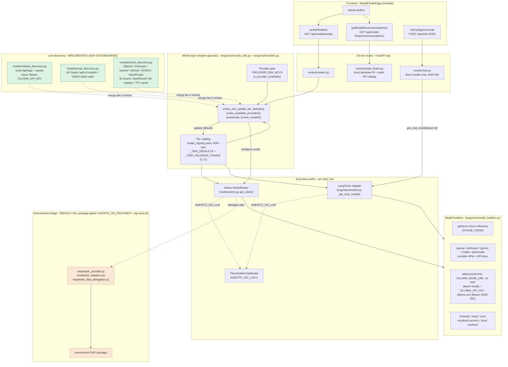
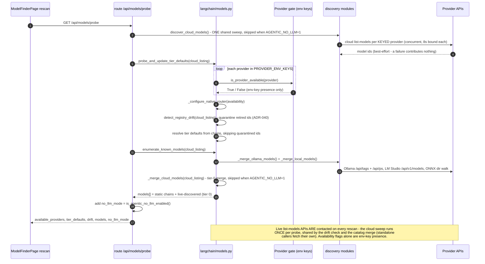

# Model Layer & Provider Probe — Current Setup

> Scope: how the runtime decides **which provider/model** to use, how the
> `/api/models/probe` "rescan" works today, and where it sits relative to the
> execution engines (native / LangChain / ExecutionKit). Originally written as
> the baseline before live discovery existed; discovery has since shipped in
> four stages — Ollama (ADR‑037), LM Studio + ONNX (ADR‑038), the keyed cloud
> providers (ADR‑039), and OpenRouter + the chat playground (ADR‑050,
> [PR #188](https://github.com/tafreeman/agentic-runtime-platform/pull/188)).

## TL;DR

- The probe is **credential‑presence + a curated static catalog + live
  discovery**. `is_provider_available()` still only checks env keys, but every
  rescan *also* calls the list‑models APIs of whatever it can reach: Ollama
  `/api/tags` (ADR‑037), LM Studio `/api/v1/models` + an ONNX folder walk
  (ADR‑038), and the keyed cloud providers — OpenAI, Anthropic, Gemini, GitHub
  Models, NVIDIA NIM (ADR‑039) and OpenRouter (full catalog + TTL cache,
  ADR‑050).
  Discovered ids absent from the static tier chains merge into the catalog at
  **tier 0** (`_merge_ollama_models` / `_merge_local_models` /
  `_merge_cloud_models`).
- A green **"ready"** still means *"a key is present (or none is required)"* —
  the availability flag itself makes no network call. The **real liveness
  check** is the chat playground: `POST /api/chat` streams a message straight
  to one exact model id and surfaces genuine auth/quota/connection failures
  (ADR‑050, PR #188).
- Cloud discovery is **best‑effort and bounded**: probes run concurrently, 8 s
  per request, any failure degrades to the static catalog, keys are never
  logged, and the whole cloud merge is **skipped under `AGENTIC_NO_LLM=1`**
  (which keeps the unit suite network-free).
- It is **engine‑agnostic** and lives in the native/LangChain **model layer**
  (`langchain/models.py` + `langchain/model_utils.py` + the
  `agentic_v2/models/*_discovery.py` modules). It is **not** an ExecutionKit
  feature — ExecutionKit is a separate, opt‑in *execution* bridge.
- "Ollama" is **local‑first**: models present in the local daemon's
  `/api/tags` are served from `OLLAMA_BASE_URL` (default
  `http://localhost:11434`, no auth). Setting `OLLAMA_API_KEY` lists
  **ollama.com cloud** models via the Bearer‑key method (ADR‑037) **and**
  routes execution of models absent locally to `ollama.com` with the same
  key (ADR‑051); without the key, Ollama stays local‑only.

## System diagram



## Probe request flow (`rescan`)



## Provider gate — `PROVIDER_ENV_KEYS` (`langchain/model_utils.py`)

`is_provider_available(provider)` returns `True` when **any** required env var is
set, or when the provider needs **no** key (local providers always pass).

| Provider | Required env key(s) | Endpoint (builder) | Auth |
|----------|---------------------|--------------------|------|
| `gemini` | `GOOGLE_API_KEY` / `GEMINI_API_KEY` | Google Generative AI | API key |
| `anthropic` | `ANTHROPIC_API_KEY` | api.anthropic.com | API key |
| `openai` | `OPENAI_API_KEY` (+ optional `OPENAI_BASE_URL` / `OPENAI_API_BASE`) | api.openai.com | API key |
| `gh` | `GITHUB_TOKEN` | `models.inference.ai.azure.com` | Bearer token |
| `nvidia` | `NVIDIA_API_KEY` (+ optional `NVIDIA_BASE_URL` for on‑prem NIM) | `integrate.api.nvidia.com/v1` | Bearer token |
| `openrouter` | `OPENROUTER_API_KEY` (+ optional `OPENROUTER_BASE_URL`) — ADR‑050, PR #188 | `openrouter.ai/api/v1` | Bearer token |
| `ollama` | _(none; optional `OLLAMA_API_KEY` for ollama.com cloud listing **and** execution of models absent locally — ADR‑051)_ | `OLLAMA_BASE_URL` → `localhost:11434`, local‑first; `ollama.com` for cloud‑routed calls | none (local) / Bearer token (cloud‑routed) |
| `lmstudio` | _(none)_ | `LMSTUDIO_HOST`, else first reachable of `:1234` / `:12340` | none (local) |
| `onnx` | _(none)_ | local onnxruntime‑genai (`ONNX_MODEL_DIR` / `AIGALLERY_CACHE`) | none (local) |
| `local` / `local_api` | _(none)_ | local ONNX / local server | none (local) |

> **Misconception guard:** a green **"ready"** in the UI means *"a key is present
> (or none is required)"* — the availability **flag** makes no network call. The
> model **list**, by contrast, is live: every rescan merges real listings from
> Ollama (ADR‑037), LM Studio/ONNX (ADR‑038), and each keyed cloud provider
> (ADR‑039/050). To prove a key/model actually **works**, use the chat
> playground (`POST /api/chat`) — see
> [Chat playground](#chat-playground--the-real-liveness-check-adr050-pr-188).

## Tier catalog (`langchain/models.py`)

- Model ids, tier membership, and per‑tier fallback chains are declared once in
  the **curated registry** `agentic_v2/config/defaults/model_registry.yaml`
  (ADR‑040) and materialized at import as `_TIER_FALLBACK_CHAINS` (tiers
  **1–5**) and `_TIER_DEFAULTS` (seeded from each chain's first id, refined at
  server startup by the probe). Design principle: *dynamic for facts the
  runtime verifies (availability, health); curated for judgments a human owns
  (tier membership, capability, price).*
- During a probe the **first available** provider in a chain wins (e.g. T1 →
  `gemini:gemini-2.5-flash-lite` → `gh:openai/gpt-4o-mini` →
  `openai:gpt-4o-mini` → `anthropic:claude-haiku-4-5-20251001` →
  `ollama:gemma3:4b`).
- `detect_registry_drift()` warns and **quarantines** registry ids a provider
  has retired; discovery never auto‑promotes a discovered id into a chain. It
  runs inside every probe *before* tier defaults resolve, reusing the probe
  request's shared cloud sweep (standalone calls fetch their own).
- `enumerate_known_models()` returns the static chain **union** as
  `{ id, provider, tier (lowest tier it appears in), available }`, **merged
  with every live‑discovered model**: Ollama (ADR‑037), LM Studio + ONNX
  (ADR‑038), and the keyed cloud providers (ADR‑039/050). Discovered models
  absent from every chain appear at `tier 0`; local entries can carry
  `cloud` / `capabilities` / `running`, cloud entries are plain ids whose
  `available` flag reflects the provider's key env. This is the full "catalog"
  the `/models` page shows.

### `get_chat_model()` resolution order (LangChain path)

1. Explicit per‑step model override.
2. `AGENTIC_MODEL_TIER_<n>` env override.
3. Probed tier default (`_TIER_DEFAULTS`, set by the probe).
4. Tier fallback chain (`_TIER_FALLBACK_CHAINS`).

## `/api/models/probe` response shape (`server/routes/models.py`)

```jsonc
{
  "available_providers":   ["anthropic", "gh", "ollama", ...],
  "unavailable_providers": ["gemini", "openai"],
  "tier_defaults":         { "1": "gh:openai/gpt-4o-mini", "2": "...", ... },
  // probe-time registry reconciliation (ADR-040) — see detect_registry_drift()
  "drift":                 { "quarantined": [], "missing_pricing": ["..."],
                             "checked_providers": ["openai", "anthropic"] },
  "models": [ { "id": "anthropic:claude-...", "provider": "anthropic",
                "tier": 2, "available": true },
              // live-discovered Ollama models also carry cloud/capabilities/running
              { "id": "ollama:gpt-oss:120b-cloud", "provider": "ollama",
                "tier": 0, "available": true, "cloud": true,
                "capabilities": ["tools"], "running": false },
              // live-discovered cloud models are plain tier-0 ids (ADR-039)
              { "id": "openai:gpt-4.1", "provider": "openai",
                "tier": 0, "available": true },
              // public OpenRouter entries stay unavailable until a key is set
              { "id": "openrouter:openai/gpt-4o-mini", "provider": "openrouter",
                "tier": 0, "available": false }, ... ],
  "no_llm_mode": false
}
```

- `ImportError` (LangChain extra not installed) → **503**; any other error → **500**.
- `no_llm_mode` = `is_agentic_no_llm_enabled()` (`AGENTIC_NO_LLM`). When true,
  **every** tier is routed to `PlaceholderChatModel` regardless of keys, and the
  cloud‑discovery merge is skipped entirely.
- A **separate** system, `/api/model-finder/*` (`server/routes/model_finder.py`),
  powers the same page's hardware‑fit section: it profiles the local machine and
  ranks a hard‑coded HuggingFace catalog. It is unrelated to the provider probe.

## ExecutionKit boundary (it is *not* the probe)

ExecutionKit is an **opt‑in execution bridge** (per **ADR‑023**), gated on
`AGENTIC_EK_PROVIDER` (default‑on) plus the optional `executionkit` PyPI package
(`pip install ...[ek]`). It changes **how a step's model call is executed**
(delegating to the EK kernel) — a layer *beside* the engines, downstream of tier
resolution. Its entire footprint:

| ExecutionKit file | Role |
|-------------------|------|
| `models/ek_provider.py`, `models/ek_adapters.py` | EK provider + value/error adapters |
| `engine/ek_step_delegation.py` | Delegates a workflow step to the EK kernel |
| touch‑points: `models/client.py`, `engine/tool_execution.py`, `engine/agent_resolver.py`, `settings.py` | Wiring + the `AGENTIC_EK_PROVIDER` flag |

The probe (`probe_*`, `enumerate_known_models`, `server/routes/models.py`)
contains **no EK imports** and is shared by the native router, the LangChain
adapter, and the EK bridge alike. These EK modules are in the coverage `omit`
list (CI does not install the optional dependency).

## File map

| Concern | File |
|---------|------|
| Provider gate / env keys | `agentic_v2/langchain/model_utils.py` |
| Tier chains + probe + `enumerate_known_models` | `agentic_v2/langchain/models.py` |
| Curated model registry (ids, tiers, prices) | `agentic_v2/config/defaults/model_registry.yaml` + `agentic_v2/models/model_registry.py` |
| Per‑provider client builders | `agentic_v2/langchain/model_builders.py` |
| Live discovery — Ollama (ADR‑037) | `agentic_v2/models/ollama_discovery.py` |
| Live discovery — LM Studio + ONNX (ADR‑038) | `agentic_v2/models/local_discovery.py` |
| Live discovery — cloud providers incl. OpenRouter (ADR‑039/050) | `agentic_v2/models/cloud_discovery.py` |
| Probe route (`/api/models/probe`) | `agentic_v2/server/routes/models.py` |
| Chat playground route (`POST /api/chat`; ADR‑050, PR #188) | `agentic_v2/server/routes/chat.py` + `agentic_v2/contracts/chat.py` |
| Hardware‑fit finder (`/api/model-finder/*`) | `agentic_v2/server/routes/model_finder.py` |
| Native model client | `agentic_v2/models/client.py` |
| ExecutionKit bridge (opt‑in) | `agentic_v2/models/ek_*.py`, `agentic_v2/engine/ek_step_delegation.py` |
| Frontend model router page | `agentic-workflows-v2/ui/src/pages/ModelFinderPage.tsx` |
| Frontend client + types | `ui/src/api/client.ts` (`probeModels`), `ui/src/api/types.ts` (`ModelProbeResponse`) |

## Live discovery (Ollama) — implemented (ADR‑037)

`rescan` now *updates* the Ollama model list from the live server instead of
echoing the static chain. `agentic_v2/models/ollama_discovery.py` reads the raw
REST API over `httpx` (the pinned `ollama` 0.6.1 client drops the fields we need)
and `enumerate_known_models()` merges the results in **behind the existing
availability gate**:

- **Ollama (local):** `GET ${OLLAMA_BASE_URL}/api/tags` and `GET …/api/ps` — no auth.
- **Ollama (cloud):** `GET https://ollama.com/api/tags` with
  `Authorization: Bearer ${OLLAMA_API_KEY}` — **only when the key is set**.

Each model becomes `OllamaModelInfo{ id, name, cloud, capabilities, running,
size, remote_host }`. Cloud is classified by `remote_host`/`remote_model` first
(a signed‑in local server proxies cloud models and stamps them), with the
`:cloud`/`-cloud` suffix as fallback. Discovery is **best‑effort** (any failure →
no entries → the endpoint degrades to the static catalog), bounded by 5 s
timeouts, and never logs the key. It lives entirely in the **model layer**, so it
benefits native + LangChain + EK‑bridged execution identically, touches **no**
`ek_*` file, and is covered by mocked‑HTTP tests
(`tests/models/test_ollama_discovery.py`).

**Auth:** set `OLLAMA_API_KEY` (create at ollama.com/settings/keys) *or* run
`ollama signin` (the local server then proxies cloud models into its own
`/api/tags`, stamped with `remote_host`). An Ollama **Pro** plan raises cloud
rate limits but does **not** expose the catalog without one of these.

## Live discovery (LM Studio + ONNX) — implemented (ADR‑038)

`agentic_v2/models/local_discovery.py` extends the same merge to the other two
local providers; both are best‑effort and surface as `tier 0` router entries:

- **LM Studio (`lmstudio:`):** `GET {host}/api/v1/models` — LM Studio's
  current native API, which lists the whole downloaded library, loaded
  instances, and capabilities. Legacy `/api/v0/models` and OpenAI-compatible
  `/v1/models` are ordered fallbacks. `LM_API_TOKEN` is sent for both discovery
  and inference when configured. Host comes from `LMSTUDIO_HOST`; with it
  unset, ports `1234` then `12340` are tried and the first reachable wins.
- **ONNX (`onnx:`):** bounded‑depth walk for **genai_config.json** marker files
  under the ONNX root (`ONNX_MODEL_DIR` / `AIGALLERY_CACHE`, default
  `~/.cache/aigallery`).
  Returns `onnx:<relpath>` relative to that root — the *same* root `OnnxBackend`
  resolves against, so **discovered == runnable**. The aigallery cache works out
  of the box; point `ONNX_MODEL_DIR` at `~/.aitk/models` or `~/.foundry/cache/...`
  to surface those Phi‑4 ONNX sets.

`onnx` is registered in `PROVIDER_ENV_KEYS` (no key) so the router marks it
available. Covered by `tests/models/test_local_discovery.py`.

## Live discovery (cloud providers) — implemented (ADR‑039)

`agentic_v2/models/cloud_discovery.py` (live since 2026‑06‑23) extends the same
merge to the hosted providers, so the probe lists what each configured **key**
can actually reach — not just the handful of ids pinned in the tier chains.
Each provider is probed **only when its key env var is set** (no key → no
network call); the probes run **concurrently** (worst case ≈ one 8 s timeout,
not the sum); any failure (network, auth, schema drift) contributes nothing
instead of failing the probe; keys travel only as auth headers/params and are
never logged. A conservative name heuristic drops obvious non‑chat ids
(embeddings, speech, image, rerank, …) — over‑listing beats silent dropping.
Results are appended by `_merge_cloud_models()` at **tier 0**:

- **OpenAI** (`openai:`) — `GET {base}/models`, Bearer `OPENAI_API_KEY`;
  `OPENAI_BASE_URL` / `OPENAI_API_BASE` honored for proxies/Azure,
  `OPENAI_ORG_ID` forwarded.
- **Anthropic** (`anthropic:`) — `GET https://api.anthropic.com/v1/models` with
  `x-api-key` + `anthropic-version` headers.
- **Google Gemini** (`gemini:`) — `GET …/v1beta/models?key=…`, filtered to
  models advertising `generateContent`; the `models/` name prefix is stripped.
- **GitHub Models** (`gh:`) — `GET https://models.github.ai/catalog/models`,
  Bearer `GITHUB_TOKEN`; ids keep their `publisher/model` form (e.g.
  `gh:openai/gpt-4.1`) to match the `gh:` backend's resolution (the *builder*
  still targets `models.inference.ai.azure.com`).
- **NVIDIA NIM** (`nvidia:`) — `GET {base}/models` where the base comes from
  `resolve_nvidia_base_url()` (`NVIDIA_BASE_URL` for on‑prem NIM, else
  `https://integrate.api.nvidia.com/v1`), Bearer `NVIDIA_API_KEY`;
  `publisher/model` ids round‑trip to the OpenAI‑compatible backend unchanged.

**No‑LLM gating:** `_merge_cloud_models()` is skipped entirely under
`AGENTIC_NO_LLM=1` — that mode routes every tier to the deterministic
placeholder, so a live listing would mislead, and the gate keeps the unit suite
(which runs with `AGENTIC_NO_LLM=1`) network-free with no per‑test patching. Local
discovery (localhost, free) stays ungated; cloud discovery (internet, metered)
does not. Covered by mocked‑HTTP tests in `tests/models/test_cloud_discovery.py`.

**Shared sweep:** a probe request runs this cloud sweep **once** — the route
fetches the listing and threads it through `detect_registry_drift()` (the
ADR‑040 quarantine pass) and `_merge_cloud_models()` via their `cloud_listing`
parameter. Standalone callers (e.g. the server‑startup probe) pass nothing and
fetch their own.

### OpenRouter — full catalog + TTL cache (ADR‑050, PR #188)

OpenRouter is a single‑key aggregator fronting 300–400 models, so its discovery
deliberately deviates from ADR‑039's list‑everything/no‑cache baseline:

- **Endpoint:** `GET {base}/models?output_modalities=all` via
  `resolve_openrouter_base_url()` (`OPENROUTER_BASE_URL` for gateways, else
  `https://openrouter.ai/api/v1`), with optional bearer `OPENROUTER_API_KEY`.
- **Catalog:** every text-output chat model is retained; image/audio-only and
  obvious embedding/reranking ids are excluded because the playground consumes
  a text stream. Multimodal models that can output text remain visible.
- **TTL cache:** the full compatible **live** result is cached for 300 s
  (lock‑guarded;
  the static fallback is never cached). A failed re‑fetch serves the last live
  result before degrading to the static list.
- **Keyless discovery:** the public catalog is queried without a key. The merge
  layer still marks entries `available: false` until a key is configured for
  inference. A small static list is used only if the catalog request fails.
- **Ids:** `publisher/model[:free]`, so a full id has **two** colons
  (`openrouter:meta-llama/llama-3.1-8b-instruct:free`) — safe under
  `provider_prefix()`'s first‑colon split. The LangChain builder is a
  `ChatOpenAI` base‑URL swap; the native engine gets parity via
  `OpenRouterBackend`. Like NVIDIA, OpenRouter joins **no** tier chain — it is
  reachable via explicit id or override only.

## Chat playground — the real liveness check (ADR‑050, PR #188)

Everything above answers *"what exists and which providers look configured"*;
none of it proves a call **works** — `is_provider_available()` remains
env‑detection only, and local providers are hard‑coded available whether or not
their server is up. The chat playground closes that gap:

- `POST /api/chat` (`agentic_v2/server/routes/chat.py`) is a request‑scoped
  **SSE** stream that sends the supplied conversation **straight to the
  requested model id** via `get_chat_model(full_id)` — deliberately bypassing
  `SmartModelRouter` tier selection. It answers "does this one id work," not
  "what would the router pick."
- Wire contract (`agentic_v2/contracts/chat.py`, part of the ADR‑014
  wire‑format drift pipeline): `ChatRequest { model, messages[{role, content}],
  temperature }`; the response is a discriminated‑union event stream —
  `token {delta}` frames terminated by exactly one `done {model}` **or** one
  `error {message, category}`.
- The endpoint always answers **HTTP 200**: real provider failures (401, 429,
  connection refused, unknown prefix, missing key) surface as in‑stream
  `error` frames categorized by `classify_error()`, with the message
  **secret‑scrubbed** (bearer headers and every reachable provider's key shape
  redacted, length‑capped) so a verbose provider error can never echo a
  credential to the browser. Only FastAPI request validation stays a native
  422; a missing LangChain install returns the same 503 convention as the
  probe route.
- The playground tab on the `/models` page (ModelFinderPage) drives it, so
  "provider looks ready" (env key) and "provider actually answered" (live SSE
  reply) are adjacent, clearly distinct signals.

With ADR‑039/050 the discovery story covers every registered provider — the
former "cloud list‑models is still future work" note in this doc is done.
