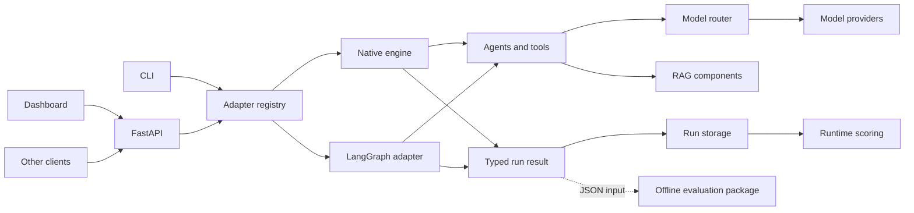

# Architecture

This page explains the repository boundaries and the main runtime path. Use the
linked deep dives for implementation detail.

Last verified: 2026-07-28.

## Repository boundaries

| Area | Path | Owns |
|---|---|---|
| Shared Python code | repository root and `tools/` | Provider clients, benchmark utilities, and shared helpers |
| Runtime | `agentic-workflows-v2/` | Workflow loading, execution, agents, model routing, RAG, CLI, and server |
| Dashboard | `agentic-workflows-v2/ui/` | Browser UI for workflows, models, runs, and evaluations |
| Evaluation package | `agentic-v2-eval/` | Offline rubrics, evaluators, runners, metrics, and reports |

The root Python project installs as `agentic-tools`. The runtime and evaluation
packages depend on that installed package; they should not reach into the
`tools/` source tree through relative path manipulation.

The runtime and `agentic-v2-eval` use separate evaluation implementations:

- `agentic_v2/scoring/` scores saved runs for the runtime API and dashboard;
- `agentic-v2-eval` is a reusable offline package that consumes structured
  results.

They can exchange JSON data, but neither needs to import the other.

## Request and execution flow



The normal path is:

1. the CLI or API loads and validates a workflow;
2. the adapter registry selects `native` or `langchain`;
3. the engine schedules steps whose dependencies are complete;
4. a step invokes an agent, a deterministic tool, or both;
5. model-backed agents ask the router for an available model;
6. the engine emits typed events and builds a typed result; and
7. the server saves the result for later inspection or evaluation.

## Execution engines

The repository intentionally keeps two engines:

| Engine | Use |
|---|---|
| `native` | Platform-specific DAG behavior, including conditional edges, retries, execution budgets, and observer hooks |
| `langchain` | LangGraph execution for compatible workflows and engine comparison |

`agentic run` defaults to `langchain`. A workflow can require native features,
so engine support must be checked rather than inferred. The API exposes
workflow capabilities, and `agentic compare` runs both adapters against the
same input.

`AdapterRegistry` owns engine discovery. At server startup, it validates the
adapter selected by `AGENTIC_DEFAULT_ADAPTER` and reports a missing optional
dependency before accepting work.

See [ADR-001](adr/ADR-001-002-003-architecture-decisions.md) and
[ADR-020](adr/ADR-020-langchain-adapter-eager-validation.md).

## Workflow and agent configuration

Workflow YAML files define:

- their input schema;
- steps and dependencies;
- the agent or deterministic role for each step;
- optional tools, persona, model settings, observers, and conditions; and
- output selection.

The loader turns YAML into typed definitions and rejects invalid dependencies
and cycles. The runtime keeps model selection separate from workflow structure:
a step requests a tier or model, and the router resolves that request using
environment pins, saved UI settings, provider availability, health, and
fallback chains.

Personas are Markdown prompt assets under `agentic_v2/prompts/`. They are not
Python agent classes. See [Workflow authoring](WORKFLOW_AUTHORING.md) and
[Agents](deep-dive-agents.md).

## API and event contracts

Pydantic models under `agentic_v2/contracts/` and selected server models define
the public wire format. The generation path is:

```text
Pydantic models -> committed JSON Schemas -> generated TypeScript
```

The dashboard imports generated TypeScript rather than maintaining a separate
handwritten copy. CI regenerates the artifacts and fails when they differ from
the Python source.

HTTP requests use REST. Workflow execution can stream over:

- WebSocket for interactive execution and reconnect;
- server-sent events for chat and saved run events; and
- normal HTTP for run creation and later retrieval.

Authentication, rate limiting, sanitization, and CORS are applied at the server
boundary. See [Runtime API contracts](api-contracts-runtime.md),
[Data models](data-models-runtime.md), and
[ADR-014](adr/ADR-014-pydantic-wire-format.md).

## Model routing

`SmartModelRouter` maps a requested capability tier to an available model. It
tracks provider health, observes retry guidance, applies cooldowns, and tries
configured fallbacks. Circuit-breaker state can use Redis across workers; when
Redis is not configured or cannot be used, routing state remains local to the
process.

Provider credentials stay in environment variables or the configured secret
provider. Saved UI settings may select endpoints and models but do not return
secret values.

See [Runtime architecture](architecture-runtime.md) and
[Configuration](configuration.md#model-providers).

## RAG boundary

`agentic_v2/rag/` provides document models, loaders, character-based chunking,
embedding adapters, vector stores, BM25 search, reciprocal-rank fusion,
optional reranking, and token-budget context assembly.

The Python factory can construct provider-backed embeddings and a durable
LanceDB store when the required extra is installed. `InMemoryEmbedder` and
`InMemoryVectorStore` are test and demonstration components.

The current `agentic rag` CLI does not persist an index between commands and
does not yet use the new factory. Do not treat its ingest command as a durable
indexing service. See [RAG](rag/index.md) and
[Known limitations](KNOWN_LIMITATIONS.md).

## Persistence and shared state

Different data has different storage:

| Data | Default behavior | Optional durable or shared behavior |
|---|---|---|
| Saved workflow runs | JSON files | Deployment-specific mounted storage |
| WebSocket replay | Configured replay store | SQLite or Redis |
| LangGraph checkpoints | Engine configuration | SQLite or PostgreSQL |
| Model-router circuit state | Process-local | Redis |
| Authentication lockouts | Process-local | No shared backend |
| UI provider and tier settings | `~/.agentic/ui-settings.json` | No remote settings backend |
| `RAGMemoryStore` key map | Process-local | No durable key map |

Do not assume that configuring Redis makes every type of state shared. See
[Configuration](configuration.md#redis-and-replay-storage) for the settings
that select each backend.

## Core protocols

The main extension seams are structural `typing.Protocol` contracts in
`agentic_v2/core/protocols.py`.

| Protocol | Responsibility |
|---|---|
| `ExecutionEngine` | Execute a compiled workflow |
| `SupportsStreaming` | Emit incremental execution events |
| `SupportsCheckpointing` | Save and resume execution state |
| `AgentProtocol` | Run one agent step and return a typed result |
| `ToolProtocol` | Invoke a tool exposed to an agent |
| `DetectorProtocol` | Inspect untrusted content |
| `MiddlewareProtocol` | Process an HTTP request and response |
| `VerifierProtocol` | Decide whether a step result is acceptable |

Implementations satisfy these contracts by shape. `scripts/check-doc-drift.py`
checks that every protocol in the source remains listed here.

## Where to read next

| Topic | Document |
|---|---|
| Runtime modules and execution | [Runtime architecture](architecture-runtime.md) |
| Dashboard state and components | [UI architecture](architecture-ui.md) |
| Offline evaluation | [Evaluation architecture](architecture-eval.md) |
| Shared tools | [Tools architecture](architecture-tools.md) |
| Package integration | [Integration architecture](integration-architecture.md) |
| Deployment | [Deployment guide](deployment-guide.md) |
| Design decisions | [ADR index](adr/ADR-INDEX.md) |

ADRs are historical decision records. Do not rewrite an accepted ADR to
describe a later design; add a new ADR that supersedes it and update the index.
