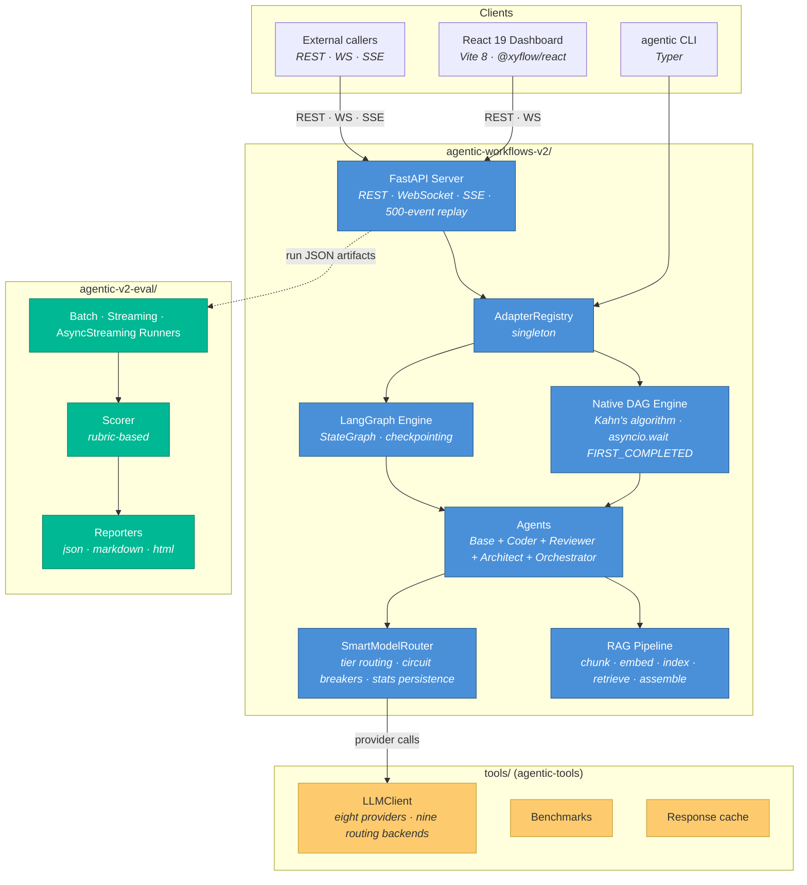

# Architecture

> **Audience:** Engineers orienting to the monorepo for design or review work.
> **Outcome:** After reading, you know which package owns which concern, how they communicate, and where to dive deeper.
> **Last verified:** 2026-07-05

This document is the umbrella. It does not re-derive system internals — it points at the existing per-package architecture docs and the ADRs that ratify each decision. If you are new to the repo, read this in full first; if you are in a specific area, jump to the per-package link.

---

## 1. System at a glance

The three Python packages have **no source-tree imports between them** — `tools/` is consumed as an installed workspace package (`agentic-tools`), like any other library, by both the runtime and the eval package. Beyond that:

- The runtime and the offline eval harness integrate at the **data level**: the runtime persists run results as JSON artifacts, and `agentic-v2-eval` reads those files as input. Neither package imports the other.
- The runtime's own in-server scoring (`agentic_v2/scoring/`, exposed via `GET /api/runs/{filename}/evaluation`) is independent of `agentic-v2-eval` — see [`integration-architecture.md`](integration-architecture.md).

---

## 2. Per-package deep dives

| Package | Entry point | Deep dive |
|---------|------------|-----------|
| Runtime | `agentic-workflows-v2/agentic_v2/` | [`architecture-runtime.md`](architecture-runtime.md) |
| UI | `agentic-workflows-v2/ui/src/` | [`architecture-ui.md`](architecture-ui.md) |
| Evaluation | `agentic-v2-eval/src/agentic_v2_eval/` | [`architecture-eval.md`](architecture-eval.md) |
| Shared tools | `tools/` | [`architecture-tools.md`](architecture-tools.md) |
| Cross-package integration | — | [`integration-architecture.md`](integration-architecture.md) |

Additional supporting documents:

- [`api-contracts-runtime.md`](api-contracts-runtime.md) — REST endpoint, WebSocket, and SSE schemas.
- [`data-models-runtime.md`](data-models-runtime.md) — Pydantic v2 models across server, contracts, core.
- [`component-inventory-ui.md`](component-inventory-ui.md) — UI component inventory.
- [`development-guide.md`](development-guide.md) — dev environments, CLI, tests.
- [`deployment-guide.md`](deployment-guide.md) — CI/CD, environment variables, production checklist.

---

## 3. The load-bearing mechanisms

These are the places where a change ripples across the system. Understand these before proposing architectural work.

### 3.1 Adapter registry

`AdapterRegistry` is a process-wide singleton in [`agentic_v2/adapters/registry.py`](https://github.com/tafreeman/agentic-runtime-platform/blob/main/agentic-workflows-v2/agentic_v2/adapters/registry.py). Engines register with a name (`native`, `langchain`), the CLI resolves `--adapter <name>` at runtime, and tests reset the singleton via an autouse fixture to prevent cross-test leakage. At FastAPI lifespan startup, `AdapterRegistry.validate_selected()` is called for the adapter named by `AGENTIC_DEFAULT_ADAPTER`; missing extras raise `ConfigurationError` with an install hint at boot time rather than mid-workflow.

- **Why it exists:** [ADR-001](adr/ADR-001-002-003-architecture-decisions.md) — dual execution engine.
- **Current default:** `langchain` (configurable per run); startup validation ratified by [ADR-020](adr/ADR-020-langchain-adapter-eager-validation.md).

### 3.2 Typed execution-event wire format

`contracts/events.py` defines a Pydantic discriminated union covering `workflow_start`, `step_start`, `step_end`, `token_delta`, `step_complete`, `step_error`, `workflow_end`, `error`, `evaluation_start`, `evaluation_complete`, `approval_required`, and `approval_decision`. WebSocket and SSE broadcasts validate before emit. The TypeScript union in `ui/src/api/events.generated.ts` is generated from this contract, and the `wire-format-drift` CI job fails any PR where the committed schemas or generated types diverge from the Python source of truth.

The same drift gate also covers four HTTP response shapes: `DAGResponse`, `WorkflowInputSchemaResponse`, `WorkflowEditorStep`, and `RunsSummaryResponse`. Their JSON schemas are committed under `tests/schemas/` and regenerated via `scripts/generate_schemas.py`.

- **Ratifies:** [ADR-014](adr/ADR-014-pydantic-wire-format.md).
- **Related:** the 500-event replay buffer in `server/websocket.py` — clients reconnecting mid-run receive missed events.

### 3.3 SLO gates in git

Time-to-first-span p95 and nightly flake rate are stored as rolling windows in git — measurements are appended to JSON artifacts committed on each CI run, and the gate reads the window, not a fresh sample. This keeps the signal stable across single bad runs.

- **Ratifies:** [ADR-015](adr/ADR-015-slo-in-git-rolling-window.md).
- **Known limitation:** p95 gate passes trivially when the window is empty — see [`KNOWN_LIMITATIONS.md`](KNOWN_LIMITATIONS.md).

### 3.4 SmartModelRouter

Maps a numeric capability tier (`ModelTier.TIER_0` through `TIER_5` in `models/router.py`) → best available model at runtime. Health-weighted selection, exponential cooldowns, circuit breakers, persisted stats across restarts, `Retry-After` header awareness. Circuit-breaker state can be shared across workers via Redis (`agentic_v2/models/redis_state.py`) with an in-process fallback.

- **Ratifies:** [ADR-002](adr/ADR-001-002-003-architecture-decisions.md).
- **Provider default for CI:** GitHub Models via `GITHUB_TOKEN` — see [ADR-016](adr/ADR-016-github-token-as-default-e2e-llm.md).

### 3.5 RAG pipeline

Modules in [`agentic_v2/rag/`](https://github.com/tafreeman/agentic-runtime-platform/tree/main/agentic-workflows-v2/agentic_v2/rag/): loader → recursive chunker → embedder (content-hash dedup) → cosine vectorstore + BM25 keyword index → RRF hybrid retriever → token-budget assembler. Full OTEL tracing. Memory backed by `MemoryStoreProtocol` (`InMemoryStore` or `RAGMemoryStore`).

- **Blueprint:** [`adr/RAG-pipeline-blueprint.md`](adr/RAG-pipeline-blueprint.md).

### 3.6 Core protocols

The seams above are held together by a small set of `typing.Protocol` contracts in [`agentic_v2/core/protocols.py`](https://github.com/tafreeman/agentic-runtime-platform/blob/main/agentic-workflows-v2/agentic_v2/core/protocols.py). Implementations are structurally typed against these, so an engine, tool, or middleware can be swapped without touching call sites:

| Protocol | Contract |
|----------|----------|
| `ExecutionEngine` | Runs a compiled workflow graph; the seam the adapter registry resolves (`native`, `langchain`). |
| `SupportsStreaming` | Optional capability — an engine that emits incremental execution events. |
| `SupportsCheckpointing` | Optional capability — an engine that persists and resumes run state. |
| `AgentProtocol` | A single agent step: takes context, returns a typed result. |
| `ToolProtocol` | An invocable tool exposed to agents through the MCP client stack. |
| `DetectorProtocol` | A sanitization/threat detector applied to inbound content. |
| `MiddlewareProtocol` | An ASGI-layer request/response interceptor (auth, rate limit, sanitization). |
| `VerifierProtocol` | A post-step check that gates whether a result is accepted. |

A CI drift check (`scripts/check-doc-drift.py`) fails any PR where a protocol defined in source is missing from this section.

---

## 4. The decision record

Every architecturally significant decision is captured as an ADR. The record spans decisions from the founding dual-engine and router decisions (ADR-001/002) through wire-format contracts (ADR-014), authentication and tenancy (ADR-021/022), the ExecutionKit seam (ADR-023), scoring extraction (ADR-032), the RAG pipeline (ADR-035), and model discovery (ADR-036–040). Numbers 004–006 and 013 are intentionally unused gaps and must not be reclaimed.

The full, maintained index — with status, one-line summaries, and a suggested reading order — is [`adr/ADR-INDEX.md`](adr/ADR-INDEX.md). This page deliberately does not duplicate that table.

Deeper mechanism docs that used to live here have moved to the runtime deep dive: core protocols, operability infrastructure (Redis, metrics, replay store, structured logging), the ExecutionKit ↔ runtime LLM seam (ADR-023), and the governance module are all covered in [`architecture-runtime.md`](architecture-runtime.md).

---

## 5. What this document is not

- Not a replacement for per-package docs — it is a map.
- Not a roadmap — see [`ROADMAP.md`](ROADMAP.md).
- Not a limitations list — see [`KNOWN_LIMITATIONS.md`](KNOWN_LIMITATIONS.md).
- Not a migration guide — see [`MIGRATIONS.md`](MIGRATIONS.md).
