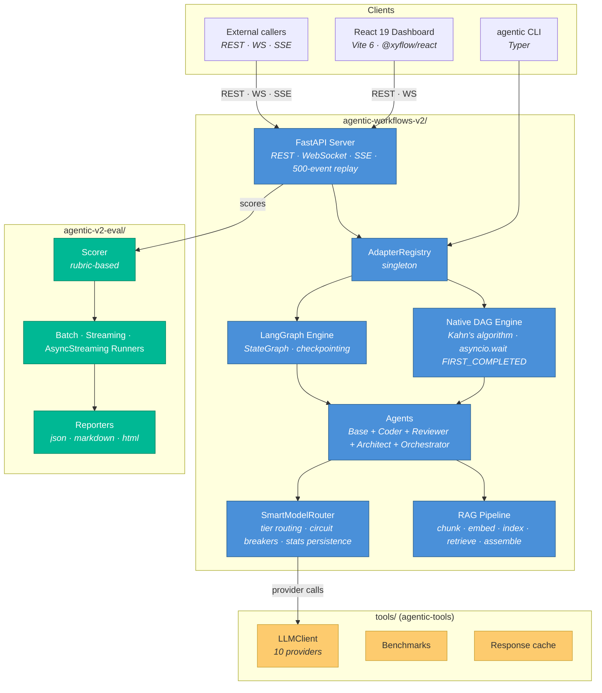

# Architecture

> **Audience:** Engineers orienting to the monorepo for design or review work.
> **Outcome:** After reading, you know which package owns which concern, how they communicate, and where to dive deeper.
> **Last verified:** 2026-05-15

This document is the umbrella. It does not re-derive system internals — it points at the existing per-package architecture docs and the ADRs that ratify each decision. If you are new to the repo, read this in full first; if you are in a specific area, jump to the per-package link.

---

## 1. System at a glance

The three Python packages have **zero cross-package imports**. They communicate via:

- `tools/` is published as a wheel (`agentic-tools`) — the runtime and eval packages consume it like any other library.
- The runtime exposes `agentic-v2-eval` through its REST API (`POST /runs/:id/evaluation`, `GET /runs/:id/evaluation`) — the eval framework does not import runtime internals.

---

## 2. Per-package deep dives

| Package | Entry point | Deep dive |
|---------|------------|-----------|
| Runtime | `agentic-workflows-v2/agentic_v2/` | [`architecture-runtime.md`](architecture-runtime.md) |
| UI | `agentic-workflows-v2/ui/src/` | [`architecture-ui.md`](architecture-ui.md) |
| Evaluation | `agentic-v2-eval/src/agentic_v2_eval/` | [`architecture-eval.md`](architecture-eval.md) |
| Shared tools | `tools/` | [`architecture-tools.md`](architecture-tools.md) |
| Cross-package integration | — | [`integration-architecture.md`](integration-architecture.md) |

Additional supporting documents:

- [`api-contracts-runtime.md`](api-contracts-runtime.md) — 16 REST endpoints + WebSocket + SSE schemas.
- [`data-models-runtime.md`](data-models-runtime.md) — 38+ Pydantic v2 models across server, contracts, core.
- [`component-inventory-ui.md`](component-inventory-ui.md) — 17 UI components across 6 categories.
- [`development-guide.md`](development-guide.md) — dev environments, CLI, tests.
- [`deployment-guide.md`](deployment-guide.md) — CI/CD, environment variables, production checklist.

---

## 3. The five load-bearing mechanisms

These are the places where a change ripples across the system. Understand these before proposing architectural work.

### 3.1 Adapter registry

`AdapterRegistry` is a process-wide singleton in [`agentic_v2/adapters/registry.py`](https://github.com/tafreeman/agentic-runtime-platform/blob/main/agentic-workflows-v2/agentic_v2/adapters/registry.py). Engines register with a name (`native`, `langchain`), the CLI resolves `--adapter <name>` at runtime, and tests reset the singleton via an autouse fixture to prevent cross-test leakage. At FastAPI lifespan startup, `AdapterRegistry.validate_selected()` is called for the adapter named by `AGENTIC_DEFAULT_ADAPTER`; missing extras raise `ConfigurationError` with an install hint at boot time rather than mid-workflow.

- **Why it exists:** [ADR-001](adr/ADR-001-002-003-architecture-decisions.md) — dual execution engine.
- **Current default:** `langchain` (configurable per run); startup validation ratified by [ADR-020](adr/ADR-020-langchain-adapter-eager-validation.md).

### 3.2 Typed execution-event wire format

`contracts/events.py` defines a Pydantic discriminated union covering `workflow_start`, `step_start`, `step_end`, `step_complete`, `step_error`, `workflow_end`, `evaluation_start`, `evaluation_complete`. WebSocket and SSE broadcasts validate before emit. TypeScript interfaces in `ui/src/api/types.ts` mirror this union by hand — drift is detected by convention, not yet by automation.

Sprint 1 (S1-1) extended the schema-drift CI gate to also cover four HTTP response shapes: `DAGResponse`, `WorkflowInputSchemaResponse`, `WorkflowEditorStep`, and `RunsSummaryResponse`. Their JSON schemas are committed under `tests/schemas/` and regenerated via `scripts/generate_schemas.py`. The `DAGNodeModel.depends_on` and `WorkflowEditorStep.depends_on` fields are now required (no default `[]`) in the wire schema.

- **Ratifies:** [ADR-014](adr/ADR-014-pydantic-wire-format.md).
- **Related:** the 500-event replay buffer in `server/websocket.py` — clients reconnecting mid-run receive missed events.

### 3.3 SLO gates in git

Time-to-first-span p95 and nightly flake rate are stored as rolling windows in git — measurements are appended to JSON artifacts committed on each CI run, and the gate reads the window, not a fresh sample. This keeps the signal stable across single bad runs.

- **Ratifies:** [ADR-015](adr/ADR-015-slo-in-git-rolling-window.md).
- **Known limitation:** p95 gate passes trivially when the window is empty — see [`KNOWN_LIMITATIONS.md`](KNOWN_LIMITATIONS.md).

### 3.4 SmartModelRouter

Maps tier (`tier3_analyst`) → capability → best available model at runtime. Health-weighted selection, exponential cooldowns, circuit breakers, persisted stats across restarts, `Retry-After` header awareness.

- **Ratifies:** [ADR-002](adr/ADR-001-002-003-architecture-decisions.md).
- **Provider default for CI:** GitHub Models via `GITHUB_TOKEN` — see [ADR-016](adr/ADR-016-github-token-as-default-e2e-llm.md).

### 3.5 RAG pipeline

Thirteen modules in [`agentic_v2/rag/`](https://github.com/tafreeman/agentic-runtime-platform/tree/main/agentic-workflows-v2/agentic_v2/rag/): loader → recursive chunker → embedder (content-hash dedup) → cosine vectorstore + BM25 keyword index → RRF hybrid retriever → token-budget assembler. Full OTEL tracing. Memory backed by `MemoryStoreProtocol` (`InMemoryStore` or `RAGMemoryStore`).

- **Blueprint:** [`adr/RAG-pipeline-blueprint.md`](adr/RAG-pipeline-blueprint.md).

---

## 6. Core protocols (`core/protocols.py`)

All protocols use PEP 544 structural subtyping — conformance is checked by shape, not inheritance. Every protocol listed below is `@runtime_checkable`, meaning `isinstance()` checks work at test time.

| Protocol | Purpose |
|----------|---------|
| `ExecutionEngine` | Common interface for workflow execution engines. Any class exposing `execute(workflow, ctx, on_update, **kwargs) -> WorkflowResult` satisfies this protocol. Implementations: `DAGExecutor`, `PipelineExecutor`, `WorkflowExecutor`, `LangChainEngine`. |
| `AgentProtocol` | Common interface for workflow agents. Requires a `name` property and `run(input_data, ctx) -> object`. Concrete agents use bounded `TypeVar`s (`TInput`/`TOutput`) from `agents.base`. |
| `ToolProtocol` | Common interface for tools available to agents. Requires `name`, `description` properties and `execute(**kwargs) -> object`. |
| `MemoryStore` / `MemoryStoreProtocol` | Async key-value store with search capability used by agents and the RAG pipeline. `MemoryStore` in `protocols.py` is a backward-compatible alias for `MemoryStoreProtocol` from `core.memory`. Implementations: `InMemoryStore`, `RAGMemoryStore`. |
| `SupportsStreaming` | Optional engine capability — exposes `stream(workflow, ctx, **kwargs) -> AsyncIterator[dict]` for event-by-event execution streaming. |
| `SupportsCheckpointing` | Optional engine capability — exposes `get_checkpoint_state()` and `resume()` so long-running workflows can be interrupted and continued from the last saved state. |
| `DetectorProtocol` | A pluggable threat-scanner that inspects text for a specific category (secrets, prompt injection, PII, etc.). Requires `name`, `version` properties and `scan(text) -> Sequence[Finding]`. Used by the sanitization middleware pipeline (ADR-002). |
| `MiddlewareProtocol` | A pipeline middleware that transforms or gates content. Requires `process(content, context) -> SanitizationResult`. Multiple middlewares are chained for layered defense. |
| `VerifierProtocol` | A post-step quality gate. Requires `verify(step_output, policy) -> VerificationStatus`. Plugged into the execution engine to enforce output quality policies before the next step runs. |

---

## 7. Sprint 2 — Operability at Scale

Sprint 2 added production-hardening infrastructure across four areas.

### 7.1 Redis integration (optional)

Two modules use Redis when available, each with graceful fallback:

- **`server/redis_state.py`** — Shared circuit-breaker state for the `SmartModelRouter`. When multiple workers are running, they share per-provider health scores via Redis so one worker's detected failure is immediately visible to all others. Falls back to in-process state when `REDIS_URL` is not set.
- **`server/replay_store.py`** — Durable WebSocket event history (see §7.3). Falls back to SQLite or in-memory.

Redis is an optional dependency. Install with `pip install -e ".[redis]"`. The server starts without Redis and emits a `logger.info` noting which backend was selected.

### 7.2 Observability stack

- **`integrations/metrics.py`** — OTEL Metrics SDK with a Prometheus-compatible `/metrics` scrape endpoint. All imports are guarded so the module degrades to a no-op when `opentelemetry-exporter-prometheus` is not installed. Enable with `AGENTIC_METRICS=1`. The endpoint is mounted in `create_app()` using `get_metrics_app()`.
- **`server/middleware/metrics.py` (`MetricsMiddleware`)** — ASGI middleware that records HTTP request duration histograms and request-count counters per route, method, and status code. Added as the innermost metric layer in `create_app()`.
- **`server/middleware/tracing.py` (`TraceparentMiddleware`)** — Injects W3C `traceparent` / `tracestate` response headers so the browser can correlate frontend and backend OTEL spans. Also injects `Server-Timing` for DevTools visibility.
- **`integrations/otel.py`** — existing OTEL tracing module; `CORS` headers now expose `traceparent` and `tracestate` so cross-origin frontends can read them.

### 7.3 Replay store

`server/replay_store.py` implements the `ReplayStore` protocol with three backends, auto-selected at startup:

| Backend | Class | Selected when |
|---------|-------|---------------|
| Redis | `RedisReplayStore` | `REDIS_URL` set and `redis` package installed |
| SQLite | `SqliteReplayStore` | `aiosqlite` installed (no Redis) |
| In-memory | `InMemoryReplayStore` | Fallback — zero dependencies |

`ConnectionManager.initialize_store()` (called in `app.py` lifespan) selects and connects the appropriate backend. The in-process `event_buffers` deque acts as a hot cache; the store is authoritative for replay after restarts or across workers.

### 7.4 Structured logging

`logging_config.py` provides `configure_logging()`, called once at module import in `app.py`. When `LOG_FORMAT=json` the root logger emits newline-delimited JSON (compatible with CloudWatch Logs Insights and Datadog). The default (`LOG_FORMAT=text`) uses the existing human-readable format.

---

## 4. The decision record

| ADR | Domain | Status |
|-----|--------|--------|
| [001](adr/ADR-001-002-003-architecture-decisions.md) | Dual execution engine | Accepted |
| [002](adr/ADR-001-002-003-architecture-decisions.md) | SmartModelRouter circuit breakers | Accepted |
| [003](adr/ADR-001-002-003-architecture-decisions.md) | Deep research supervisor | Superseded → 007 |
| [007](adr/ADR-007-classification-matrix-stop-policy.md) | Multidimensional classification + stop policy | Proposed |
| [008](adr/ADR-008-testing-approach-overhaul.md) | Test value taxonomy | Accepted |
| [009](adr/ADR-009-scoring-enhancements.md) | Scoring enhancements | Accepted |
| [010](adr/ADR-010-eval-harness-methodology.md) | Commit-driven A/B eval harness | Proposed |
| [011](adr/ADR-011-eval-harness-api-interface.md) | Eval harness API design | Proposed |
| [012](adr/ADR-012-ui-evaluation-hub.md) | UI evaluation hub | Proposed |
| [014](adr/ADR-014-pydantic-wire-format.md) | Pydantic wire format for execution events | Accepted |
| [015](adr/ADR-015-slo-in-git-rolling-window.md) | SLO rolling window in git | Accepted |
| [016](adr/ADR-016-github-token-as-default-e2e-llm.md) | GitHub Models as default E2E provider | Accepted |
| [018](adr/ADR-018-api-rate-limiting-and-auth-throttle.md) | API rate limiting + per-IP auth throttle | Accepted |
| [019](adr/ADR-019-dag-executor-top-level-timeout.md) | DAG executor top-level timeout watchdog | Accepted |
| [020](adr/ADR-020-langchain-adapter-eager-validation.md) | LangChain adapter eager validation at startup | Accepted |
| [023](adr/ADR-023-executionkit-runtime-contract-relationship.md) | ExecutionKit ↔ runtime contract unification (Option A′: single `executionkit` package) | Accepted |

ADRs 004–006 and 013 are **intentionally unused** — the gap is documented in [`adr/ADR-INDEX.md`](adr/ADR-INDEX.md) and should not be reclaimed.

---

## 8. ADR-023 — ExecutionKit ↔ runtime LLM seam (end state)

The Option A′ migration (ADR-023, F0–F5 landed 2026-06-01) unified the runtime
and ExecutionKit (EK) LLM contracts onto a single seam using the **single
`executionkit` package** — the intermediate `executionkit-contracts` package
was retired (see ADR-023 Amendment). The end state:

- **One runtime backend interface** — the `LLMBackend` ABC in
  `models/backends_base.py` (re-exported from `models/client.py`). The prior
  divergent `Protocol` definition was deleted (P2). All concrete backends
  (OpenAI, Anthropic, Gemini, Ollama, …) implement this one ABC.
- **One EK provider protocol** — the EK `LLMProvider` protocol. The runtime
  bridges to it via `SmartRouterProvider` (`models/ek_provider.py`), which
  wraps the router + backend so the EK kernel sees a uniform
  `complete(messages) -> LLMResponse`.
- **`ek_adapters.py` is the sole bridge** — `dict_to_llm_response`,
  `llm_response_to_dict`, and `map_http_error` (`models/ek_adapters.py`,
  backed by the `executionkit` package directly) are the only sanctioned
  translation between OpenAI-shaped backend dicts and the frozen EK value
  types (`LLMResponse`, `ToolCall`, `TokenUsage`, `LLMError` hierarchy). No
  mapping logic is reimplemented elsewhere.
- **Legacy retained, opt-in EK path** — `agentic_ek_provider` defaults to
  **OFF** (opt-in via `AGENTIC_EK_PROVIDER=1`). `LLMClientWrapper.complete()`
  routes through the EK path (`_complete_via_ek`) when the flag is set. The
  legacy text-only branch is **retained** as the rollback path, marked
  deprecated and slated for removal once the flag-ON full suite is clean.

### Kernel seam scope

The EK kernel seam is **`complete(messages) -> LLMResponse` only**. Streaming
(`complete_stream`) and per-provider `count_tokens` stay **out of the kernel**;
they remain reachable on the `LLMBackend` ABC, and the `SupportsStreaming`
protocol (`core/protocols.py`) already exists for callers that need streaming
(ADR-023 decision #7, accepted).

### Budget ownership (layered, not merged)

| Dimension | Owner | Mechanism |
|-----------|-------|-----------|
| Token-sum ceiling | runtime `TokenBudget` | `TokenBudget.consume(total_tokens)` runs **first** and raises on cap |
| `llm_calls` count | EK `CostTracker` | two-phase `reserve_call()` / `record_without_call()` |

A cache hit counts as a **0-token recorded call** (`call_count++`, tokens 0).
The two layers are stacked, never merged.

### Retry ownership

httpx errors translate to EK error classes via `map_http_error`
(`429 -> RateLimitError(retry_after)`; `401/403/404 -> PermanentError`;
else `-> ProviderError`) so EK `RetryConfig.should_retry` recognizes them.
`record_success` / `_classify_and_record_error` fire **exactly once per
physical HTTP call** — the router and EK each retry, but neither
double-counts. The EK path is **not** additionally wrapped in
`retry_with_jitter`.

### Tool-path ownership

| Path | When | Mechanism |
|------|------|-----------|
| EK `react_loop` | **default** | uniform retry/budget/structured tool-calling |
| native | step opts out with `tool_path: native` | `tool_execution.run_tool_calls` |

The two paths are never mixed mid-thread for a single step. Gemini routes
report `supports_tools=False`; `react_loop` **refuses** rather than silently
dropping tools.

### Preserved router reliability

The cutover preserves all `SmartModelRouter` reliability machinery: circuit
breaker, per-provider bulkhead semaphore, rate-limit header cooldown,
cross-tier fallback, Redis CAS shared state (with in-memory fallback), and
`supports_tools` delegation.

---

## 5. What this document is not

- Not a replacement for per-package docs — it is a map.
- Not a roadmap — see [`ROADMAP.md`](ROADMAP.md).
- Not a limitations list — see [`KNOWN_LIMITATIONS.md`](KNOWN_LIMITATIONS.md).
- Not a migration guide — see [`MIGRATIONS.md`](MIGRATIONS.md).
