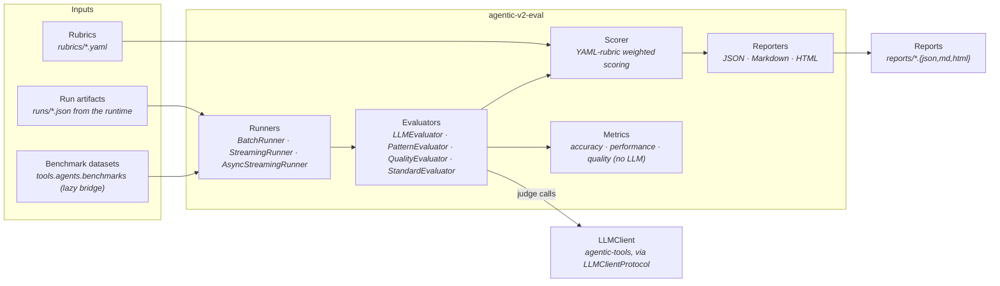

# Architecture: agentic-v2-eval

## Executive summary

`agentic-v2-eval` (v0.3.0) is the rubric-driven evaluation framework for the `agentic-runtime-platform` monorepo. It turns LLM outputs — prose responses, agent workflow results, code artifacts, prompt templates — into reproducible, weighted scores and human-readable reports.

The framework provides four complementary scoring paths:

1. **Rubric scoring** — YAML-defined criteria with explicit weights, applied by the `Scorer` engine.
2. **LLM-as-judge** — Choice-anchored prompts sent to an LLM; the judge returns a normalized 0–1 score per criterion.
3. **Structural pattern evaluation** — Conformance testing for agentic prompt patterns (ReAct, CoVe, Reflexion, RAG) with hard-gate pass/fail conditions.
4. **Static quality metrics** — AST-based code quality, cyclomatic complexity, lint scores, and classification accuracy computed without any LLM call.

All evaluator implementations depend only on `LLMClientProtocol` — a structural (duck-typed) protocol. Tests inject mocks that satisfy the protocol; no live API calls are made in the test suite.

The package is a `uv` workspace member. `agentic-tools` supplies the concrete `LLMClient` and is lazy-loaded at evaluation time. The `agentic-workflows-v2` runtime imports only `LLMClientProtocol` from this package, keeping the dependency graph acyclic.

---

## Technology stack

| Component | Technology | Notes |
|-----------|-----------|-------|
| Language | Python 3.11+ | `match` statements and `tomllib` used |
| Build backend | hatchling | `pyproject.toml` as single config source |
| Rubric format | YAML (PyYAML 6.0+) | Loaded at call time, not import time |
| LLM access | `agentic-tools` workspace dep | Lazy-loaded; optional at import |
| Test runner | pytest + pytest-asyncio | `asyncio_mode = "auto"` |
| Coverage gate | pytest-cov | `fail_under = 80`, branch coverage on |
| Static analysis | mypy `--strict` | Zero findings on `src/agentic_v2_eval/` |
| Linting | ruff | Rules: E, F, W, I, N, UP, S, B, A, C4, SIM, TCH, RUF |

---

## System architecture

### Pipeline overview



### Key design decisions

**Structural protocols instead of abstract base classes for the LLM boundary.** `LLMClientProtocol` uses `typing.Protocol` with `@runtime_checkable`. Any object whose `generate_text` method matches the signature satisfies the protocol — no import-time coupling between the eval package and `agentic-tools`. This means the eval package can be imported in environments where `agentic-tools` is not installed, reducing test setup friction.

**Rubric YAML loaded at call time, not import time.** Rubric YAML files are opened when a `Scorer` is constructed or an evaluator method is first called. The module-level `__init__.py` exports are pure class symbols with no file I/O. This keeps import overhead negligible and allows test code to override the rubric path trivially.

**EvaluatorRegistry as a classvar singleton.** The registry is a class-level dict rather than a module-level global. Evaluators register themselves at class-definition time via the `@EvaluatorRegistry.register("name")` decorator. Discovery is automatic: importing any evaluator module is sufficient for it to appear in the registry.

**Median aggregation over multiple judge runs.** Both `PatternEvaluator` and `StandardEvaluator` optionally run the judge prompt `N` times (default 20 for pattern, 1 for standard) and report the median across runs. This reduces the impact of stochastic LLM output on the final score. The `runs` parameter is the primary handle for trading cost against variance.

**Discriminated union return type for async evaluation.** `AsyncStreamingRunner._eval_one` returns `tuple[Literal[True], R] | tuple[Literal[False], Exception]` — a discriminated union that avoids raising exceptions across `asyncio.Task` boundaries. This pattern keeps the runner fully typed under `mypy --strict`.

---

## Package structure

```
agentic-v2-eval/
├── src/agentic_v2_eval/
│   ├── __init__.py          # 17 public exports; version 0.3.0
│   ├── __main__.py          # CLI: evaluate + report subcommands
│   ├── interfaces.py        # LLMClientProtocol + Evaluator protocols
│   ├── scorer.py            # YAML-rubric weighted scoring engine
│   ├── datasets.py          # Lazy bridge to tools.agents.benchmarks
│   ├── adapters/
│   │   └── llm_client.py    # Lazy-loading bridge to agentic-tools LLMClient
│   ├── evaluators/
│   │   ├── base.py          # Abstract Evaluator + EvaluatorRegistry
│   │   ├── llm.py           # LLMEvaluator — choice-anchored 5-point judge
│   │   ├── pattern.py       # PatternEvaluator — agentic pattern conformance
│   │   ├── quality.py       # QualityEvaluator — 5 output quality dimensions
│   │   └── standard.py      # StandardEvaluator — prompt quality 0-10 grading
│   ├── metrics/
│   │   ├── accuracy.py      # accuracy, precision/recall, F1, confusion matrix
│   │   ├── performance.py   # execution time, memory, throughput, latency percentiles
│   │   └── quality.py       # code_quality (AST), lint_score, complexity_score
│   ├── reporters/
│   │   ├── _summary.py      # Shared calculate_summary() utility
│   │   ├── json.py          # JsonReporter + generate_json_report()
│   │   ├── markdown.py      # MarkdownReporter + generate_markdown_report()
│   │   └── html.py          # HtmlReporter (self-contained CSS) + generate_html_report()
│   ├── rubrics/
│   │   ├── __init__.py      # load_rubric(), list_rubrics(), get_rubric_path()
│   │   ├── default.yaml     # 3 criteria: Accuracy/Completeness/Efficiency
│   │   ├── agent.yaml       # 6 criteria: general agent output scoring
│   │   ├── code.yaml        # 5 criteria: code generation quality
│   │   ├── coding_standards.yaml  # 8 criteria: Python/ML coding standards
│   │   ├── pattern.yaml     # 6 criteria + hard gates: pattern adherence
│   │   ├── quality.yaml     # 5 LLM judge definitions for QualityEvaluator
│   │   ├── prompt_standard.yaml   # Judge prompt for StandardEvaluator
│   │   └── prompt_pattern.yaml    # Judge prompts + pattern data (ReAct/CoVe/Reflexion/RAG)
│   ├── runners/
│   │   ├── batch.py         # BatchRunner[T,R] + run_batch_evaluation()
│   │   └── streaming.py     # StreamingRunner + AsyncStreamingRunner + run_streaming_evaluation()
│   └── sandbox/
│       ├── base.py          # BaseSandbox abstract class
│       └── local.py         # LocalSubprocessSandbox (subprocess isolation, safe_mode)
└── tests/                   # 13 test files
    ├── conftest.py
    ├── test_adapters.py
    ├── test_benchmarks.py
    ├── test_datasets_bridge.py
    ├── test_eval.py
    ├── test_evaluator_parse_caps.py
    ├── test_llm_evaluator.py
    ├── test_metrics.py
    ├── test_pattern_evaluator.py
    ├── test_quality_evaluator.py
    ├── test_reporters.py
    ├── test_rubrics.py
    ├── test_sandbox.py
    ├── test_standard_evaluator.py
    └── verify_p2.py
```

---

## Evaluator system

### Class hierarchy

```
abc.ABC
└── Evaluator (base.py)
    └── LLMEvaluator (llm.py)  @dataclass, registered as "llm"

EvaluatorRegistry.register("pattern") → PatternEvaluator (pattern.py)
EvaluatorRegistry.register("quality") → QualityEvaluator (quality.py)
EvaluatorRegistry.register("standard") → StandardEvaluator (standard.py)
```

Note: `PatternEvaluator`, `QualityEvaluator`, and `StandardEvaluator` do not extend the abstract `Evaluator` base class directly — they satisfy the duck-typed `Evaluator` protocol from `interfaces.py` while being accepted by the registry's wider `type[Any]` parameter.

### LLMEvaluator

The general-purpose choice-anchored judge. Constructs a prompt from `prompt_template` and `system_prompt`, sends it to the LLM, then maps the response to a score using `STANDARD_CHOICES = [(1, 0.0), (2, 0.25), (3, 0.5), (4, 0.75), (5, 1.0)]`.

Score extraction reads the **last line** of the response first (exact match), then falls back to scanning the last three lines (containment match). If no choice is matched, the score is 0.0 and `passed = False`.

Temperature is set to 0.0 for deterministic output.

### PatternEvaluator

Evaluates whether a prompt or output correctly follows an agentic reasoning pattern. The evaluation sends a structured judge prompt loaded from `rubrics/prompt_pattern.yaml` that defines two layers of scoring:

**Universal dimensions (7 total, 0–5 scale each):**

| Code | Dimension | Hard Gate |
|------|-----------|-----------|
| PIF | Pattern Invocation Fidelity | No |
| POI | Phase Ordering Integrity | Yes (min 4) |
| PC | Phase Completeness | Yes (min 4) |
| CA | Constraint Adherence | Yes (min 4) |
| SRC | Self-Reference Correctness | No |
| PR | Pattern Robustness | Yes (min 0.75) |
| IR | Interference Resistance | No |

**Pattern-specific dimensions (3 per pattern, 0–5 scale):**

| Pattern | Dimensions |
|---------|-----------|
| ReAct | R1 (Thought/Action Separation), R2 (Observation Binding), R3 (Termination Discipline) |
| CoVe | C1 (Verification Question Quality), C2 (Evidence Independence), C3 (Revision Delta) |
| Reflexion | F1 (Critique Specificity), F2 (Memory Utilization), F3 (Improvement Signal) |
| RAG | G1 (Retrieval Trigger Accuracy), G2 (Evidence Grounding), G3 (Citation Discipline) |

Scores are aggregated using **median** across `runs` invocations. Hard gates are evaluated on the aggregated medians, not per-run.

### QualityEvaluator

Scores output quality across five independent LLM judge calls. Each call uses an `LLMEvaluatorDefinition` loaded from `rubrics/quality.yaml`:

| Constant | Dimension | Key Input Variable |
|----------|-----------|-------------------|
| `COHERENCE` | Logical flow and consistency | `{{input}}`, `{{completion}}` |
| `FLUENCY` | Grammar, spelling, natural language | `{{completion}}` |
| `RELEVANCE` | On-topic alignment with query | `{{input}}`, `{{completion}}` |
| `GROUNDEDNESS` | Claims supported by provided context | `{{context}}`, `{{completion}}` |
| `SIMILARITY` | Semantic overlap with reference | `{{expected}}`, `{{completion}}` |

All five use `STANDARD_CHOICES` (1–5 → 0.0–1.0). The caller selects which dimensions to evaluate and accumulates scores.

### StandardEvaluator

Evaluates prompt templates on five 0–10 dimensions using a judge prompt from `rubrics/prompt_standard.yaml`. The judge returns JSON:

```json
{
  "scores": {
    "clarity": 8,
    "effectiveness": 7,
    "structure": 9,
    "specificity": 6,
    "completeness": 8
  },
  "improvements": ["Add output format section", "Include examples"],
  "confidence": 0.92
}
```

Grade mapping: A (≥ 90%), B (≥ 80%), C (≥ 70%), D (≥ 60%), F (< 60%). Pass threshold: `overall_score >= 7.0`.

Input content longer than 18,000 characters is truncated: the first 16,000 characters are preserved along with the last 1,000 characters, separated by a truncation marker.

---

## Scoring engine

`scorer.py` implements `Scorer` and `ScoringResult`. The scorer:

1. Loads a rubric from a YAML file path or an in-memory dict.
2. Parses `criteria` entries into `Criterion` dataclasses (name, weight, description, min_value, max_value).
3. On `score(results: dict[str, float])`: clamps each input value to `[min_value, max_value]`, normalizes to `[0, 1]`, multiplies by weight, sums, and divides by total weight.
4. Returns `ScoringResult(total_score, weighted_score, criterion_scores, missing_criteria)`.

`total_score` is the unweighted mean. `weighted_score` is the weight-adjusted aggregate in `[0.0, 1.0]`. Criteria absent from the input are recorded in `missing_criteria` without failing the call.

---

## Runner architecture

All runners are generic over `T` (test case type) and `R` (result type), accepting any callable `evaluator: Callable[[T], R]`.

| Runner | Execution Model | Result Order | Use Case |
|--------|----------------|--------------|----------|
| `BatchRunner[T,R]` | Sync, sequential | Submission order | CI pipelines, finite datasets, all results required before reporting |
| `StreamingRunner[T,R]` | Sync iterator | Submission order | Terminal progress display without async complexity |
| `AsyncStreamingRunner[T,R]` | Async, `asyncio.Semaphore(max_concurrency)` | Completion order (FIRST_COMPLETED) | I/O-bound LLM scoring, up to N concurrent calls |

`BatchRunner.run()` returns `BatchResult[R]` with `.results`, `.errors`, `.total`, `.successful`, `.failed`, and `.success_rate`.

`StreamingRunner.run()` returns `StreamingStats`. `StreamingRunner.iter_results()` is a generator that yields each result as it completes.

`AsyncStreamingRunner.iter_results()` is an `AsyncIterator[R]`. It accepts both sync and async evaluator functions (detected via `inspect.isawaitable`). Concurrency is bounded by a semaphore; results are drained as tasks complete.

---

## Reporter architecture

All reporters share `calculate_summary()` from `reporters/_summary.py`, which computes mean/min/max for numeric fields plus a total count.

| Reporter | Function API | Class API | Output Format |
|----------|-------------|-----------|---------------|
| `JsonReporter` | `generate_json_report(results, path)` | `JsonReporter(config).generate(results, path)` | `{metadata, results, summary}` |
| `MarkdownReporter` | `generate_markdown_report(results, path)` | `MarkdownReporter(config).generate(results, path)` | Heading + ToC + summary stats + pipe table |
| `HtmlReporter` | `generate_html_report(results, path)` | `HtmlReporter(config).generate(results, path)` | Self-contained HTML with embedded CSS |

`HtmlReporter` applies score color coding: cells are styled `score-high` (green, ≥ 0.8), `score-medium` (amber, ≥ 0.5), or `score-low` (red, < 0.5) based on configurable `score_thresholds`.

---

## Metrics modules

### accuracy.py

- `calculate_accuracy(predictions, ground_truth)` — element-wise equality, returns float in [0, 1].
- `calculate_precision_recall(predictions, ground_truth, positive_label)` — binary classification precision and recall.
- `calculate_f1_score(predictions, ground_truth, positive_label)` — harmonic mean of precision and recall.
- `calculate_confusion_matrix(predictions, ground_truth, labels)` — nested dict `matrix[actual][predicted]`.

### performance.py

- `execution_time_score(time_seconds, threshold, penalty_factor)` — score 1.0 at or below threshold; exponential decay above.
- `memory_usage_score(memory_bytes, threshold_mb)` — score 1.0 at or below threshold; linear decay above.
- `throughput_score(items_per_second, target_throughput)` — `min(1.0, rate/target)`.
- `measure_time()` — context manager; populates `result["elapsed"]` on exit.
- `benchmark(func, *args, iterations, warmup)` — multi-iteration timing returning `(last_result, stats_dict)`.
- `latency_percentiles(latencies, percentiles)` — P50/P90/P95/P99 from a latency sample list.

### quality.py (metrics)

- `code_quality_score(code, language)` — combines structure, common issues, and Python AST validity checks into a single [0, 1] score.
- `lint_score(code, language)` — heuristic checks (spacing, line length, trailing whitespace, TODO comments, print statements) with per-issue deductions from 1.0.
- `complexity_score(code, language, max_complexity)` — cyclomatic complexity via `ast.walk`; score 1.0 at or below `max_complexity`, linear decay above.

---

## Sandbox

`LocalSubprocessSandbox` (in `sandbox/local.py`) runs evaluated code in a subprocess with a configurable timeout (default 30 s) and an optional blocked-command list (`safe_mode=True`).

Blocked commands in safe mode include: `rm`, `wget`, `curl`, `nc`, `kill`, `chmod`, `chown`, `dd`, `mkfs`, and other destructive or network-accessing commands.

The sandbox prevents path-escape by rejecting absolute paths outside the configured sandbox root before execution. It does not provide container-level isolation; for higher assurance, wrap the evaluator in a Docker image.

---

## Dataset bridge

`datasets.py` provides a lazy facade over `tools.agents.benchmarks`. The benchmark modules are imported only on first access, not at package import time.

Available benchmarks:

| ID | Name | Tasks | Notes |
|----|------|-------|-------|
| `swe-bench` | SWE-bench | Full | Real GitHub issues |
| `swe-bench-lite` | SWE-bench Lite | 300 | Quick evaluation subset |
| `swe-bench-verified` | SWE-bench Verified | Subset | Human-validated |
| `humaneval` | HumanEval | 164 | Python function-level tasks |
| `mbpp` | MBPP | 974 | Basic Python programming |
| `codeclash` | CodeClash | Variable | Competitive programming |
| `custom-local` | Custom Local | Variable | User-defined tasks |

```python
from agentic_v2_eval.datasets import load_benchmark, list_benchmarks

tasks = load_benchmark("humaneval", limit=10)
for task in tasks:
    print(task.task_id, task.prompt[:60])
```

---

## Server-side integration

The `agentic-workflows-v2` server runs its own three-stage evaluation pipeline that is architecturally parallel to but distinct from the standalone `agentic-v2-eval` package. The integration point is the `GET /runs/{filename}/evaluation` API endpoint.

See `docs/evaluation/gating.md` for the full server-side scoring pipeline, scoring profiles, and hard gate specification.

---

## CLI reference

The CLI is the `__main__.py` entry point, available as `python -m agentic_v2_eval` or via the `agentic-v2-eval` console script registered in `pyproject.toml`.

```bash
# Score results.json against the built-in default rubric
python -m agentic_v2_eval evaluate results.json

# Score against a custom rubric and save scored output
python -m agentic_v2_eval evaluate results.json \
  --rubric rubrics/code.yaml \
  --output scored.json

# Generate an HTML report
python -m agentic_v2_eval report results.json \
  --format html \
  --output report.html

# Generate a Markdown report (default format)
python -m agentic_v2_eval report results.json \
  --format markdown \
  --output report.md
```

The `evaluate` command accepts a JSON file containing either a list of result dicts or a dict with a `"results"` key containing a list. Each dict is scored against the rubric; the average weighted score is printed to stdout.

---

## Public API

The package exports 17 symbols from its top-level `__init__.py`:

| Symbol | Type | Description |
|--------|------|-------------|
| `COHERENCE` | `LLMEvaluatorDefinition \| None` | Built-in coherence quality dimension definition |
| `FLUENCY` | `LLMEvaluatorDefinition \| None` | Built-in fluency quality dimension definition |
| `GROUNDEDNESS` | `LLMEvaluatorDefinition \| None` | Built-in groundedness quality dimension definition |
| `RELEVANCE` | `LLMEvaluatorDefinition \| None` | Built-in relevance quality dimension definition |
| `SIMILARITY` | `LLMEvaluatorDefinition \| None` | Built-in similarity quality dimension definition |
| `Evaluator` | Protocol | Structural protocol: `evaluate(output, expected, **kwargs) -> dict` |
| `EvaluatorRegistry` | Class | Singleton registry; evaluators register via `@EvaluatorRegistry.register("name")` |
| `LLMClientProtocol` | Protocol | Structural protocol: `generate_text(model_name, prompt, temperature, max_tokens) -> str` |
| `LLMEvaluatorDefinition` | Dataclass | Configuration for a quality evaluator: prompts, choices, model |
| `PatternEvaluator` | Class | Structural conformance for ReAct/CoVe/Reflexion/RAG |
| `PatternScore` | Dataclass | 17-field result from pattern evaluation |
| `QualityEvaluator` | Class | Five-dimension output quality evaluator |
| `Scorer` | Class | YAML-rubric weighted scoring engine |
| `ScoringResult` | Dataclass | `(total_score, weighted_score, criterion_scores, missing_criteria)` |
| `StandardEvaluator` | Class | Five-dimension prompt quality evaluator with letter grade |
| `StandardScore` | Dataclass | `(prompt_file, scores, overall_score, grade, passed, improvements, ...)` |
| `__version__` | `str` | Package version string |

---

## Testing

```bash
cd agentic-v2-eval
pip install -e ".[dev]"

# Run full test suite
python -m pytest tests/ -v

# Run with coverage
python -m pytest tests/ --cov=agentic_v2_eval --cov-report=term-missing

# Skip integration tests (no LLM required)
python -m pytest tests/ -m "not integration"

# Static analysis
mypy --strict src/agentic_v2_eval/
ruff check src/agentic_v2_eval/
```

| Property | Value |
|----------|-------|
| Test files | 13 |
| Approximate test count | ~215 |
| asyncio mode | auto |
| Coverage gate | 80%, branch coverage on |
| Live API calls in tests | None — all mock `LLMClientProtocol` |
| mypy findings | 0 |
