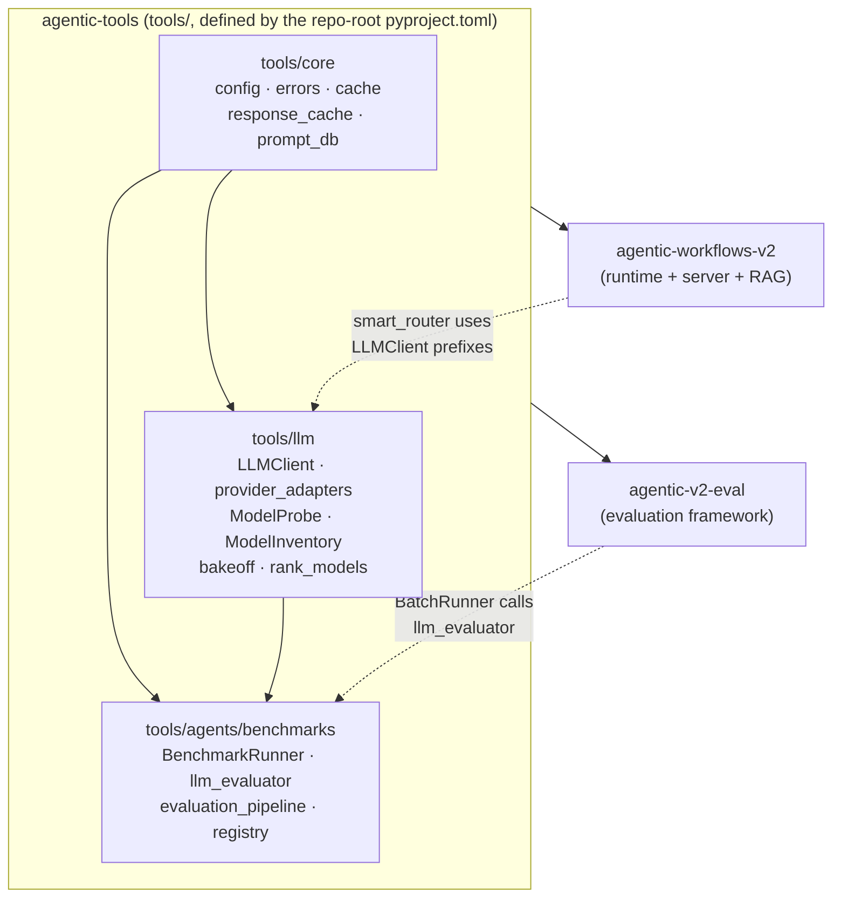

# Architecture: agentic-tools

> Package name: `agentic-tools` | Version: 0.1.0 | Python: 3.11+

## Executive summary

`agentic-tools` is the shared utility layer for the `tafreeman/agentic-runtime-platform` monorepo. It
provides a multi-provider LLM client abstraction (eight providers across nine routing backends), a disk-backed SHA-256
response cache, model probing and provider discovery, a model bakeoff runner, a benchmark and
LLM-as-judge evaluation framework, a structured error taxonomy, and script bootstrap helpers.

The package is defined by the **repo-root** `pyproject.toml` (project name `agentic-tools`), which is
also the `uv` workspace root; there is no `tools/pyproject.toml`. Members `agentic-workflows-v2` and
`agentic-v2-eval` declare `agentic-tools` as a workspace dependency.

The central design choice is a **static facade + provider adapters + two-level cache** pattern.
Callers never instantiate a client object; they call `LLMClient.generate_text(model_name, prompt)`
as a static method. The method dispatches to one of nine routing backends (local ONNX and Windows AI are distinct local backends) based on a name prefix
in the model string. A 24-hour, SHA-256-keyed disk cache sits in front of all provider calls when
enabled.

---

## Dependency diagram



---

## Technology stack

| Component | Technology | Notes |
|-----------|-----------|-------|
| Language | Python 3.11+ | `from __future__ import annotations` throughout |
| Build backend | hatchling | `pyproject.toml` as single config source |
| Workspace manager | uv | Workspace root is the repo-root `pyproject.toml`; members: agentic-workflows-v2, agentic-v2-eval |
| HTTP (sync) | `urllib.request` stdlib | Ollama, Azure Foundry, Azure OpenAI adapters |
| HTTP (async) | `aiohttp` | Available for async provider backends |
| Data validation | Pydantic v2 | `model_dump()` / `model_validate()` — not `.dict()` / `.parse_obj()` |
| OpenAI SDK | `openai >=2.41.1,<3` | OpenAI and Azure OpenAI providers |
| Anthropic SDK | `anthropic >=0.109.1,<1` | Claude provider |
| Numeric | `numpy >=1.26.4,<3` | Upper bound for semver safety |
| Optional: Google | `google-generativeai` | Gemini provider |
| Optional: ONNX | `onnxruntime-genai` | Local ONNX model inference |
| Optional: Windows AI | .NET bridge + WinRT | Phi Silica NPU (Copilot+ PC) |
| GitHub Models | `gh` CLI subprocess | Rate-limit-aware; `GITHUB_TOKEN` required |
| LangChain | `langchain-core >=1.4.7,<2` | Thin adapter in `langchain_adapter.py` |

---

## Package structure

```
pyproject.toml                        # Repo root: package definition (agentic-tools) + uv workspace root
tools/
├── __init__.py
├── llm/                              # 25 modules — LLM client and provider layer
│   ├── llm_client.py                 # LLMClient static facade — primary entry point
│   ├── provider_adapters.py          # All provider adapter functions
│   ├── langchain_adapter.py          # LangChain compatibility shim
│   ├── local_model.py                # ONNX model wrapper (onnxruntime-genai)
│   ├── local_models.py               # LOCAL_MODELS catalog (key → aigallery path)
│   ├── local_model_cli.py            # CLI for local model operations
│   ├── local_model_discovery.py      # Auto-detect from ~/.cache/aigallery
│   ├── model_probe.py                # ModelProbe class (slim facade + public API)
│   ├── model_registry.py             # Curated model registry constants
│   ├── check_provider_limits.py      # Provider rate-limit inspection CLI
│   ├── list_gemini.py                # Gemini model listing helper
│   ├── probe_config.py               # ProbeResult dataclass, constants, cache I/O, with_retry
│   ├── probe_providers.py            # Per-provider probe dispatch
│   ├── probe_providers_cloud.py      # Cloud probe logic (GitHub, OpenAI, Gemini, Claude, Azure)
│   ├── probe_providers_local.py      # Local probe logic (ONNX, Ollama, LM Studio, AITK)
│   ├── probe_discovery.py            # discover_all_models() — multi-provider orchestration
│   ├── probe_discovery_providers.py  # Underlying per-provider discovery helpers
│   ├── model_inventory.py            # build_inventory() — passive + active capability scan
│   ├── model_locks.py                # PID-based lock files for concurrent ONNX loading
│   ├── model_bakeoff.py              # Multi-model bakeoff runner
│   ├── bakeoff_tasks.py              # TaskSpec dataclass + TASKS list
│   ├── bakeoff_reporting.py          # _write_reports(), _recommend_alignment()
│   ├── rank_models.py                # Score-based model ranking from probe + limits data
│   ├── run_local_concurrency.py      # Local concurrency stress harness
│   ├── windows_ai.py                 # WindowsAIModel — .NET bridge to Phi Silica
│   └── windows_ai_bridge/            # C# .NET bridge project (PhiSilicaBridge.csproj)
├── core/                             # 9 modules — shared utilities
│   ├── config.py                     # ModelConfig, PathConfig, Config dataclasses
│   ├── errors.py                     # ErrorCode StrEnum + classify_error()
│   ├── cache.py                      # Function-based cache API (delegates to ResponseCache)
│   ├── response_cache.py             # ResponseCache class: SHA-256, 24h TTL, disk-backed
│   ├── prompt_db.py                  # JSON-file-backed prompt/rubric/evaluation store
│   ├── _encoding.py                  # Windows console encoding fix (UTF-8)
│   ├── tool_init.py                  # ToolInit bootstrap dataclass
│   ├── local_media.py                # Local media file handling
│   └── model_availability.py        # Runtime model availability helpers
├── agents/
│   ├── repo_analyzer/                # Repository analysis agent helpers
│   └── benchmarks/                   # 11 modules — benchmark infrastructure
│       ├── registry.py               # BenchmarkRegistry + PRESET_CONFIGS
│       ├── datasets.py               # BENCHMARK_DEFINITIONS per benchmark
│       ├── loader.py                 # load_benchmark() + clear_cache()
│       ├── runner.py                 # run_benchmark() + interactive CLI
│       ├── runner_commands.py        # cmd_* CLI handler functions
│       ├── runner_ui.py              # colorize, print_table, interactive_mode
│       ├── llm_evaluator.py          # LLM-as-judge: build_evaluation_prompt, evaluate_with_llm
│       ├── evaluator_models.py       # EvaluationResult, DimensionScore, SCORE_RUBRIC
│       ├── evaluator_reporting.py    # summarize_batch_results, save_evaluation_report
│       ├── evaluation_pipeline.py    # evaluate_task_output_llm, get_gold_standard_for_task
│       └── workflow_pipeline.py      # extract_workflow_data, save_workflow_phases_md
└── tests/                            # Test suite (14 files) — no live LLM calls
    ├── conftest.py
    ├── test_benchmark_pipeline.py
    ├── test_config.py
    ├── test_errors.py
    ├── test_evaluation_pipeline.py
    ├── test_llm_client.py
    ├── test_llm_evaluator.py
    ├── test_local_model_parsing.py
    ├── test_model_inventory.py
    ├── test_model_probe.py
    ├── test_model_registry_constants.py
    ├── test_probe_discovery_cloud.py
    ├── test_repo_analyzer.py
    ├── test_tool_init.py
    └── test_workflow_pipeline.py
```

---

## LLM client

### Core interface

```python
from tools.llm.llm_client import LLMClient

# Synchronous, static — no instance required
response = LLMClient.generate_text(
    model_name="gh:gpt-4o-mini",
    prompt="Explain Kahn's algorithm.",
    system_instruction="You are a concise technical writer.",  # optional
    temperature=0.7,                                           # default
    max_tokens=4096,                                           # default
)
```

`LLMClient` is a pure static-method facade. No instance state exists. Thread safety is delegated
to the `ResponseCache` layer, which uses a `threading.Lock` on all read/write operations.

### Call flow

```
Caller
  └─ LLMClient.generate_text(model_name, prompt, ...)
       ├─ ResponseCache.get(sha256_key)         ← 24h disk cache
       │    └─ hit → return cached string
       └─ miss → provider_adapters.dispatch(prefix)
            ├─ local:*           → call_local()        (onnxruntime-genai)
            ├─ ollama:*          → call_ollama()        (urllib.request REST)
            ├─ windows-ai:*      → call_windows_ai()   (.NET bridge → Phi Silica)
            ├─ azure-foundry:*   → call_azure_foundry() (urllib.request REST)
            ├─ azure-openai:*    → call_azure_openai() (openai.AzureOpenAI SDK)
            ├─ gh:*              → call_github_models() (gh CLI subprocess)
            ├─ openai:*          → call_openai()        (openai.OpenAI SDK)
            ├─ gemini:*          → call_gemini()        (google.generativeai SDK)
            └─ claude:*          → call_claude()        (anthropic.Anthropic SDK)
                  └─ ResponseCache.set(sha256_key, response)
```

### Provider routing table

| Prefix | Provider | Transport | Required Env Var(s) |
|--------|----------|-----------|---------------------|
| `local:*` | Local ONNX | `onnxruntime-genai` in-process | none; models in `~/.cache/aigallery` |
| `ollama:*` | Ollama REST | `http://localhost:11434` (default) | `OLLAMA_HOST` (optional override) |
| `windows-ai:*` | Windows Copilot Runtime / Phi Silica | .NET bridge subprocess | Win 11 Copilot+ PC + `dotnet` |
| `azure-foundry:*` | Azure AI Foundry | `urllib.request` REST | `AZURE_FOUNDRY_API_KEY`, `AZURE_FOUNDRY_ENDPOINT_1` |
| `azure-openai:*` | Azure OpenAI Service | `openai.AzureOpenAI` SDK | `AZURE_OPENAI_ENDPOINT_0`, `AZURE_OPENAI_API_KEY_0` |
| `gh:*` | GitHub Models | `gh` CLI subprocess | `GITHUB_TOKEN` |
| `openai:*` | OpenAI (hosted) | `openai.OpenAI` SDK | `OPENAI_API_KEY` |
| `gemini:*` | Google Gemini | `google.generativeai` SDK | `GEMINI_API_KEY` or `GOOGLE_API_KEY` |
| `claude:*` | Anthropic Claude | `anthropic.Anthropic` SDK | `ANTHROPIC_API_KEY` or `CLAUDE_API_KEY` |
| bare `gpt*` | OpenAI (inferred) | `openai.OpenAI` SDK | `OPENAI_API_KEY` |
| bare `gemini*` | Google Gemini (inferred) | `google.generativeai` | `GEMINI_API_KEY` |
| bare `claude*` | Anthropic (inferred) | `anthropic.Anthropic` | `ANTHROPIC_API_KEY` |

### Remote provider gate

Remote providers (OpenAI, Anthropic, Gemini, Azure variants) are **disabled by default**. This
prevents accidental API spend during local development and CI runs.

```python
# Blocked unless PROMPTEVAL_ALLOW_REMOTE=1
LLMClient.generate_text("gpt-4o", "Hello")  # raises RuntimeError

# Always allowed (local + free-tier)
LLMClient.generate_text("local:phi4mini", "Hello")     # OK
LLMClient.generate_text("gh:gpt-4o-mini", "Hello")     # OK
LLMClient.generate_text("ollama:llama3", "Hello")       # OK
LLMClient.generate_text("windows-ai:phi-silica", "Hi") # OK
```

Set `PROMPTEVAL_ALLOW_REMOTE=1` to enable the remote providers (OpenAI, Anthropic, Gemini, and the Azure variants).

---

## Response cache

| Property | Value |
|----------|-------|
| Algorithm | SHA-256 of `(model_name, prompt, system_instruction, temperature, max_tokens)` |
| TTL | 24 hours (configurable) |
| Storage | `~/.cache/prompts-eval/responses/<sha256_hex>.json` |
| Max size | 500 MB (LRU eviction) |
| Thread safety | `threading.Lock` on all read/write operations |
| Enable | `PROMPTS_CACHE_ENABLED=1` (default) |
| Disable | `PROMPTS_CACHE_ENABLED=0` |

The cache is transparent to callers. It is always consulted first inside `generate_text()` and
populated on every successful response. It can be disabled at runtime by setting the environment
variable without restarting the process.

---

## Model probing subsystem

`ModelProbe` provides runtime availability checking before evaluation runs. Rather than attempting
an inference that may fail or incur cost, the probe sends a minimal test request and caches the
result with TTL-stratified expiry.

```
ModelProbe
  ├─ check_model(model, force_probe=False) → ProbeResult
  ├─ filter_runnable(models) → list[str]
  ├─ get_probe_report(models) → dict
  ├─ clear_cache(model=None)
  └─ get_cache_summary() → dict

discover_all_models(verbose=False) → dict   # multi-provider scan
build_inventory(active_probes=False) → dict # passive + active capability inventory
```

**TTL strategy:**
- Successful probe: 1 hour cache
- Permanent error (403, model unavailable): 24 hours cache
- Transient error (rate limit, timeout): 5 minutes cache

---

## Model bakeoff

`model_bakeoff.py` runs a repeatable capability comparison across discovered models and recommends
values for `DEEP_RESEARCH_SMALL_MODEL` and `DEEP_RESEARCH_HEAVY_MODEL`.

Scoring combines:
- Task completion score (0–100, per-task weighted checks)
- Latency penalty (`min(elapsed_s, 120) × 0.15`)

Output: JSON + Markdown reports written to `runs/` with a timestamp suffix.

---

## Benchmark infrastructure

`tools/agents/benchmarks/` provides an LLM-as-judge evaluation framework usable independently of
the bakeoff. The primary entry point is `evaluate_with_llm()` in `llm_evaluator.py`, which scores
output on five weighted dimensions (Completeness, Correctness, Quality, Specificity, Alignment)
on a 0.0–10.0 scale.

Research gating thresholds (enforced by `agentic-v2-eval`):
- `coverage_score >= 0.80`
- `source_quality_score >= 0.80`

---

## Error taxonomy

`tools.core.errors` defines a `StrEnum` with ten values, two membership sets, and a heuristic
classifier.

| Code | Meaning | Retryable |
|------|---------|-----------|
| `SUCCESS` | No error | — |
| `UNAVAILABLE_MODEL` | Model not found or not loaded | No |
| `PERMISSION_DENIED` | Access denied (403/401) or remote gate | No |
| `RATE_LIMITED` | Provider rate limit exceeded (429) | Yes |
| `TIMEOUT` | Request exceeded timeout | Yes |
| `PARSE_ERROR` | Could not parse LLM response JSON | Yes |
| `FILE_NOT_FOUND` | Required file path missing | No |
| `INVALID_INPUT` | Input failed validation | No |
| `NETWORK_ERROR` | DNS/connection/network failure | Yes |
| `INTERNAL_ERROR` | Unexpected error | No |

```python
from tools.core.errors import classify_error, ErrorCode

code, should_retry = classify_error("Rate limit exceeded")
# → (ErrorCode.RATE_LIMITED, True)
```

---

## Core configuration

```python
from tools.core.config import default_config

# Loaded at import time from environment
default_config.models.generator_model   # GEN_MODEL env var, default "gpt-4o-mini"
default_config.models.reviewer_model    # REV_MODEL env var
default_config.models.refiner_model     # REF_MODEL env var

default_config.models.generator_temp    # 0.7
default_config.models.reviewer_temp     # 0.0
default_config.models.refiner_temp      # 0.5
```

---

## Dependency installation

```bash
# Core (no optional providers) — run from the repo root, which owns the package
pip install -e .

# With Google Gemini support
pip install google-generativeai

# With local ONNX model inference
pip install onnxruntime-genai

# With Windows AI (Phi Silica) — Windows only
pip install winrt-runtime

# Dev dependencies (test, lint, typecheck)
pip install -e ".[dev]"
```

---

## Environment variables reference

| Variable | Provider / Feature | Notes |
|----------|--------------------|-------|
| `OPENAI_API_KEY` | OpenAI | Required for `openai:*` and bare `gpt*` |
| `ANTHROPIC_API_KEY` | Anthropic Claude | Required for `claude:*` |
| `GEMINI_API_KEY` / `GOOGLE_API_KEY` | Google Gemini | Required for `gemini:*` |
| `GITHUB_TOKEN` / `GH_TOKEN` | GitHub Models | Required for `gh:*` |
| `AZURE_OPENAI_ENDPOINT_0` | Azure OpenAI | Slot-indexed; `_0` through `_n` for failover |
| `AZURE_OPENAI_API_KEY_0` | Azure OpenAI | Paired with endpoint slot |
| `AZURE_OPENAI_API_VERSION` | Azure OpenAI | Default: `2024-02-15-preview` |
| `AZURE_FOUNDRY_API_KEY` | Azure Foundry | Single key for all Foundry endpoints |
| `AZURE_FOUNDRY_ENDPOINT_1` | Azure Foundry | Model slot 1 (phi4mini, phi4) |
| `AZURE_FOUNDRY_ENDPOINT_2` | Azure Foundry | Model slot 2 (mistral) |
| `OLLAMA_HOST` | Ollama | Default: `http://localhost:11434` |
| `OLLAMA_TIMEOUT_SECONDS` | Ollama | Default: `180` |
| `LOCAL_MODEL_PATH` | Local ONNX | Override; auto-detected from `~/.cache/aigallery` |
| `PROMPTS_CACHE_ENABLED` | Response cache | `1` (default) / `0` to disable |
| `PROMPTEVAL_ALLOW_REMOTE` | Remote gate | `1` to enable OpenAI/Claude/Gemini/Azure |
| `GEN_MODEL` / `REV_MODEL` / `REF_MODEL` | Config | Override default pipeline model assignments |
| `PHI_SILICA_LAF_FEATURE_ID` | Windows AI | Limited Access Feature token (if required) |
| `PHI_SILICA_LAF_TOKEN` | Windows AI | LAF unlock token |

---

## Testing

All tests in `tools/tests/` are fully mocked — no live LLM calls are made. The suite covers
`LLMClient`, `ModelProbe`, `ModelInventory`, `llm_evaluator`, `evaluation_pipeline`, and config.

```bash
# From repo root
python -m pytest tools/tests/ -v

# With coverage
python -m pytest tools/tests/ -q --cov=tools --cov-report=term-missing
```

**Markers**: `slow`, `integration`. Skip with `pytest -m 'not integration'`.

See `tools/tests/test_llm_client.py` for representative patterns using `unittest.mock.patch`.
