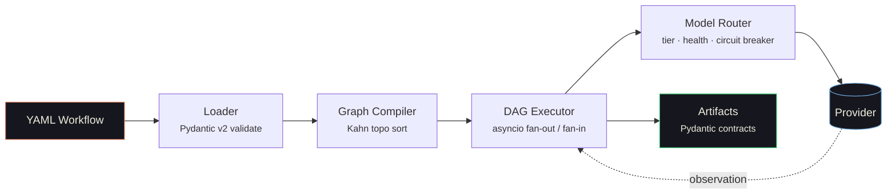

<div class="ember-hero" markdown="1">

<div class="hero-meta">
  <span class="eyebrow">
    <svg viewBox="0 0 24 24"><line x1="6" y1="3" x2="6" y2="15"></line><circle cx="18" cy="6" r="3"></circle><circle cx="6" cy="18" r="3"></circle><path d="M18 9a9 9 0 0 1-9 9"></path></svg>
    Multi-agent orchestration platform
  </span>
  <span class="status-badge">Actively maintained</span>
</div>

# Agentic Runtime Platform

<p class="hero-sub">Production-grade orchestration for multi-agent AI systems. Declarative YAML workflows compile to executable DAGs, route across eight LLM providers with health-aware failover, and are scored by rubric-based evaluation — observable end to end.</p>

<div class="hero-actions" markdown>
[Get started](getting-started/quickstart.md){ .md-button .md-button--primary }
[Read the architecture](ARCHITECTURE.md){ .md-button }
[View on GitHub](https://github.com/tafreeman/agentic-runtime-platform){ .md-button }
</div>

<div class="term">
  <span class="term-prompt">$</span>
  <span class="term-cmd">AGENTIC_NO_LLM=1 agentic run test_deterministic --input /tmp/test-input.json</span>
  <span class="term-comment"># zero-credential dev mode</span>
</div>

</div>

<div class="trusted-stack" markdown>
<span>Python 3.11+</span>
<span>FastAPI</span>
<span>Pydantic v2</span>
<span>LangGraph</span>
<span>React 19</span>
<span>OpenTelemetry</span>
<span>mypy --strict</span>
</div>

<p class="section-kicker">Get running</p>

## Quick start in 60 seconds

No API keys required. The runtime ships with a deterministic placeholder backend that exercises every code path the real models do.

```bash
# 1. Clone and install
git clone https://github.com/tafreeman/agentic-runtime-platform.git
cd agentic-runtime-platform/agentic-workflows-v2
pip install -e ".[dev,server]"

# 2. Enable zero-credential mode
export AGENTIC_NO_LLM=1   # Windows: $env:AGENTIC_NO_LLM=1

# 3. Create an input file (--input accepts a file path, not inline JSON)
echo '{"task":"hello"}' > /tmp/test-input.json

# 4. Run a workflow
agentic run test_deterministic --input /tmp/test-input.json
```

In under a minute you will see the DAG executor emit a structured run record — step timings, tool calls, and a final scored artifact. No provider credentials required.

[Full walkthrough](getting-started/quickstart.md){ .link-forward }

<p class="section-kicker">Pipeline</p>

## How it works

A workflow definition flows through a deterministic pipeline — YAML loader, graph compiler, DAG executor, model router — before reaching an LLM provider. Every stage emits OpenTelemetry traces and Pydantic-validated artifacts.



<p class="section-kicker">Capabilities</p>

## Built for production from the first commit

<div class="feature-grid" markdown>

<div class="feature-card" markdown>
<div class="fc-icon"><svg viewBox="0 0 24 24"><rect x="2" y="3" width="9" height="7" rx="1"></rect><rect x="13" y="14" width="9" height="7" rx="1"></rect><path d="M6.5 10v4a2 2 0 0 0 2 2H13"></path></svg></div>
<h3 class="fc-title">Dual execution engines</h3>
<p class="fc-body">Run any workflow through the native DAG executor or the LangGraph-backed engine. Both produce structurally equivalent output, and <code>agentic compare</code> diffs them side by side.</p>
[Architecture overview](ARCHITECTURE.md){ .fc-link }
</div>

<div class="feature-card" markdown>
<div class="fc-icon"><svg viewBox="0 0 24 24"><path d="M4 6h16"></path><path d="M4 12h10"></path><path d="M4 18h6"></path><circle cx="19" cy="15" r="3"></circle></svg></div>
<h3 class="fc-title">Tiered model routing</h3>
<p class="fc-body">Steps declare a capability tier, not a model name. The <code>SmartRouter</code> resolves the best available provider at runtime with circuit breakers, adaptive cooldowns, and automatic fallback chains.</p>
[Runtime engine](architecture-runtime.md){ .fc-link }
</div>

<div class="feature-card" markdown>
<div class="fc-icon"><svg viewBox="0 0 24 24"><circle cx="12" cy="12" r="9"></circle><path d="M3 12h18"></path><path d="M12 3a14 14 0 0 1 0 18a14 14 0 0 1 0-18"></path></svg></div>
<h3 class="fc-title">Eight LLM providers</h3>
<p class="fc-body">OpenAI, Anthropic, Gemini, Azure OpenAI, Azure AI Foundry, GitHub Models, Ollama, and local ONNX / Windows AI — all behind one client with per-provider bulkhead concurrency limits.</p>
[Tools &amp; providers](architecture-tools.md){ .fc-link }
</div>

<div class="feature-card" markdown>
<div class="fc-icon"><svg viewBox="0 0 24 24"><path d="M21 15a2 2 0 0 1-2 2H7l-4 4V5a2 2 0 0 1 2-2h14a2 2 0 0 1 2 2z"></path><path d="M8 9h8"></path><path d="M8 13h5"></path></svg></div>
<h3 class="fc-title">Full RAG pipeline</h3>
<p class="fc-body">Document loading, recursive chunking, deduplicated embedding, hybrid retrieval with Reciprocal Rank Fusion, cross-encoder and LLM reranking, and token-budget context assembly.</p>
[RAG pipeline](rag/index.md){ .fc-link }
</div>

<div class="feature-card" markdown>
<div class="fc-icon"><svg viewBox="0 0 24 24"><path d="M9 11l3 3l8-8"></path><path d="M20 12v6a2 2 0 0 1-2 2H6a2 2 0 0 1-2-2V6a2 2 0 0 1 2-2h9"></path></svg></div>
<h3 class="fc-title">Rubric-based evaluation</h3>
<p class="fc-body">YAML-defined rubrics with weighted criteria, LLM-as-judge integration, and 0.0–10.0 multidimensional scoring. Production gating is driven by <code>coverage_score &gt;= 0.80</code>, not string matches.</p>
[Evaluation framework](architecture-eval.md){ .fc-link }
</div>

<div class="feature-card" markdown>
<div class="fc-icon"><svg viewBox="0 0 24 24"><rect x="2" y="3" width="20" height="14" rx="2"></rect><path d="M8 21h8"></path><path d="M12 17v4"></path><path d="M7 10l3 3l5-6"></path></svg></div>
<h3 class="fc-title">Live dashboard</h3>
<p class="fc-body">A React 19 SPA streams execution events over WebSocket. DAG nodes animate through queued → running → complete in real time, with per-step drill-down into inputs, outputs, and timing.</p>
[UI dashboard](architecture-ui.md){ .fc-link }
</div>

<div class="feature-card" markdown>
<div class="fc-icon"><svg viewBox="0 0 24 24"><rect x="3" y="11" width="18" height="10" rx="2"></rect><path d="M7 11V7a5 5 0 0 1 10 0v4"></path></svg></div>
<h3 class="fc-title">Zero-credential dev mode</h3>
<p class="fc-body"><code>AGENTIC_NO_LLM=1</code> installs deterministic placeholder providers at both engine chokepoints. The full test suite passes without provider credentials — federal-friendly by default.</p>
[No-LLM dev mode](NO_LLM_MODE.md){ .fc-link }
</div>

<div class="feature-card" markdown>
<div class="fc-icon"><svg viewBox="0 0 24 24"><rect x="3" y="4" width="18" height="16" rx="2"></rect><path d="M3 9h18"></path><path d="M7 15l2 2l4-4"></path></svg></div>
<h3 class="fc-title">Windows-first support</h3>
<p class="fc-body">The runtime and all tooling are validated on Windows in CI. <code>scripts/setup-dev.ps1</code> is a one-command bring-up, and the Windows AI Bridge (Phi Silica) is first-class.</p>
[Development guide](development-guide.md){ .fc-link }
</div>

</div>

<p class="section-kicker">Metrics</p>

## By the numbers

<div class="stat-strip" markdown>
<div class="stat-item">
  <div class="stat-value">187K</div>
  <div class="stat-label">Lines of Python</div>
</div>
<div class="stat-item">
  <div class="stat-value">2,595</div>
  <div class="stat-label">Tests passing</div>
</div>
<div class="stat-item">
  <div class="stat-value">31</div>
  <div class="stat-label">ADRs</div>
</div>
<div class="stat-item">
  <div class="stat-value">8+</div>
  <div class="stat-label">LLM providers</div>
</div>
<div class="stat-item">
  <div class="stat-value">6</div>
  <div class="stat-label">Production workflows</div>
</div>
</div>

<p class="section-kicker">Workflows</p>

## Production workflow definitions

The engine ships with six production workflow definitions:

| Workflow | Pattern | Description |
|----------|---------|-------------|
| `code_review` | Fan-out / fan-in | Parse code → parallel architecture + quality reviews → synthesis |
| `bug_resolution` | Sequential with verification | Reproduce → root cause → fix → test → verify |
| `fullstack_generation` | Parallel sub-steps | API design → frontend + backend in parallel → integration |
| `iterative_review` | Multi-loop with bounded iteration | Review → feedback → revise until quality gates pass |
| `conditional_branching` | Conditional DAG | Steps execute or skip based on runtime conditions |
| `test_deterministic` | Tier-0 only | Deterministic step for testing without LLM calls |

[Workflow reference](workflows/index.md){ .link-forward }

<p class="section-kicker">Documentation</p>

## Where to go next

<div class="doc-grid" markdown>

<div class="doc-card" markdown>
<h3 class="dc-title">Getting started</h3>

- [Overview](getting-started/index.md) — install paths and the 60-second tour
- [Installation](getting-started/installation.md) — Python, Node, and provider setup
- [Quick Start](getting-started/quickstart.md) — your first workflow run, narrated
- [First Workflow](getting-started/first-workflow.md) — write a two-step DAG from scratch
- [Onboarding](ONBOARDING.md) — 5-minute to 1-hour onboarding path
</div>

<div class="doc-card" markdown>
<h3 class="dc-title">Architecture</h3>

- [Architecture Overview](ARCHITECTURE.md) — system map across the four packages
- [Runtime Engine](architecture-runtime.md) — DAG executor, model router, RAG pipeline
- [Evaluation Framework](architecture-eval.md) — rubrics, evaluators, runners
- [UI Dashboard](architecture-ui.md) — React 19 SPA and live streaming
- [Integration Architecture](integration-architecture.md) — cross-package contracts
</div>

<div class="doc-card" markdown>
<h3 class="dc-title">Deep dives</h3>

- [Server &amp; API](deep-dive-server.md) — FastAPI endpoints, WebSocket, auth middleware
- [Agents](deep-dive-agents.md) — agent lifecycle, personas, capability declarations
- [RAG Pipeline](rag/index.md) — ingestion, chunking, retrieval, reranking
- [Evaluation Engine](deep-dive-agentic-v2-eval.md) — standalone eval package internals
</div>

<div class="doc-card" markdown>
<h3 class="dc-title">Reference</h3>

- [Workflow Reference](workflows/index.md) — every production workflow described
- [Pattern Catalog](PATTERN_CATALOG.md) — reusable agentic patterns
- [API Contracts](api-contracts-runtime.md) — REST endpoint reference
- [ADR Index](adr/ADR-INDEX.md) — every architecture decision, dated and rationalized
- [Known Limitations](KNOWN_LIMITATIONS.md) — honest accounting of caveats
</div>

</div>

<div class="cta-card" markdown>
### Read the architecture deep-dive

The runtime engine combines two execution backends, an adapter registry, a tiered model router, and a full RAG pipeline. The architecture document is the canonical map of how those pieces fit together.

[Open the architecture overview](ARCHITECTURE.md){ .md-button .md-button--primary }
</div>
