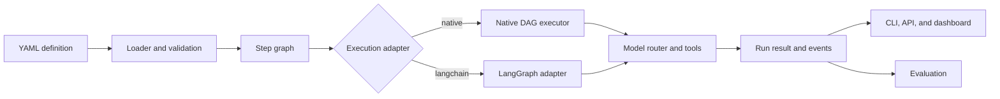

# Agentic Runtime Platform

Agentic Runtime Platform runs YAML-defined AI workflows. Each workflow is a
directed acyclic graph: steps declare their inputs, outputs, and dependencies;
the runtime schedules ready steps, runs independent work concurrently, and
prevents downstream steps from using failed or missing outputs.

The repository includes a Python runtime and CLI, a FastAPI server, a React
dashboard, an evaluation package, and shared model utilities. It supports
local development without provider credentials and real provider calls when
credentials are configured.

[Run the quick start](getting-started/quickstart.md){ .md-button .md-button--primary }
[Read the architecture](ARCHITECTURE.md){ .md-button }
[Check known limitations](KNOWN_LIMITATIONS.md){ .md-button }

## Quick start

Install the workspace:

```bash
git clone https://github.com/tafreeman/agentic-runtime-platform.git
cd agentic-runtime-platform
just setup
```

Create a JSON input file and run the deterministic workflow:

```bash
printf '{"input_text":"Hello World"}\n' > /tmp/agentic-input.json
AGENTIC_NO_LLM=1 agentic run test_deterministic \
  --input /tmp/agentic-input.json
```

PowerShell:

```powershell
'{"input_text":"Hello World"}' |
  Set-Content -Encoding utf8 .\agentic-input.json
$env:AGENTIC_NO_LLM = "1"
agentic run test_deterministic --input .\agentic-input.json
```

Expected result: `Status: SUCCESS`. The input option accepts a file path, not
inline JSON.

`AGENTIC_NO_LLM=1` replaces model calls with a fixed response. It verifies
workflow structure, server integration, and event streaming. It does not
verify response quality or structured model output.

[Detailed quick start](getting-started/quickstart.md)

## Choose a starting point

| Goal | Read |
|---|---|
| Install the runtime or UI | [Installation](getting-started/installation.md) |
| Learn every CLI command | [CLI reference](cli-reference.md) |
| Write a YAML workflow | [First workflow](getting-started/first-workflow.md) |
| Understand engine behavior | [Architecture](ARCHITECTURE.md) |
| Integrate with the API | [Runtime API contracts](api-contracts-runtime.md) |
| Configure providers and security | [Configuration](configuration.md) |
| Evaluate workflow output | [Evaluation architecture](architecture-eval.md) |
| Deploy or troubleshoot the service | [Operations](operations/index.md) |

## How a run works



Named YAML workflows default to the LangGraph adapter. Pass
`--adapter native` for the built-in DAG engine. Runtime-generated `DAG` and
`Pipeline` objects use the native engine. Both engines remain supported.

## Main capabilities

### Workflow execution

- YAML input and output contracts
- Dependency-aware scheduling
- Concurrent branches and fan-in
- Conditional steps and bounded loops
- Retries, timeouts, and failure propagation
- Run records plus SSE and WebSocket events

### Model and tool control

- Capability-tier routing across configured providers
- Health tracking, fallback chains, and circuit breakers
- Explicit tool allowlists
- Approval checks for high-impact tools
- File path containment and outbound URL checks

Approval-required calls are denied when no approval provider is registered.
This is safer than silently running the tool, but it also means a deployment
must connect an approval provider before those calls can succeed.

### Evaluation

- YAML-defined rubrics
- Objective metrics that run without a model
- Batch and streaming runners
- Optional LLM-as-judge scoring
- JSON, Markdown, and HTML reports

## Repository numbers

These values are generated from the current source tree:

<div class="stat-strip" markdown>
<div class="stat-item">
  <div class="stat-value">3,825</div>
  <div class="stat-label">Backend tests</div>
</div>
<div class="stat-item">
  <div class="stat-value">80%</div>
  <div class="stat-label">Coverage gate, CI-enforced</div>
</div>
<div class="stat-item">
  <div class="stat-value">53</div>
  <div class="stat-label">ADRs</div>
</div>
<div class="stat-item">
  <div class="stat-value">6</div>
  <div class="stat-label">Production workflows</div>
</div>
</div>

53 architecture decision records capture accepted, rejected, superseded, and
proposed choices. The [ADR index](adr/ADR-INDEX.md) is the source of truth for
their status.

The test count is a static count of Python test functions. It is not a claim
that every test passed in the latest local run. Check the repository's
[CI workflow](https://github.com/tafreeman/agentic-runtime-platform/actions/workflows/ci.yml)
for current hosted results.

## Development commands

Run these from the repository root:

```bash
just test
just docs
pre-commit run --all-files
npm --prefix agentic-workflows-v2/ui run build
```

The docs check validates selected file references and verifies that the numbers
above match the source. The published site is also built with MkDocs strict
mode in the documentation workflow.

## Scope and limitations

The repository includes controls needed for serious development and testing,
but deployment still requires operator decisions:

- configure API-key or OIDC authentication;
- place shared rate limiting at the edge for multiple replicas;
- choose durable stores for run and retrieval data;
- register an approval provider for approval-required tools;
- apply network-level egress controls for high-assurance environments;
- run provider-specific integration tests for every configured provider.

Review [Known limitations](KNOWN_LIMITATIONS.md),
[Security hardening](operations/security-hardening.md), and
[Deployment](deployment-guide.md) before exposing the service.
