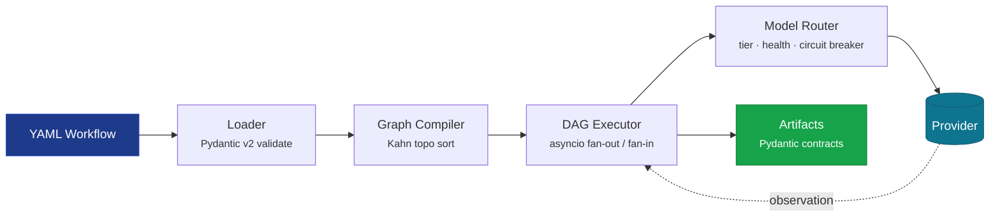

<div class="ember-hero" markdown="1">

<a href="https://github.com/tafreeman" class="hero-back-link">
  <svg viewBox="0 0 24 24" width="12" height="12" stroke="currentColor" fill="none" stroke-width="2" stroke-linecap="round" stroke-linejoin="round"><polyline points="15 18 9 12 15 6"></polyline></svg>
  tafreeman
</a>

<div class="eyebrow">
  <svg viewBox="0 0 24 24"><line x1="6" y1="3" x2="6" y2="15"></line><circle cx="18" cy="6" r="3"></circle><circle cx="6" cy="18" r="3"></circle><path d="M18 9a9 9 0 0 1-9 9"></path></svg>
  Multi-agent orchestration platform
</div>

<span class="status-badge">Active</span>

# Agentic Runtime Platform

<p class="hero-sub">Declarative YAML workflows compiled to executable DAGs. Tiered model routing across 8+ providers with circuit-breaker failover. Rubric-based LLM evaluation and live SSE/WebSocket observability.</p>

<div class="term">
  <span class="term-prompt">$</span>
  <span class="term-cmd">AGENTIC_NO_LLM=1 agentic run test_deterministic --input /tmp/test-input.json</span>
  <span class="term-comment"># zero-credential dev mode</span>
</div>

</div>

[Quick Start](getting-started/quickstart.md){ .md-button .md-button--primary }
[Architecture](ARCHITECTURE.md){ .md-button }
[GitHub](https://github.com/tafreeman/agentic-runtime-platform){ .md-button }

<div class="trusted-stack" markdown>
<span>Python 3.11+</span>
<span>FastAPI</span>
<span>Pydantic v2</span>
<span>LangGraph</span>
<span>React 19</span>
<span>OpenTelemetry</span>
<span>mypy --strict</span>
</div>

---

## Quick start in 60 seconds

No API keys required. The runtime ships with a deterministic placeholder backend that exercises every code path the real models do.

```bash
# 1. Clone and install
git clone https://github.com/tafreeman/agentic-runtime-platform.git
cd agentic-runtime-platform/agentic-workflows-v2
pip install -e ".[dev,server]"

# 2. Enable zero-credential mode
export AGENTIC_NO_LLM=1   # Windows: $env:AGENTIC_NO_LLM=1

# 3. Create an input file (--input accepts a file path, not inline JSON)
echo '{"task":"hello"}' > /tmp/test-input.json

# 4. Run a workflow
agentic run test_deterministic --input /tmp/test-input.json
```

In under a minute you will see the DAG executor emit a structured run record — step timings, tool calls, and a final scored artifact. No provider credentials required.

[Full walkthrough](getting-started/quickstart.md)

---

## How it works

A workflow definition flows through a deterministic pipeline — YAML loader, graph compiler, DAG executor, model router — before reaching an LLM provider. Every stage emits OpenTelemetry traces and Pydantic-validated artifacts.



---

## Feature highlights

### Dual execution engines

Every workflow YAML definition can run through either the native DAG executor (`engine/`) or the LangGraph-backed engine (`langchain/`). Both produce structurally equivalent output. The `agentic compare` command diffs them side-by-side. The `AdapterRegistry` singleton maps engine names to `ExecutionEngine` protocol implementations — swap engines without touching workflow code.

### Tiered model routing

Model names change, endpoints go down, pricing shifts. Each agent step is assigned a **capability tier** rather than a specific model. The `SmartRouter` resolves tiers to the best available provider at runtime, with health-weighted selection, adaptive cooldowns, circuit breakers, per-provider bulkhead concurrency limits, and automatic fallback chains:

```
Tier 3: gemini-2.5-flash → gh:gpt-4o → openai:gpt-4o → anthropic:claude-sonnet
```

Eight providers supported: OpenAI, Anthropic, Gemini, Azure OpenAI, Azure AI Foundry, GitHub Models, Ollama, and local ONNX/Windows AI (Phi Silica).

### Full RAG pipeline

`agentic_v2/rag/` is a complete retrieval-augmented generation pipeline: document loading (PDF, DOCX, Markdown, code), recursive chunking, content-hash-deduplicated embedding, cosine similarity vector store, BM25 keyword indexing, hybrid retrieval with Reciprocal Rank Fusion, cross-encoder and LLM reranking, and token-budget context assembly. Every stage is instrumented with OpenTelemetry spans.

### Rubric-based evaluation

LLM outputs resist binary pass/fail evaluation. The `agentic-v2-eval` package provides YAML-defined rubrics with weighted criteria, multidimensional scoring (S/A/B/C/D/F tiers), LLM-as-judge integration, and 0.0–10.0 scoring across eight rubric profiles. Production gating is driven by `coverage_score >= 0.80` — not string-match assertions.

### React 19 live dashboard

The React 19 SPA streams workflow execution events over WebSocket. DAG nodes animate through queued → running → complete / error states in real time. A drill-down panel on each node shows inputs, outputs, timing, and errors as the step executes. TanStack Query manages all server state; `@xyflow/react` renders interactive DAG visualizations.

### Zero-credential development mode

`AGENTIC_NO_LLM=1` installs deterministic placeholder providers at both engine chokepoints. CLI, server, and dashboard requests still default to the LangGraph adapter for named YAML workflows unless `--adapter native` or request `adapter: "native"` is supplied; runtime-generated DAGs default to the native engine. The full test suite passes without provider credentials. Federal-friendly by default.

### Windows-first support

The runtime and all tooling are validated on Windows in CI. `scripts/setup-dev.ps1` provides a one-command bring-up. PowerShell paths, Windows Unicode CLI output, and the Windows AI Bridge (Phi Silica) are all first-class.

---

---

## By the numbers

<div class="stat-strip" markdown>
<div class="stat-item">
  <div class="stat-value">187K</div>
  <div class="stat-label">Lines of Python</div>
</div>
<div class="stat-item">
  <div class="stat-value">2,595</div>
  <div class="stat-label">Tests passing</div>
</div>
<div class="stat-item">
  <div class="stat-value">17</div>
  <div class="stat-label">ADRs</div>
</div>
<div class="stat-item">
  <div class="stat-value">8+</div>
  <div class="stat-label">LLM providers</div>
</div>
<div class="stat-item">
  <div class="stat-value">6</div>
  <div class="stat-label">Production workflows</div>
</div>
</div>

---

## Production workflow definitions

The engine ships with six production workflow definitions:

| Workflow | Pattern | Description |
|----------|---------|-------------|
| `code_review` | Fan-out / fan-in | Parse code → parallel architecture + quality reviews → synthesis |
| `bug_resolution` | Sequential with verification | Reproduce → root cause → fix → test → verify |
| `fullstack_generation` | Parallel sub-steps | API design → frontend + backend in parallel → integration |
| `iterative_review` | Multi-loop with bounded iteration | Review → feedback → revise until quality gates pass |
| `conditional_branching` | Conditional DAG | Steps execute or skip based on runtime conditions |
| `test_deterministic` | Tier-0 only | Deterministic step for testing without LLM calls |

---

## Project structure

```
agentic-runtime-platform/
├── agentic-workflows-v2/    # Core runtime (Python 3.11+)
│   ├── agentic_v2/          # Execution engine, agents, models, RAG, server
│   ├── ui/                  # React 19 dashboard
│   └── tests/               # 100+ test files
├── agentic-v2-eval/         # Standalone evaluation framework
├── tools/                   # Shared LLM client, benchmarks, utilities
└── docs/                    # Architecture, guides, ADRs, audit reports
```

---

## Where to go next

### Getting started

- **[Overview](getting-started/index.md)** — install paths and the 60-second tour
- **[Installation](getting-started/installation.md)** — Python, Node, and provider setup
- **[Quick Start](getting-started/quickstart.md)** — your first workflow run, narrated
- **[First Workflow](getting-started/first-workflow.md)** — write a two-step DAG from scratch
- **[No-LLM Dev Mode](NO_LLM_MODE.md)** — zero-credential development
- **[Onboarding](ONBOARDING.md)** — 5-minute to 1-hour onboarding path

### Architecture

- **[Architecture Overview](ARCHITECTURE.md)** — system map across the four packages
- **[Runtime Engine](architecture-runtime.md)** — DAG executor, model router, RAG pipeline
- **[Evaluation Framework](architecture-eval.md)** — rubrics, evaluators, runners
- **[Tools & Providers](architecture-tools.md)** — multi-provider LLM client and tool registry
- **[UI Dashboard](architecture-ui.md)** — React 19 SPA and live streaming
- **[Integration Architecture](integration-architecture.md)** — cross-package contracts

### Deep dives

- **[Server & API](deep-dive-server.md)** — FastAPI endpoints, WebSocket, auth middleware
- **[Agents](deep-dive-agents.md)** — agent lifecycle, personas, capability declarations
- **[RAG Pipeline](rag/index.md)** — ingestion, chunking, retrieval, reranking
- **[Evaluation Engine](deep-dive-agentic-v2-eval.md)** — standalone eval package internals

### Reference

- **[Workflow Reference](workflows/index.md)** — every production workflow described
- **[Pattern Catalog](PATTERN_CATALOG.md)** — reusable agentic patterns
- **[API Contracts](api-contracts-runtime.md)** — REST endpoint reference
- **[Glossary](GLOSSARY.md)** — terminology used across the docs
- **[ADR Index](adr/ADR-INDEX.md)** — every architecture decision, dated and rationalized
- **[Roadmap](ROADMAP.md)** — what is shipped, in flight, and proposed
- **[Known Limitations](KNOWN_LIMITATIONS.md)** — honest accounting of caveats

---

<div class="cta-card" markdown>
### Read the architecture deep-dive

The runtime engine combines two execution backends, an adapter registry, a tiered model router, and a full RAG pipeline. The architecture document is the canonical map of how those pieces fit together.

[Open the architecture overview](ARCHITECTURE.md){ .md-button .md-button--primary }
</div>
