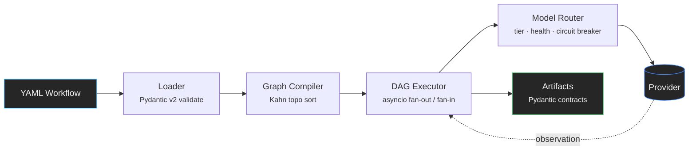

<div class="console-hero" markdown="1">
<div class="hero-inner" markdown="1">

<div class="hero-meta">
  <span class="hero-eyebrow">L2 · platform · multi-agent orchestration</span>
  <span class="status-tag">status: active</span>
</div>

# Agentic Runtime Platform

<p class="hero-sub">Declarative YAML workflows compile to executable DAGs — tiered routing across eight LLM providers, rubric-scored evaluation, and OpenTelemetry on every stage. Deterministic core; the LLM sits at the boundary. Built solo to production discipline: every consequential decision has an ADR, every quality gate is enforced in CI.</p>

<div class="hero-actions" markdown>
[Get started](getting-started/quickstart.md){ .md-button .md-button--primary }
[Read the architecture](ARCHITECTURE.md){ .md-button }
[View source](https://github.com/tafreeman/agentic-runtime-platform){ .md-button }
</div>

<div class="term">
  <span class="term-prompt">$</span>
  <span class="term-cmd">AGENTIC_NO_LLM=1 agentic run test_deterministic --input /tmp/test-input.json</span>
  <span class="term-comment"># zero-credential dev mode</span>
</div>

</div>
</div>

<div class="trusted-stack" markdown>
<span>Python 3.11+</span>
<span>FastAPI</span>
<span>Pydantic v2</span>
<span>LangGraph</span>
<span>React 19</span>
<span>OpenTelemetry</span>
<span>mypy --strict</span>
</div>

<p class="section-kicker">get running</p>

## Quick start in 60 seconds

No API keys required. The runtime ships with a deterministic placeholder backend that exercises every code path the real models do.

```bash
# 1. Clone and install
git clone https://github.com/tafreeman/agentic-runtime-platform.git
cd agentic-runtime-platform/agentic-workflows-v2
pip install -e ".[dev,server]"

# 2. Enable zero-credential mode
export AGENTIC_NO_LLM=1   # Windows: $env:AGENTIC_NO_LLM=1

# 3. Create an input file (--input accepts a file path, not inline JSON)
echo '{"task":"hello"}' > /tmp/test-input.json

# 4. Run a workflow
agentic run test_deterministic --input /tmp/test-input.json
```

In under a minute the DAG executor emits a structured run record — step timings, tool calls, and a final scored artifact.

[Full walkthrough](getting-started/quickstart.md){ .link-forward }

---

<p class="section-kicker">pipeline</p>

## How it works

A workflow definition flows through a deterministic pipeline — YAML loader, graph compiler, DAG executor, model router — before reaching an LLM provider. Every stage emits OpenTelemetry traces and Pydantic-validated artifacts.



---

<p class="section-kicker">capabilities</p>

## Capabilities

<div class="feature-grid" markdown>

<div class="feature-card" markdown>
<div class="fc-icon"><svg fill="currentColor" xmlns="http://www.w3.org/2000/svg" viewBox="0 0 32 32"><path d="m20,6c0,1.8587,1.2795,3.4109,3,3.858v4.142c0,1.6543-1.3457,3-3,3h-8c-1.1299,0-2.1617.391-3,1.0256v-8.1676c1.7203-.4471,3-1.9993,3-3.858,0-2.2061-1.7944-4-4-4s-4,1.7939-4,4c0,1.8587,1.2797,3.4108,3,3.858v12.142s0,.142,0,.142c-1.7203.4473-3,1.9997-3,3.858,0,2.2056,1.7944,4,4,4s4-1.7944,4-4c0-1.8583-1.2797-3.4107-3-3.858v-.142c0-1.6543,1.3457-3,3-3h8c2.7568,0,5-2.2432,5-5v-4.142c1.7205-.4471,3-1.9993,3-3.858,0-2.2061-1.7939-4-4-4s-4,1.7939-4,4Zm-14,0c0-1.1025.897-2,2-2s2,.8975,2,2c0,1.1025-.897,2-2,2s-2-.8975-2-2Zm4,20c0,1.103-.897,2-2,2s-2-.897-2-2,.897-2,2-2,2,.897,2,2ZM26,6c0,1.1025-.8975,2-2,2s-2-.8975-2-2c0-1.1025.8975-2,2-2s2,.8975,2,2Z"></path></svg></div>
<h3 class="fc-title">Dual execution engines</h3>
<p class="fc-body">Run any workflow through the native DAG executor or the LangGraph-backed engine. Both produce structurally equivalent output; <code>agentic compare</code> diffs them side by side.</p>
[Architecture overview](ARCHITECTURE.md){ .fc-link }
</div>

<div class="feature-card" markdown>
<div class="fc-icon"><svg fill="currentColor" xmlns="http://www.w3.org/2000/svg" viewBox="0 0 32 32"><path d="M27,22.14V17a2,2,0,0,0-2-2H17V9.86a4,4,0,1,0-2,0V15H7a2,2,0,0,0-2,2v5.14a4,4,0,1,0,2,0V17H25v5.14a4,4,0,1,0,2,0ZM8,26a2,2,0,1,1-2-2A2,2,0,0,1,8,26ZM14,6a2,2,0,1,1,2,2A2,2,0,0,1,14,6ZM26,28a2,2,0,1,1,2-2A2,2,0,0,1,26,28Z"></path></svg></div>
<h3 class="fc-title">Tiered model routing</h3>
<p class="fc-body">Steps declare a capability tier, not a model name. The <code>SmartRouter</code> resolves the best available provider at runtime — circuit breakers, adaptive cooldowns, automatic fallback chains.</p>
[Runtime engine](architecture-runtime.md){ .fc-link }
</div>

<div class="feature-card" markdown>
<div class="fc-icon"><svg fill="currentColor" xmlns="http://www.w3.org/2000/svg" viewBox="0 0 32 32"><path d="M30,30H22V22h8Zm-6-2h4V24H24Z"></path><path d="M20,27H8A6,6,0,0,1,8,15h2v2H8a4,4,0,0,0,0,8H20Z"></path><path d="M20,20H12V12h8Zm-6-2h4V14H14Z"></path><path d="M24,17H22V15h2a4,4,0,0,0,0-8H12V5H24a6,6,0,0,1,0,12Z"></path><path d="M10,10H2V2h8ZM4,8H8V4H4Z"></path></svg></div>
<h3 class="fc-title">Eight LLM providers</h3>
<p class="fc-body">OpenAI, Anthropic, Gemini, Azure OpenAI, Azure AI Foundry, GitHub Models, Ollama, and local ONNX / Windows AI — one client, per-provider bulkhead concurrency limits.</p>
[Tools & providers](architecture-tools.md){ .fc-link }
</div>

<div class="feature-card" markdown>
<div class="fc-icon"><svg fill="currentColor" xmlns="http://www.w3.org/2000/svg" viewBox="0 0 32 32"><path d="M26,2H8A2,2,0,0,0,6,4V8H4v2H6v5H4v2H6v5H4v2H6v4a2,2,0,0,0,2,2H26a2,2,0,0,0,2-2V4A2,2,0,0,0,26,2Zm0,26H8V24h2V22H8V17h2V15H8V10h2V8H8V4H26Z" transform="translate(0 0)"></path><rect x="14" y="8" width="8" height="2"></rect><rect x="14" y="15" width="8" height="2"></rect><rect x="14" y="22" width="8" height="2"></rect></svg></div>
<h3 class="fc-title">Full RAG pipeline</h3>
<p class="fc-body">Document loading, recursive chunking, deduplicated embedding, hybrid retrieval with Reciprocal Rank Fusion, cross-encoder and LLM reranking, token-budget context assembly.</p>
[RAG pipeline](rag/index.md){ .fc-link }
</div>

<div class="feature-card" markdown>
<div class="fc-icon"><svg fill="currentColor" xmlns="http://www.w3.org/2000/svg" viewBox="0 0 32 32"><polygon points="13 24 4 15 5.414 13.586 13 21.171 26.586 7.586 28 9 13 24"></polygon></svg></div>
<h3 class="fc-title">Rubric-based evaluation</h3>
<p class="fc-body">YAML-defined rubrics with weighted criteria and LLM-as-judge integration — each criterion scored on a normalized 0–1 scale, then weighted into a composite. Production gating is <code>coverage_score >= 0.80</code> — not string matches.</p>
[Evaluation framework](architecture-eval.md){ .fc-link }
</div>

<div class="feature-card" markdown>
<div class="fc-icon"><svg fill="currentColor" xmlns="http://www.w3.org/2000/svg" viewBox="0 0 32 32"><path d="M7,28a1,1,0,0,1-1-1V5a1,1,0,0,1,1.4819-.8763l20,11a1,1,0,0,1,0,1.7525l-20,11A1.0005,1.0005,0,0,1,7,28ZM8,6.6909V25.3088L24.9248,16Z" transform="translate(0)"></path></svg></div>
<h3 class="fc-title">Live dashboard</h3>
<p class="fc-body">A React 19 SPA streams execution events over WebSocket. DAG nodes move through queued → running → complete in real time, with per-step drill-down into inputs, outputs, and timing.</p>
[UI dashboard](architecture-ui.md){ .fc-link }
</div>

<div class="feature-card" markdown>
<div class="fc-icon"><svg fill="currentColor" xmlns="http://www.w3.org/2000/svg" viewBox="0 0 32 32"><path d="M26,4H6A2,2,0,0,0,4,6V26a2,2,0,0,0,2,2H26a2,2,0,0,0,2-2V6A2,2,0,0,0,26,4Zm0,2v4H6V6ZM6,26V12H26V26Z" transform="translate(0 0.01)"></path><polygon points="10.76 16.18 13.58 19.01 10.76 21.84 12.17 23.25 16.41 19.01 12.17 14.77 10.76 16.18"></polygon></svg></div>
<h3 class="fc-title">Zero-credential dev mode</h3>
<p class="fc-body"><code>AGENTIC_NO_LLM=1</code> installs deterministic placeholder providers at both engine chokepoints. The full test suite passes with zero provider credentials.</p>
[No-LLM dev mode](NO_LLM_MODE.md){ .fc-link }
</div>

<div class="feature-card" markdown>
<div class="fc-icon"><svg fill="currentColor" xmlns="http://www.w3.org/2000/svg" viewBox="0 0 32 32"><path d="M27,16.76c0-.25,0-.5,0-.76s0-.51,0-.77l1.92-1.68A2,2,0,0,0,29.3,11L26.94,7a2,2,0,0,0-1.73-1,2,2,0,0,0-.64.1l-2.43.82a11.35,11.35,0,0,0-1.31-.75l-.51-2.52a2,2,0,0,0-2-1.61H13.64a2,2,0,0,0-2,1.61l-.51,2.52a11.48,11.48,0,0,0-1.32.75L7.43,6.06A2,2,0,0,0,6.79,6,2,2,0,0,0,5.06,7L2.7,11a2,2,0,0,0,.41,2.51L5,15.24c0,.25,0,.5,0,.76s0,.51,0,.77L3.11,18.45A2,2,0,0,0,2.7,21L5.06,25a2,2,0,0,0,1.73,1,2,2,0,0,0,.64-.1l2.43-.82a11.35,11.35,0,0,0,1.31.75l.51,2.52a2,2,0,0,0,2,1.61h4.72a2,2,0,0,0,2-1.61l.51-2.52a11.48,11.48,0,0,0,1.32-.75l2.42.82a2,2,0,0,0,.64.1,2,2,0,0,0,1.73-1L29.3,21a2,2,0,0,0-.41-2.51ZM25.21,24l-3.43-1.16a8.86,8.86,0,0,1-2.71,1.57L18.36,28H13.64l-.71-3.55a9.36,9.36,0,0,1-2.7-1.57L6.79,24,4.43,20l2.72-2.4a8.9,8.9,0,0,1,0-3.13L4.43,12,6.79,8l3.43,1.16a8.86,8.86,0,0,1,2.71-1.57L13.64,4h4.72l.71,3.55a9.36,9.36,0,0,1,2.7,1.57L25.21,8,27.57,12l-2.72,2.4a8.9,8.9,0,0,1,0,3.13L27.57,20Z" transform="translate(0 0)"></path><path d="M16,22a6,6,0,1,1,6-6A5.94,5.94,0,0,1,16,22Zm0-10a3.91,3.91,0,0,0-4,4,3.91,3.91,0,0,0,4,4,3.91,3.91,0,0,0,4-4A3.91,3.91,0,0,0,16,12Z" transform="translate(0 0)"></path></svg></div>
<h3 class="fc-title">Windows-first support</h3>
<p class="fc-body">Runtime and tooling validated on Windows in CI. <code>scripts/setup-dev.ps1</code> is a one-command bring-up; the Windows AI Bridge (Phi Silica) is first-class.</p>
[Development guide](development-guide.md){ .fc-link }
</div>

</div>

---

<p class="section-kicker">metrics</p>

## By the numbers

<div class="stat-strip" markdown>
<div class="stat-item">
  <div class="stat-value">187K</div>
  <div class="stat-label">Lines of Python</div>
</div>
<div class="stat-item">
  <div class="stat-value">3,955</div>
  <div class="stat-label">Backend tests</div>
</div>
<div class="stat-item">
  <div class="stat-value">80%</div>
  <div class="stat-label">Coverage gate, CI-enforced</div>
</div>
<div class="stat-item">
  <div class="stat-value">50</div>
  <div class="stat-label">ADRs</div>
</div>
<div class="stat-item">
  <div class="stat-value">8</div>
  <div class="stat-label">LLM providers</div>
</div>
<div class="stat-item">
  <div class="stat-value">6</div>
  <div class="stat-label">Production workflows</div>
</div>
</div>

---

<p class="section-kicker">engineering practice</p>

## Engineering practice

Everything below is committed, versioned, and CI-enforced.

<div class="feature-grid practice-grid" markdown>

<div class="feature-card" markdown>
<h3 class="fc-title">A written decision record</h3>
<p class="fc-body">50 architecture decision records capture context, alternatives, and consequences for every consequential choice — engine adapters, wire-format contracts, storage backends, security boundaries. The reasoning is reviewable, not reconstructed.</p>
[ADR index](adr/ADR-INDEX.md){ .fc-link }
</div>

<div class="feature-card" markdown>
<h3 class="fc-title">Correctness gated in CI</h3>
<p class="fc-body">An 80% coverage gate (79.93% fails — no rounding up), ruff and strict mypy on the engine and contracts, and a wire-format drift job that regenerates JSON schemas and TypeScript types and fails on any mismatch.</p>
[Contributing &amp; gates](CONTRIBUTING.md){ .fc-link }
</div>

<div class="feature-card" markdown>
<h3 class="fc-title">Proven under load</h3>
<p class="fc-body">The Redis-CAS circuit breaker and horizontal scale-out are load-tested with k6 against a multi-replica stack, and the report is generated from committed results — numbers, not adjectives.</p>
[Load proof](load-report.md){ .fc-link }
</div>

<div class="feature-card" markdown>
<h3 class="fc-title">Governance, honestly scoped</h3>
<p class="fc-body">A living NIST AI RMF alignment document, an OWASP-informed threat model, security hardening notes, and a maintained known-limitations page that says plainly what this platform does not do.</p>
[AI risk management](AI_RISK_MANAGEMENT.md){ .fc-link }
</div>

</div>

---

<p class="section-kicker">workflows</p>

## Production workflow definitions

The engine ships with six production workflow definitions:

| Workflow | Pattern | Description |
|----------|---------|-------------|
| `code_review` | Fan-out / fan-in | Parse code → parallel architecture + quality reviews → synthesis |
| `bug_resolution` | Sequential with verification | Reproduce → root cause → fix → test → verify |
| `fullstack_generation` | Parallel sub-steps | API design → frontend + backend in parallel → integration |
| `iterative_review` | Multi-loop with bounded iteration | Review → feedback → revise until quality gates pass |
| `conditional_branching` | Conditional DAG | Steps execute or skip based on runtime conditions |
| `test_deterministic` | Tier-0 only | Deterministic step for testing without LLM calls |

[Workflow reference](workflows/index.md){ .link-forward }

---

<p class="section-kicker">documentation</p>

## Further reading

<div class="doc-grid" markdown>

<div class="doc-card" markdown>
<h3 class="dc-title">Getting started</h3>

- [Overview](getting-started/index.md) — install paths and the 60-second tour
- [Installation](getting-started/installation.md) — Python, Node, and provider setup
- [Quick start](getting-started/quickstart.md) — your first workflow run, narrated
- [First workflow](getting-started/first-workflow.md) — write a two-step DAG from scratch
- [Onboarding](ONBOARDING.md) — 5-minute to 1-hour onboarding path
</div>

<div class="doc-card" markdown>
<h3 class="dc-title">Architecture</h3>

- [Architecture overview](ARCHITECTURE.md) — system map across the four packages
- [Runtime engine](architecture-runtime.md) — DAG executor, model router, RAG pipeline
- [Evaluation framework](architecture-eval.md) — rubrics, evaluators, runners
- [UI dashboard](architecture-ui.md) — React 19 SPA and live streaming
- [Integration architecture](integration-architecture.md) — cross-package contracts
</div>

<div class="doc-card" markdown>
<h3 class="dc-title">Deep dives</h3>

- [Server & API](deep-dive-server.md) — FastAPI endpoints, WebSocket, auth middleware
- [Agents](deep-dive-agents.md) — agent lifecycle, personas, capability declarations
- [RAG pipeline](rag/index.md) — ingestion, chunking, retrieval, reranking
- [Evaluation engine](deep-dive-agentic-v2-eval.md) — standalone eval package internals
</div>

<div class="doc-card" markdown>
<h3 class="dc-title">Reference</h3>

- [Workflow reference](workflows/index.md) — every production workflow described
- [Pattern catalog](PATTERN_CATALOG.md) — reusable agentic patterns
- [API contracts](api-contracts-runtime.md) — REST endpoint reference
- [ADR index](adr/ADR-INDEX.md) — every architecture decision, dated and rationalized
- [Security hardening](operations/security-hardening.md) — operational security posture
- [Known limitations](KNOWN_LIMITATIONS.md) — honest accounting of caveats
</div>

</div>
