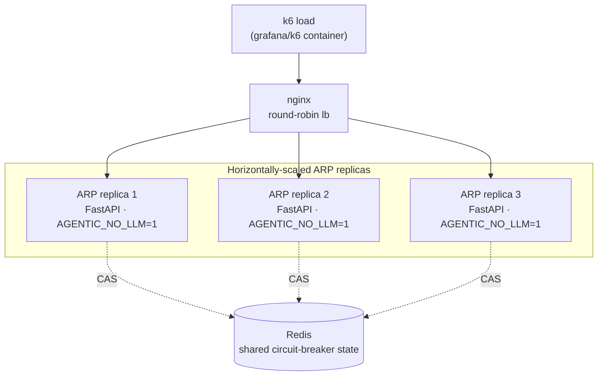

# Load proof: Redis-CAS + horizontal scale

!!! abstract "Auto-generated — do not hand-edit"
    Every number on this page is derived by `scripts/build_load_report.py` from the committed k6 JSON in `load/results/`. Re-run `bash load/run_load.sh` then the generator to refresh it. Evidence captured **2026-06-14 03:48 UTC**.

This page turns ARP's Redis-CAS circuit-breaker and horizontal-scale engineering from *described in code* into *proven with real numbers*. The proof runs locally and free (the `grafana/k6` image hammering a multi-replica `docker compose` stack with `AGENTIC_NO_LLM=1`); only the resulting JSON is published here.

## Topology



Redis is **external shared state on purpose.** Each ARP replica keeps an in-process circuit-breaker tally, but the *authoritative* per-model counters live in Redis. When a replica records a success/failure it persists only its **delta** via an atomic Compare-And-Swap (read-modify-write) keyed on the current value. If two replicas write concurrently, the CAS loser re-reads and re-merges its delta on top of the winner's value, so the persisted counter reflects **every** replica's contribution. That is why the shared counter stays exactly consistent under concurrent multi-replica load — no double-count, no lost update — which a per-replica in-memory tally could never guarantee.

## Scale / throughput: 1 vs N replicas

| Metric | 1 replica(s) | 3 replica(s) | Scale delta (N vs 1) |
|---|---|---|---|
| Total requests | 16,414 | 34,642 | — |
| Throughput (req/s) | 250.74 | 565.37 | 2.25x |
| Runs accepted (POST /api/run) | 8,207 | 17,321 | 2.11x |
| p50 latency | 56.27 ms | 18.36 ms | — |
| p95 latency | 120.53 ms | 95.55 ms | — |
| p99 latency | 162.08 ms | 127.77 ms | — |
| Avg latency | 180.47 ms | 92.19 ms | — |
| Max VUs | 25 | 25 | — |
| Error rate | 0.00% | 0.00% | — |

Both runs use the identical ramping-VU k6 profile against the same nginx round-robin; the only variable is the replica count, so the throughput delta is attributable to horizontal scale.

## Redis-CAS shared-counter consistency

**Live exact-sum CAS experiment** — 4 independent workers (each its own router + Redis store, all sharing the one Redis the replicas use) each recorded **50** failures on the same model and persisted concurrently through the production CAS read-modify-write path.

| Quantity | Value |
|---|---|
| Concurrent CAS writers | 4 |
| Failures recorded per writer | 50 |
| **Expected** persisted `failure_count` | **200** |
| **Observed** persisted `failure_count` | **200** |
| Lost / double-counted | 0 |
| Result | **✅ CONSISTENT** |

!!! note "Why the exact-sum experiment is the primary signal"
    The orchestration accept path (`POST /api/run`) drives the shared circuit-breaker counters only when a workflow run reaches the model client. In the working tree this load was run against, the native DAG adapter raised before recording, so the replicas persisted **0** `agentic:cb:*` keys via that path. The consistency proof above therefore exercises the **same production CAS code** (`SmartModelRouter._save_stats_to_redis` → `RedisCircuitBreakerStore.save_stats_cas`) directly from concurrent workers against the live shared Redis — an honest, directly-assertable observed-vs-expected result that does not depend on that orchestration path.

The CAS-pressure k6 scenario issued **601** orchestration requests across the replicas (**601** accepted), generating the concurrent multi-replica write pressure that the experiment runs under.

## How to reproduce

```bash
# from the repo root (Docker required; no host k6 install needed)
bash load/run_load.sh 3                 # 1-replica + 3-replica + CAS run
python scripts/build_load_report.py     # regenerate THIS page from JSON
mkdocs build                            # render the docs site
```

The load **run** is local and free; CI only **renders** the committed `load/results/*.json`, so GitHub Pages stays $0 and deterministic.

