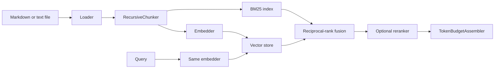

# RAG pipeline

The RAG package provides Python components for loading a file, splitting it
into chunks, embedding those chunks, storing vectors, combining dense and BM25
retrieval, reranking results, and assembling bounded model context.

The Python API is the supported way to build an ingest-and-search flow. The
current `agentic rag` CLI is incomplete and is described separately under
[CLI status](#cli-status).

## Install

The deterministic in-memory components are part of the base runtime. Install
the `rag` extra for LiteLLM embeddings and LanceDB:

```bash
python -m pip install \
  -e "./agentic-workflows-v2[rag]" \
  -c ci-constraints.txt
```

Importing `agentic_v2.rag` does not require LiteLLM or LanceDB. The optional
dependency is loaded only when its component is selected.

## Component flow



Index and query vectors must come from the same embedding model and dimension.
Changing providers or models requires rebuilding the index.

## Working in-memory example

This example has no provider or storage dependency:

```python
import asyncio

from agentic_v2.rag import (
    ChunkingConfig,
    Document,
    HybridRetriever,
    InMemoryEmbedder,
    InMemoryVectorStore,
    RecursiveChunker,
    TokenBudgetAssembler,
)


async def main() -> None:
    document = Document(
        source="notes.md",
        content=(
            "The native executor schedules steps when their dependencies "
            "have completed. Independent steps can run concurrently."
        ),
        metadata={"topic": "runtime"},
    )

    chunks = RecursiveChunker().chunk(
        document,
        ChunkingConfig(chunk_size=120, chunk_overlap=20),
    )

    embedder = InMemoryEmbedder(dimensions=128)
    vectorstore = InMemoryVectorStore()
    vectors = await embedder.embed([chunk.content for chunk in chunks])
    await vectorstore.add(chunks, vectors)

    retriever = HybridRetriever(
        embedder=embedder,
        vectorstore=vectorstore,
    )
    retriever.index_chunks(chunks)

    results = await retriever.retrieve(
        "When can workflow steps run together?",
        top_k=3,
    )
    response = TokenBudgetAssembler(max_tokens=500).assemble(
        results,
        query="When can workflow steps run together?",
    )
    print(response.model_dump())


asyncio.run(main())
```

The deterministic embedder hashes text into repeatable vectors. It is useful
for tests and examples, but it does not provide semantic embeddings and should
not be used to measure retrieval quality.

A longer runnable version is in
[`examples/02_rag_pipeline.py`](https://github.com/tafreeman/agentic-runtime-platform/blob/main/examples/02_rag_pipeline.py).

## Configuration

All configuration models are frozen Pydantic models with
`extra="forbid"`.

### Chunking

```python
from agentic_v2.rag import ChunkingConfig

chunking = ChunkingConfig(
    strategy="recursive",
    chunk_size=512,
    chunk_overlap=64,
    separators=["\n\n", "\n", ". ", " ", ""],
)
```

`RecursiveChunker` currently measures `chunk_size` and `chunk_overlap` in
Python characters, not tokenizer tokens. `chunk_overlap` must be smaller than
`chunk_size`.

`strategy="semantic"` is accepted by the configuration model, but the shipped
chunker is recursive. There is no semantic chunker implementation in the
package.

### Embeddings

```python
from agentic_v2.rag import EmbeddingConfig

embedding = EmbeddingConfig(
    provider="openai",
    model_name="text-embedding-3-small",
    dimensions=1536,
    batch_size=100,
    max_concurrent=5,
)
```

| Provider value | LiteLLM model string | Credential handling |
|---|---|---|
| `openai` | `openai/<model_name>` | Reads `OPENAI_API_KEY` at call time |
| `voyage` | `voyage/<model_name>` | Reads `VOYAGE_API_KEY` at call time |
| `local` | `ollama/<model_name>` | Does not forward an API key |
| `litellm` | Uses `model_name` unchanged | LiteLLM resolves its normal environment settings |

`dimensions` is validated against every response. A provider response with the
wrong vector width raises `EmbeddingError` instead of corrupting the index.
Calls are batched and bounded by `max_concurrent`.

### Reranking

```python
from agentic_v2.rag import RerankerConfig

reranking = RerankerConfig(
    strategy="none",
    model_name=None,
    top_k=5,
    batch_size=32,
)
```

| Strategy | Requirement |
|---|---|
| `none` | No extra scorer; preserves the fused order |
| `cross_encoder` | A supplied `predict_fn`, or a separately installed `sentence-transformers` package |
| `llm` | An async `score_fn(query, document)` supplied to the factory |

`sentence-transformers` is not included in the `rag` extra.

### Full pipeline configuration

```python
from agentic_v2.rag import RAGConfig

config = RAGConfig(
    chunking=chunking,
    embedding=embedding,
    reranker=reranking,
    vectorstore_type="lancedb",
    db_path="./data/rag",
    top_k=5,
    score_threshold=0.0,
    collection_name="runtime_docs",
)
```

`db_path` is required when `vectorstore_type="lancedb"`.

## Build configured components

Use the factory to turn configuration into live components:

```python
from agentic_v2.rag import build_rag_components

components = build_rag_components(config)

embedder = components.embedder
vectorstore = components.vectorstore
reranker = components.reranker
```

The factory behavior is explicit:

- `build_embedder()` returns `LiteLLMEmbedder`; it never substitutes the
  deterministic `InMemoryEmbedder`.
- `build_vectorstore()` returns `InMemoryVectorStore` or
  `LanceDBVectorStore`.
- requesting LanceDB without the optional package raises `VectorStoreError`;
  it does not silently fall back to memory;
- `build_reranker()` returns the selected strategy; and
- `build_rag_components()` returns all three in a frozen `RAGComponents`
  object.

### Embedding fallback

`build_embedder(config, fallback=True)` creates a Voyage, OpenAI, and local
Ollama chain with the configured provider first. This option is off by default.

Embedding providers do not share one semantic vector space. Mixing providers
inside one index can lower retrieval quality without raising an error even when
their vector widths match. Prefer retrying the same provider and model. If you
change provider or model, rebuild the index. Use the mixed-provider fallback
only when you have measured its behavior for your data.

## Loading and chunking

The package exports:

- `MarkdownLoader` for `.md` and `.markdown`;
- `TextLoader` for `.txt`; and
- `IngestionPipeline` to combine one loader and one chunker.

```python
from pathlib import Path

from agentic_v2.rag import IngestionPipeline, MarkdownLoader, RecursiveChunker

pipeline = IngestionPipeline(
    loader=MarkdownLoader(allowed_base_dir=Path("./docs")),
    chunker=RecursiveChunker(),
)
chunks = await pipeline.ingest("docs/ARCHITECTURE.md")
```

`allowed_base_dir` prevents a loader from reading outside the configured
directory. The package does not currently export a directory loader; callers
must enumerate allowed files and pass them to the pipeline one at a time.

`Chunk.content_hash` is a SHA-256 digest used for deduplication. The vector
stores skip or replace data according to their own implementation.

## Vector stores

### In-memory

`InMemoryVectorStore` keeps chunks and vectors in one process and performs a
linear cosine-similarity scan.

```python
store = InMemoryVectorStore()
await store.add(chunks, vectors)
results = await store.search(query_vector, top_k=5)
```

It enforces vector dimensions and supports exact metadata key-value filters.
Use it for tests and small datasets, not as durable storage.

### LanceDB

Create LanceDB through the factory:

```python
config = RAGConfig(
    vectorstore_type="lancedb",
    db_path="./data/rag",
    collection_name="runtime_docs",
)
store = build_vectorstore(config)
```

The factory passes `collection_name` as the LanceDB table name and passes the
configured embedding dimension.

Current LanceDB limitations:

- metadata filtering is not implemented;
- the implementation's third `search()` parameter is named differently from
  the protocol, so omit the filter argument or pass it positionally as
  `None`; and
- document identifiers are interpolated into the delete expression, so treat
  them as application-generated values.

## Hybrid retrieval

`HybridRetriever` runs dense vector search and BM25, then combines their ranks
with reciprocal-rank fusion (RRF):

```python
retriever = HybridRetriever(
    embedder=embedder,
    vectorstore=vectorstore,
    rrf_k=60,
    score_threshold=0.0,
    reranker=reranker,
)
retriever.index_chunks(chunks)
results = await retriever.retrieve(query, top_k=5)
```

The BM25 index is separate from the vector store. After adding chunks to the
vector store, call `index_chunks(chunks)` in the same process.

RRF scores are rank-based and are not comparable to cosine similarity.
Calibrate `score_threshold` against observed fused scores; thresholds such as
`0.3` that may make sense for another scoring system can remove every RRF
result.

The retriever method is `retrieve()`, not `search()`.

## Reranking and context assembly

When a reranker is configured, the retriever fetches a larger candidate set,
reranks it, and returns the requested `top_k`.

Factory-built rerankers should be called positionally:

```python
reranked = await reranker.rerank(query, results, top_k=5)
```

The current `NoOpReranker` names its first parameter differently from the
protocol, so a keyword call using `query=` fails for that strategy.

`TokenBudgetAssembler` sorts results by score and includes complete chunks
until its estimated budget is full:

```python
response = TokenBudgetAssembler(
    max_tokens=4000,
    frame_results=True,
).assemble(results, query=query)
```

The default estimator is `len(text) // 4`; supply a tokenizer-aware callable
when exact model limits matter.

With framing enabled, retrieved text is:

- wrapped in `<retrieved_context>` elements;
- quoted line by line;
- stripped of unsafe control characters; and
- sanitized so source metadata cannot break the wrapper.

Framing makes the trust boundary visible; it does not prove that a model will
ignore malicious retrieved instructions. The system prompt must treat framed
content as untrusted data, and high-risk tool calls still need approval.

## RAG tools

`RAGIngestTool` and `RAGSearchTool` wrap already constructed components:

```python
from agentic_v2.rag import RAGIngestTool, RAGSearchTool

ingest_tool = RAGIngestTool(
    pipeline=pipeline,
    embedder=embedder,
    vectorstore=vectorstore,
    retriever=retriever,
)
search_tool = RAGSearchTool(retriever=retriever)

await ingest_tool.execute(source="docs/ARCHITECTURE.md")
result = await search_tool.execute(query="execution adapters", top_k=5)
```

The tools do not create a shared global index. The caller owns component
lifetime and persistence.

## RAG-backed memory

`RAGMemoryStore` combines an embedder and vector store:

```python
from agentic_v2.rag import RAGMemoryStore

memory = RAGMemoryStore(
    embedder=embedder,
    vectorstore=vectorstore,
    namespace="agent-memory",
)
await memory.store("fact-1", "The native engine schedules a DAG.")
matches = await memory.search("How are steps scheduled?", top_k=3)
```

The key-to-value map is held in Python memory. A durable vector store preserves
vectors, but it does not preserve this map across process restarts. Therefore
`retrieve(key)` and `list_keys()` are not durable without an additional
application-owned key store.

## CLI status

The CLI exposes:

```bash
agentic rag ingest --source docs/ARCHITECTURE.md
agentic rag search "execution adapters" --top-k 5
```

Current behavior:

- `rag ingest` handles one file, despite help text that also shows a directory;
- it always uses `InMemoryEmbedder` and `InMemoryVectorStore`;
- `--collection` is accepted but not connected to storage;
- the index exists only in the command process; and
- that process exits after ingestion, so a later `rag search` command has no
  index and returns no results.

Use the Python API or RAG tools in a long-lived process. Do not describe the
current CLI as persistent or provider-backed.

## Operational checklist

- Use one embedding provider and model for both indexing and queries.
- Persist the provider, model name, dimensions, chunking settings, and source
  revision with the index.
- Rebuild the index when any of those values change.
- Use a durable vector store for data that must survive a restart.
- Keep the BM25 index lifecycle aligned with vector-store updates.
- Calibrate RRF thresholds and reranking on representative queries.
- Restrict loader paths with `allowed_base_dir`.
- Treat retrieved content as untrusted.
- Trace latency and errors without logging credentials or sensitive document
  content.
- Test restore, delete, and re-index behavior before deployment.

## Related decisions

- [ADR-035: RAG pipeline architecture](../adr/ADR-035-rag-pipeline-architecture.md)
- [RAG pipeline blueprint](../adr/RAG-pipeline-blueprint.md)
- [Known limitations](../KNOWN_LIMITATIONS.md)
- [Configuration](../configuration.md)
