# Evaluation Framework and Dynamic Benchmark Integration Design

**Status:** Superseded as decision-of-record by **ADR-042** ("Adopt `agentic-evalkit`, sliced migration"; merged 2026-07-03). Retained as the broader design analysis — Hugging Face discovery, dynamic benchmarks, provenance, reliability — behind that decision. Where this doc assumes extracting `agentic-v2-eval` in place, ADR-042 instead adopts the independently-built `agentic-evalkit` and that package boundary governs.
**Date:** 2026-07-02
**Verified as of:** 2026-07-02 (predates the ADR-042 landing and the boundary guard referenced below)
**Scope:** Standalone evaluation architecture, its integration into `agentic-runtime-platform` (ARP), and its boundary with `executionkit` (EK)
**Related:** ADR-042 (agentic-evalkit adoption) · ADR-023 (EK as ARP's optional execution kernel) · ARP-side dependency-boundary guard `agentic-workflows-v2/tests/contract/test_evalkit_boundary.py` (landed 2026-07-05, commit 62faf67)

## 1. Objective

Extract ARP's evaluation capabilities into a genuinely standalone `agentic-v2-eval` package that ARP imports, so developers can discover, resolve, preview, run, and compare local and remote datasets through one coherent Python/CLI/API/UI workflow while preserving benchmark validity and reproducibility.

The design must:

- provide Hugging Face discovery, inspection, preview, and immutable resolution in the baseline install so developers do not manually find, download, or import datasets;
- ship a versioned starter catalog, beginning with the existing benchmark presets and SWE-bench Verified;
- distinguish downloading benchmark records from executing the benchmark's authoritative verifier;
- provide typed, immutable dataset and run provenance;
- make objective grading the default and require calibration for model judges;
- report uncertainty and repeated-trial reliability, not only a point score;
- retain a high-quality developer workflow across Python, CLI, API, and UI;
- keep the standalone package independent of ARP, `agentic-tools`, and EK runtime imports;
- preserve ExecutionKit as the optional execution kernel used by ARP steps without making EK the owner of ARP evaluation.

## 2. Evidence Summary

### 2.1 Current ARP state

ARP already contains substantial evaluation code:

- `tools/agents/benchmarks/` defines nine static benchmark entries and a local/Hugging Face/GitHub loader;
- `agentic-v2-eval/` provides rubric scoring, evaluators, runners, reporters, and a lazy dataset bridge;
- `agentic-workflows-v2/agentic_v2/server/` exposes dataset and evaluation endpoints;
- the React UI provides dataset browsing, run configuration, and evaluation result views;
- ADRs 009-012 and 017 document scoring, methodology, API, UI, and dataset-routing decisions.

The existing Hugging Face path is not operational for SWE-bench Verified. A live load returned zero rows because:

1. Dataset Viewer requests omit the required `config=default` value and receive HTTP 422.
2. The `huggingface_hub` fallback imports undeclared/unavailable `pyarrow` and assumes a Parquet path without resolving the Hub conversion revision.
3. The repository's top-level `datasets/` directory shadows the optional `datasets` Python package, so the final fallback imports a namespace with no `load_dataset` function.
4. Source failures are converted into an empty list, which makes infrastructure failure indistinguishable from an empty dataset.
5. The cache key excludes revision, config, split, projection, offset, and limit. A paginated response can therefore be cached as though it were the complete dataset.

The current static registry also cannot search or import arbitrary suitable Hub datasets, and it records approximate source metadata rather than resolved immutable provenance.

### 2.2 Current ExecutionKit state

ExecutionKit `main` and public `origin/main` both resolve to commit `be2bd0bec4baddd999ea1adfa99733156f43cdd4`.

EK has a deliberately small eval harness in `executionkit/evals.py`:

- `EvalCase`: a callable plus a boolean/string check;
- `EvalResult`: pass/fail, reason, and immutable metadata;
- `EvalReport`: counts, accuracy, a deterministic all-pass gate, and an optional live accuracy floor;
- `ConversationScript` and `Turn`: ordered multi-turn checks through one stateful `Kit`;
- `live_provider_from_env()`: an opt-in OpenAI-compatible live provider.

Its committed corpora contain:

- 10 deterministic pattern goldens;
- 13 malformed-output, injection, tool-argument, and usage failure cases;
- 4 live pattern cases;
- one three-case judge smoke calibration.

The local full suite passed with `738 passed, 16 skipped` and 94.62% coverage. Current CI is green across Python 3.11-3.13 on Windows and Linux, and its dedicated deterministic eval step passes.

The scheduled live eval is not healthy: the three most recent weekly runs failed. In the latest inspected run, the pinned `llama3.2:3b` judge scored a deliberately poor answer `0.8` and the good answer `0.7`. This is useful evidence that the smoke test detects judge failure, but it also proves EK's live judge is not calibrated sufficiently for platform benchmarking.

### 2.3 Existing EK/ARP integration

ADR-023 already establishes EK as ARP's optional execution kernel. The current bridge is real:

- `agentic-workflows-v2` exposes an `ek` extra for `executionkit>=0.1.0,<0.3.0`;
- ARP wraps its routed backend as an EK provider;
- structured and ReAct steps can delegate to EK patterns;
- EK results are converted back into ARP step results;
- 91 focused EK bridge tests passed during this review.

There is no current evaluation dependency from `agentic-v2-eval` to `executionkit.evals`, and this design intentionally preserves that fact.

## 3. Source-Derived Design Principles

The following primary-source lessons shape the design:

- [OpenAI evaluation best practices](https://platform.openai.com/docs/guides/evaluation-best-practices): use task-specific evals, production-representative data, continuous evaluation, automation, logs, and human calibration.
- [OpenAI graders](https://platform.openai.com/docs/guides/graders/): separate data variables from sampled output and support deterministic, model, code, and composite graders.
- [Anthropic agent eval guidance](https://www.anthropic.com/engineering/demystifying-evals-for-ai-agents): combine code, model, and human graders; distinguish capability from regression suites; use repeated trials, reference solutions, `pass@k`, and `pass^k`.
- [Inspect datasets](https://inspect.aisi.org.uk/datasets.html): normalize source records into typed samples, provide explicit field mapping, support immutable metadata, and keep remote-code trust disabled by default.
- [Harbor adapters](https://www.harborframework.com/docs/datasets/adapters): preserve the upstream task, environment, verifier, and oracle; validate adapters with oracle and parity runs.
- [SWE-bench harness](https://www.swebench.com/SWE-bench/reference/harness/): valid SWE-bench scoring requires patch application and test execution in the benchmark's Docker environment.
- [Hugging Face Lighteval](https://huggingface.co/docs/lighteval/index): separate sample-level computation from corpus aggregation and retain sample-level outputs for debugging.
- [Hugging Face Datasets](https://huggingface.co/docs/datasets/loading): use explicit configs/splits, streaming where appropriate, dataset cards, revisions, and integrity checks.
- [DeepResearch Bench](https://arxiv.org/abs/2506.11763): report quality needs multiple dimensions, including content, citations, and presentation.
- [DeepResearch Bench II](https://arxiv.org/abs/2601.08536): prefer atomic, verifiable, expert-derived binary rubrics over broad LLM-generated scoring dimensions.
- [Deep Research Bench / RetroSearch](https://arxiv.org/abs/2506.06287): freeze time-varying external environments when longitudinal comparison requires a stable world state.
- [Microsoft M365 Copilot Eval](https://github.com/microsoft/m365-copilot-eval): a versioned document schema, discoverable defaults, interactive scaffolding, concurrency control, and multiple report formats materially improve developer experience.
- [Langfuse experiments](https://langfuse.com/docs/evaluation/experiments/experiments-via-ui): dataset experiments should make run comparison and sample inspection a priority, but ARP must pin dataset versions rather than silently using the latest version.
- [OpenAI Evals](https://github.com/openai/evals): registry-driven templates lower authoring cost, but ARP should avoid coupling evaluation definitions to a monolithic local-data registry.
- [OpenAI Frontier Evals](https://github.com/openai/frontier-evals): complex frontier benchmarks should remain isolated, reproducible projects with their own locked environments.
- [OpenAI simple-evals](https://github.com/openai/simple-evals): benchmark prompting policy is part of the benchmark and must be versioned with results.
- [Anthropic model-written eval datasets](https://github.com/anthropics/evals): model-written data can extend coverage, but human validation and dataset risk documentation remain required. This repository is a dataset collection, not a general eval framework.
- [Hamelsmu eval skills](https://github.com/hamelsmu/evals-skills/tree/main/skills): start from observed failures, use objective checks when possible, calibrate judges on held-out human labels, and build review interfaces around full traces.

The `ai-system-design-guide` is useful secondary guidance, but primary framework documentation and benchmark methodology take precedence when they disagree.

## 4. Ownership and Dependency Rule

The approved pipeline is retained, with the ARP evaluation contracts implemented by the standalone package that ARP imports:

```text
ARP dataset provider (from agentic-v2-eval)
  -> ARP typed evaluation sample (shared contract)
  -> ARP workflow execution
      -> optional EK-backed step/pattern
  -> ARP normalized workflow result
  -> objective graders / calibrated judges (from agentic-v2-eval)
  -> statistics, provenance, reports (from agentic-v2-eval)
  -> ARP persistence, API, and UI
```

This is a hard architectural invariant:

> `agentic-v2-eval` must not import ARP engine internals, `agentic-tools`, `executionkit`, or `executionkit.evals`.

ExecutionKit is a component under evaluation, not ARP's evaluation engine. EK's own eval harness remains responsible for EK's package-level regression and live smoke tests. ARP evaluates platform behavior after execution has crossed the existing EK bridge and returned to an ARP-normalized result.

### 4.1 Package responsibilities

| Package | Owns | Must not own |
|---|---|---|
| `agentic-v2-eval` | Dataset catalog and providers, curated presets, typed samples, benchmark and harness protocols, objective/model grader contracts, calibration artifacts, aggregation, statistics, provenance, standalone CLI, and portable reports | ARP workflow implementation, ARP persistence/UI, EK execution, imports from ARP, `agentic-tools`, or EK |
| `agentic-tools` (`tools/agents/benchmarks`) | Temporary compatibility wrappers during migration; unrelated tool infrastructure | Canonical evaluation dataset/provider implementations after migration |
| `agentic-workflows-v2` | Workflow execution, optional EK-backed steps, result normalization, API, persistence, run streaming, UI integration | Source-specific loader implementations, benchmark-specific grading logic |
| `executionkit` | Minimal execution primitives and its own self-evals | Hugging Face discovery, SWE-bench orchestration, ARP rubrics, ARP reports, ARP UI |

The intended dependency graph is explicit:

```text
agentic-workflows-v2 -> agentic-v2-eval
                    \-> executionkit (optional execution extra)

agentic-v2-eval -> huggingface-hub (baseline remote provider)
agentic-tools -> agentic-v2-eval (temporary compatibility facade only)

executionkit -X-> agentic-v2-eval
agentic-v2-eval -X-> executionkit
agentic-v2-eval -X-> agentic-tools
agentic-v2-eval -X-> agentic-workflows-v2
```

`agentic-v2-eval` is developed in the ARP monorepo initially but must build and install as an independent wheel. Its public protocols accept an injected execution target, so ARP can adapt workflow execution without the package knowing about ARP or EK. `agentic-workflows-v2` consumes the package through that application adapter instead of retaining a second benchmark/grader implementation. EK remains an optional sibling dependency used only by ARP workflow execution.

### 4.2 Standalone packaging decision

Three boundaries were considered:

1. **Built-in Hugging Face provider in the standalone eval package (selected).** This gives a useful zero-import first run, keeps dataset and evaluation provenance together, and lets ARP or another host reuse the same contracts.
2. **Hugging Face as an optional extra.** This keeps the base wheel smaller but makes the primary dynamic-dataset experience fail until a developer discovers and installs an extra.
3. **Keep providers in `agentic-tools`.** This minimizes migration work but leaves `agentic-v2-eval` coupled to ARP's monorepo and prevents independent installation.

The package remains in the monorepo until its public API is proven. Extraction to a separate repository is a later release decision, gated by clean-wheel installation, semantic versioning, API documentation, and host contract tests; no code move is required to achieve runtime independence.

## 5. Reference Architecture

```mermaid
flowchart LR
  Developer["Developer: CLI / API / UI"] --> Manifest["Versioned evaluation manifest"]
  Manifest --> Catalog["agentic-v2-eval dataset catalog"]
  Catalog --> Local["Local provider"]
  Catalog --> HF["Hugging Face provider"]
  Catalog --> GitHub["Optional repository-provider plugin"]
  Local --> Sample["Portable typed EvalSample"]
  HF --> Sample
  GitHub --> Sample
  Sample --> Prepare["Benchmark adapter: prepare task"]
  Prepare --> Target["Injected execution-target protocol"]
  Target --> Workflow["ARP workflow adapter"]
  Workflow --> Native["Native ARP step"]
  Workflow --> EK["Optional EK-backed step"]
  Native --> Normalized["NormalizedWorkflowResult"]
  EK --> Normalized
  Normalized --> Verify["Benchmark adapter: verify outcome"]
  Verify --> Objective["Objective graders"]
  Verify --> Judge["Calibrated model judges"]
  Objective --> Aggregate["Corpus aggregation and statistics"]
  Judge --> Aggregate
  Aggregate --> Evidence["Provenance, artifacts, reports"]
  Evidence --> Developer
```



## 6. Core Data Contracts

All contracts are immutable Pydantic models or frozen dataclasses and serialize to versioned JSON.

### 6.1 `DatasetRef`

Identifies what the user requested:

- `provider`: `local`, `huggingface`, or `git`;
- `dataset_id`;
- `revision`: optional user input such as a tag, branch, or commit;
- `config`;
- `split`;
- `data_files`;
- `field_mapping`;
- `filters`;
- `trust_remote_code`: default `false`;
- `requested_at`.

### 6.2 `ResolvedDataset`

Records what ARP actually resolved:

- canonical provider and dataset ID;
- immutable source revision/commit;
- source URI;
- config and split;
- schema/features;
- row count when available;
- dataset-card metadata;
- license and citation;
- content or manifest digest;
- loader version;
- resolution timestamp;
- cache key;
- warnings and policy decisions.

Floating revisions may be accepted interactively, but every run resolves and records an immutable revision before sampling.

### 6.3 `EvalSample`

The source-independent sample passed into ARP execution:

- `id`;
- `input`: string, messages, or structured workflow input;
- `target`: optional objective target/reference;
- `choices`: optional multiple-choice candidates;
- `metadata`: immutable domain and source metadata;
- `files`: optional sandbox files;
- `setup`: optional controlled setup descriptor;
- `grader_refs`: grader IDs applicable to this sample;
- `sandbox_ref`: optional benchmark environment reference;
- `source_provenance`: dataset revision, split, row index, and record digest.

Raw upstream records are retained as artifacts when policy permits, but graders consume the typed projection.

### 6.4 `NormalizedWorkflowResult`

The evaluation boundary after ARP execution:

- final output and structured output;
- terminal status and error classification;
- step results;
- tool calls and tool results;
- trace/artifact references;
- model/provider fingerprints;
- token, latency, and cost measurements;
- workflow definition/version;
- optional patch or changed-files artifact;
- execution-environment fingerprint.

The shape is identical whether a step executed natively or delegated to EK. EK-specific internal types do not cross into graders.

### 6.5 `GradeResult`

Every grader returns:

- `grader_id` and version;
- `kind`: objective, model, or human;
- `verdict`: pass, fail, abstain, or error;
- optional normalized score;
- evidence/assertions;
- failure reason;
- grader runtime and cost;
- grader/model/prompt fingerprints;
- calibration reference when applicable.

`error` is never counted as `fail`, and `abstain` is never silently converted to zero.

### 6.6 `EvalRunManifest`

The immutable run identity includes:

- manifest schema version;
- resolved dataset and digest;
- sample selection and random seed;
- workflow version;
- model/provider parameters;
- benchmark adapter and harness versions;
- container image digests where applicable;
- grader/rubric versions and prompt hashes;
- retry and concurrency policy;
- code commit and dirty-state indicator;
- start/end timestamps;
- environment and dependency fingerprints.

## 7. Dataset Provider Design

### 7.1 Provider protocol

Each provider implements:

- `search(query, filters, cursor) -> SearchPage`;
- `resolve(DatasetRef) -> ResolvedDataset`;
- `preview(ResolvedDataset, offset, limit) -> SamplePage`;
- `iter_records(ResolvedDataset, selection) -> AsyncIterator[SourceRecord]`;
- `healthcheck() -> ProviderHealth`.

The catalog owns provider registration. The baseline `agentic-v2-eval` install includes local-file and Hugging Face providers. Additional registries and repository sources use provider plugins, not branches added to one loader function.

The default catalog is usable immediately after installation. It contains versioned presets for the existing supported benchmark IDs plus SWE-bench Verified. Each preset declares its provider reference, compatible sample projection, intended metric, readiness (`preview`, `runnable`, or `authoritative`), license metadata, and required optional capabilities. A preset is metadata and an adapter binding, never a vendored copy of the dataset.

Developers can search the broader Hugging Face catalog without registering a preset or editing Python. Running an arbitrary discovered dataset still requires either a compatible built-in adapter or an explicit field mapping; discovery must not imply benchmark validity.

### 7.2 Hugging Face behavior

- Include `huggingface-hub` and the lightweight Hub/Dataset Viewer provider in the baseline package, not an optional extra.
- Query the Hub API for search and revision metadata.
- Query Dataset Viewer for configs, splits, schema, and paginated preview.
- Always pass the resolved config and split.
- Resolve tags/branches to a commit SHA before a run.
- Prefer safe data formats and Dataset Viewer/Hub APIs.
- Keep arbitrary dataset scripts and remote code disabled by default.
- Provide an explicit opt-in with a warning and provenance record when trusted remote code is unavoidable.
- Support authenticated private datasets without logging tokens.
- Preserve dataset card, license, citation, and gated-access metadata.
- Use bounded retries with classified errors and provider rate-limit information.

The initial path must not require the heavyweight `datasets` package, `pyarrow`, a Git clone, or a manual browser download for search, inspection, preview, and supported-file retrieval. Optional format adapters may add those dependencies later without changing `DatasetProvider` or `DatasetRef`.

Authentication is optional for public datasets and reads `HF_TOKEN` or the standard Hugging Face credential store for private/gated datasets. The CLI explains access and license requirements without printing credentials.

### 7.3 Cache behavior

The cache is content-addressed. Its key includes:

- provider;
- canonical dataset ID;
- immutable revision;
- config and split;
- data files;
- filter/projection;
- page offset and limit;
- loader schema version.

Cache entries include their own manifest and checksum. Full-dataset and page entries are different types and cannot overwrite each other. Standalone use defaults to the platform user-cache directory; a host such as ARP can inject its managed cache location. Cache data never lives inside the source package.

Offline mode uses only exact resolved cache entries. A stale cache hit is reported, not silently refreshed or accepted.

### 7.4 Error model

Provider failures use typed errors:

- `DatasetNotFound`;
- `DatasetConfigRequired`;
- `DatasetSplitNotFound`;
- `DatasetAccessDenied`;
- `DatasetLicenseRejected`;
- `DatasetIntegrityError`;
- `DatasetSchemaMismatch`;
- `DatasetProviderUnavailable`;
- `DatasetUnsafeCodeRequired`.

An empty result is valid only when the provider successfully returns zero matching rows. Exceptions never collapse to `[]`.

## 8. Benchmark Adapter Design

A dataset is not automatically a valid benchmark. A `BenchmarkAdapter` binds:

- sample projection;
- task/environment setup;
- execution artifact format;
- authoritative grader/verifier;
- oracle/reference validation;
- benchmark-specific aggregation.

The adapter protocol supports `prepare`, `validate_oracle`, `grade`, and `aggregate` operations. Adapter metadata records upstream benchmark version and compatibility.

### 8.1 SWE-bench Verified

The baseline package ships the SWE-bench Verified dataset preset, row projection, prediction schema, and harness-neutral contracts. This makes discovery and workflow output generation available in the initial release while keeping authoritative Docker execution optional.

The later `swebench` extra supplies a `HarnessExecutor` implementation through the same stable protocol. The complete high-fidelity path must:

1. Resolve `princeton-nlp/SWE-bench_Verified`, config `default`, split `test`, at an immutable revision.
2. Project each row into an `EvalSample` containing issue text, repository, base commit, test patch, fail-to-pass/pass-to-pass metadata, and the source row digest.
3. Run the injected execution target against the specified repository state; ARP supplies its workflow/agent adapter in integrated use.
4. Export the generated patch using the official SWE-bench prediction schema.
5. Delegate grading to the pinned official `swebench` Docker harness.
6. Record harness version, image digests, patch-application result, tests, logs, and resolution status.
7. Verify at least one gold patch through the same path as an oracle smoke test.

Generic rubric or similarity scoring must never be labeled `SWE-bench resolved`. Optional advisory graders may describe patch quality, but the authoritative metric remains the harness resolution result.

If the harness extra or Docker is absent, the package reports `authoritative_grader_unavailable` with the exact capability/install guidance; it never substitutes a rubric score. The CLI and UI perform a Docker/disk/resource preflight when authoritative execution is requested and retain preview, sample preparation, ARP execution, and prediction export for developers without those prerequisites.

The harness boundary accepts a versioned `HarnessRequest` and returns a versioned `HarnessResult` containing status, evidence, logs, image digests, and typed infrastructure errors. Contract tests use a deterministic fake executor in the initial release, so adding the official Docker executor later does not alter dataset, sample, workflow-result, report, or UI contracts.

## 9. Grading and Rubric Model

### 9.1 Objective-first policy

The grader planner chooses the strongest valid oracle in this order:

1. authoritative benchmark verifier or state transition;
2. executable tests;
3. schema/type/format validation;
4. exact or normalized deterministic comparison;
5. domain metric with a documented interpretation;
6. calibrated model judge;
7. human review.

Model judges cannot replace an available authoritative verifier.

### 9.2 Rubric schema

Each rubric is versioned and contains atomic criteria. A criterion defines:

- stable ID and description;
- grader type;
- explicit pass and fail definitions;
- required evidence/context;
- threshold where applicable;
- weight for diagnostic aggregation;
- `required`/non-compensatory hard-gate status;
- examples drawn only from the calibration training split;
- ownership and review date.

Broad criteria such as `quality`, `helpfulness`, or `coherence` are not accepted without task-specific operational definitions. Ordinal scores may be retained for diagnostic displays only when their anchors are explicit; release gates use binary or otherwise calibrated decisions.

Missing required criteria fail the evaluation configuration before execution. Optional missing criteria are reported as abstentions and excluded with an explicit denominator.

### 9.3 Model-judge calibration

Every production judge has a `JudgeCalibration` artifact containing:

- pinned judge model and provider;
- prompt/schema hash;
- labeled train/dev/test dataset revisions;
- class balance and annotator provenance;
- confusion matrix;
- true-positive and true-negative rates;
- confidence intervals;
- known failure modes;
- approval/expiry date.

Few-shot examples come only from the training partition. Prompt/model changes invalidate calibration. The held-out test partition is evaluated once for release qualification.

The current EK good-vs-poor smoke test remains useful inside EK, but it does not satisfy ARP calibration requirements.

### 9.4 Multi-grader aggregation

- Required objective graders are non-compensatory hard gates.
- Diagnostic dimensions may be weighted only after hard gates pass.
- Objective, model, and human scores remain separately visible.
- The report displays denominators, errors, and abstentions.
- Pairwise comparison randomizes presentation order and records both orderings when position bias matters.
- Judge ensembles are optional and used only when calibration shows a material reliability benefit.

## 10. Statistics and Benchmark Validity

Each run reports sample-level results plus corpus-level statistics:

- mean/rate and exact numerator/denominator;
- bootstrap or binomial 95% confidence interval as appropriate;
- paired deltas and paired bootstrap intervals for comparable runs;
- `pass@k` when any successful attempt is useful;
- `pass^k` when consistent success is required;
- attempt counts and seed policy;
- error and timeout rates separately from task failures;
- latency/token/cost distributions with percentiles;
- subgroup slices when predeclared and sufficiently sampled.

Comparisons are permitted only when dataset revision, split, adapter, harness, grader versions, and sampling policy are compatible. The UI labels incompatible runs rather than drawing a misleading delta.

Capability suites and regression suites are separate:

- capability suites target difficult, discriminating tasks and may begin with low pass rates;
- regression suites protect known-good behavior and require near-perfect results;
- tasks graduate from capability to regression only through an explicit versioned change.

## 11. Developer Experience

### 11.1 CLI

The standalone wheel exposes the same application service through `agentic-v2-eval`; ARP mounts it as `agentic eval`. Both command surfaces use the same provider, manifest, and report contracts. The ARP-integrated workflow is:

```text
agentic eval doctor
agentic eval datasets search "swe bench" --provider huggingface
agentic eval datasets inspect huggingface:princeton-nlp/SWE-bench_Verified
agentic eval datasets preview ... --config default --split test --limit 3
agentic eval datasets pull ... --revision <sha>
agentic eval run evals/swebench-verified.yaml --limit 1
agentic eval compare <run-a> <run-b>
agentic eval report <run-id> --format html
```

`doctor` checks provider credentials, cache permissions, Docker, disk, optional harness dependencies, and judge calibration status. Commands print the resolved revision and estimated execution implications before expensive work.

Immediately after the baseline package is installed, a developer can run `agentic-v2-eval datasets curated`, `agentic-v2-eval datasets search`, `inspect`, and `preview` against public Hugging Face datasets. No manifest authoring or manual data import is required until the developer chooses to save or run a configuration.

### 11.2 API

The API provides:

- provider health and capabilities;
- paginated dataset search;
- resolve/inspect/preview endpoints;
- immutable import records;
- eval manifest validation;
- run creation, progress, cancellation, and result retrieval;
- sample/trace/artifact detail;
- compatible-run comparison.

Long-running imports and benchmark runs are jobs with streamed events. The server never blocks a request while running SWE-bench.

### 11.3 UI

The dataset surface has `Discover`, `Imported`, and `Local` views. It shows:

- provider, resolved revision, config/split, license, size, and cache state;
- schema and native sample preview;
- field mapping validation;
- benchmark-adapter compatibility;
- execution prerequisites and cost/resource warnings.

The evaluation surface shows:

- manifest and provenance;
- progress by phase/sample;
- task failure versus infrastructure error;
- grader evidence and trace details;
- uncertainty intervals and repeated-trial metrics;
- compatible baseline comparison;
- downloadable JSON, JSONL, Markdown, and HTML artifacts.

## 12. Security, Privacy, and Governance

- Remote code execution is disabled by default.
- Dataset IDs, revisions, URLs, configs, and file paths are validated before use.
- Credentials use provider-specific secret configuration and are redacted from logs/artifacts.
- Dataset licenses and gated/private access are surfaced before import.
- Imported raw data follows tenant and retention policy.
- Benchmark setup and grader execution occur in isolated environments when they run untrusted code.
- SWE-bench uses the official container boundary; host execution is not a fallback.
- Reports identify whether data or prompts may contain sensitive content.
- Dataset, rubric, judge, and adapter changes are auditable versioned events.

## 13. Compatibility and Migration

The migration is additive first:

1. Define provider, sample, adapter, execution-target, harness, grade, and report contracts inside `agentic-v2-eval`.
2. Move canonical dataset discovery, transport, cache, and benchmark preset code from `tools.agents.benchmarks` into `agentic-v2-eval` and remove the package's `agentic-tools` runtime dependency.
3. Turn old `tools.agents.benchmarks` entry points into temporary wrappers that import the standalone package, never the reverse.
4. Keep `agentic_v2_eval.datasets` as a compatibility facade while callers migrate to typed samples.
5. Preserve existing `repository` and `local` wire values; add canonical provider metadata and deprecation guidance rather than breaking clients immediately.
6. Migrate static `BENCHMARK_DEFINITIONS` into built-in catalog presets that resolve through the same provider path as dynamically discovered datasets.
7. Route ARP workflow execution through the standalone execution-target protocol and normalize results without exposing EK-specific types.
8. Retain old query-parameter dataset endpoints only for their documented deprecation window.

A dependency test will fail if `agentic-v2-eval` imports `agentic-tools`, `tools.agents`, `agentic-workflows-v2`, ARP engine internals, `executionkit`, or `executionkit.evals`. A built wheel must install and pass its contract suite in a clean virtual environment outside the monorepo.

## 14. Implementation Slices

The initial release comprises Slices 1-4. Slice 5 is a compatible optional feature and is not required to install or use the initial framework.

### Slice 1: Standalone package and built-in dataset discovery

- Remove the runtime dependency on `agentic-tools` and enforce the standalone import boundary.
- Add typed dataset/provider contracts and a clean-wheel installation test.
- Replace the monolithic loader dispatch with provider registration.
- Ship the Hugging Face provider in the baseline install; repair config/split resolution and classified errors.
- Add immutable revision resolution and content-addressed cache entries.
- Ship the curated starter catalog, including the existing registry IDs and SWE-bench Verified.
- Expose curated listing, search, inspect, and preview through Python/standalone CLI/ARP API/UI.
- Preserve compatibility for the existing registry IDs through wrappers.

### Slice 2: Evaluation result and grader contracts

- Add normalized workflow, grade, manifest, and provenance types.
- Implement objective grader registry and hard-gate aggregation.
- Make missing/error/abstain semantics explicit.
- Add sample- and corpus-level reporter schemas.
- Adapt existing rubric/report paths without importing EK evals.

### Slice 3: Judge calibration and statistical reporting

- Add calibration artifact schema and validation commands.
- Add confusion matrices, TPR/TNR, and calibration expiry checks.
- Add confidence intervals, paired comparison, `pass@k`, and `pass^k`.
- Prevent uncalibrated judges from serving as release gates.

### Slice 4: Integrated experiment UX and documentation

- Complete comparison, trace inspection, report export, and baseline workflows.
- Add quickstart manifests and migration docs.
- Add provider/benchmark authoring documentation.
- Add current limitations and operational runbooks.

### Slice 5: Optional SWE-bench authoritative harness

- Preserve the initial SWE-bench dataset, sample, prediction, and `HarnessExecutor` contracts.
- Add the optional pinned SWE-bench harness dependency and official Docker executor.
- Add resource preflight, job progress, log/artifact capture, and cancellation.
- Validate one gold patch and one intentionally failing patch.
- Report resolved rate and harness provenance without changing initial report schemas.

## 15. Validation Strategy

Development follows test-first red/green/refactor cycles.

Required test layers:

- provider unit tests with captured API payloads and error variants;
- cache-key and corruption tests;
- live Hugging Face integration tests behind an explicit marker;
- projection/property tests for typed samples;
- dependency-boundary tests forbidding ARP, `agentic-tools`, and EK imports in `agentic-v2-eval`;
- wheel build/install and standalone CLI smoke tests in a clean temporary environment;
- deterministic `HarnessExecutor` contract tests that run without Docker;
- objective-grader contract tests;
- judge-calibration metric tests;
- statistical tests against known synthetic distributions;
- API contract tests;
- UI unit and browser tests for discovery, preview, run, error, and comparison flows;
- existing EK bridge regression tests;
- SWE-bench gold/fail smoke tests only for the optional harness feature when Docker prerequisites are available;
- full Ruff, mypy, pytest, UI, and strict documentation gates before completion.

No mocked row download proves live source integration, and no generic unit test proves SWE-bench benchmark validity. The initial release therefore requires live Hugging Face evidence and harness contract tests; the optional authoritative feature additionally requires Docker gold/fail end-to-end smoke evidence.

## 16. Acceptance Criteria

The initial release is implemented only when all of the following are demonstrated:

1. A clean environment can install the built `agentic-v2-eval` wheel and run its CLI without the ARP monorepo, `agentic-tools`, EK, Docker, `datasets`, or `pyarrow`.
2. The baseline install can list curated datasets and search public Hugging Face datasets without code changes or manual data import.
3. A developer can inspect configs/splits, license/provenance, and sample rows through the standalone CLI and ARP surfaces.
4. SWE-bench Verified preview returns typed samples, records an immutable source revision, and exports the official prediction schema without requiring Docker.
5. Requesting authoritative SWE-bench grading without its optional capability returns a typed unavailable result and exact setup guidance, never a substitute score.
6. Re-running an identical resolved request uses the exact cache entry; changing revision/config/split/page cannot collide.
7. Provider errors are visible and typed; a failed load never appears as an empty dataset.
8. The same dataset manifest works through Python, standalone CLI, ARP CLI, API, and UI.
9. An ARP workflow can contain an EK-backed step and still produce the same normalized evaluation boundary as a native step.
10. `agentic-v2-eval` has no import dependency on ARP, `agentic-tools`, or EK.
11. Results record dataset, workflow, model, adapter, harness capability, grader, environment, and code provenance.
12. Required objective grader failures cannot be compensated by model-judge scores.
13. Uncalibrated model judges are marked advisory and cannot gate a release.
14. Reports separate failure, error, timeout, abstention, and unavailable capability and include uncertainty.
15. Compatible runs can be compared with a paired delta; incompatible runs are clearly rejected or labeled.
16. Existing local dataset and evaluation workflows remain functional through the migration window.
17. Relevant standalone-package, backend, EK-bridge, UI, live-provider, and documentation verification gates pass.

The optional SWE-bench harness feature is complete only when:

18. One SWE-bench gold patch resolves through the official pinned Docker harness.
19. One invalid patch fails through the same harness, proving the smoke test discriminates.
20. The optional executor satisfies the initial `HarnessExecutor` contract without requiring changes to manifests, normalized results, reports, or ARP UI contracts.

## 17. Rejected Alternatives

### Embed Inspect AI as ARP's evaluation engine

Rejected as the primary architecture because ARP already has dataset, runner, scoring, server, and UI surfaces. Adopting Inspect wholesale would create a second runtime and force a migration before fixing current correctness gaps. Inspect remains a strong reference for typed samples and source adapters.

### Delegate all agent benchmarks to Harbor

Rejected as the primary architecture because it would make ARP a wrapper around another platform and weaken integrated product control. Harbor remains a valuable optional interoperability target and a reference for adapter parity, task isolation, and oracle validation.

### Move ARP evaluation into `executionkit.evals`

Rejected. It would violate EK's minimal zero-runtime-dependency scope, couple it to remote datasets and heavyweight benchmark harnesses, and invert the existing ARP-to-EK execution dependency. EK self-evals and ARP platform evals serve different purposes.

### Keep dataset providers in `agentic-tools`

Rejected as the target architecture. It preserves the current monorepo coupling and means the eval wheel cannot discover datasets by itself. Temporary wrappers in `agentic-tools` are allowed only for migration.

### Make Hugging Face support an optional extra

Rejected for the baseline provider. Dynamic discovery is the primary first-run experience, so public Hub search, inspection, preview, and supported-file retrieval must work after the standard install. Heavy format libraries and authoritative benchmark harnesses remain optional.

### Bundle the SWE-bench Docker harness in the baseline install

Rejected for the initial release. It imposes substantial platform, Docker, disk, and runtime requirements on developers who only need dataset discovery or other evals. The baseline ships the adapter, prediction schema, and stable harness protocol; the authoritative executor is an optional compatible feature.

### Treat downloaded SWE-bench records as ordinary rubric cases

Rejected as invalid. The official test harness is the authoritative grader.

### Preserve silent fallback and empty-list behavior

Rejected because it destroys evidence integrity and makes a broken provider look like a valid empty benchmark.

## 18. Explicit Non-Goals

- Replacing EK's internal `executionkit.evals` self-test harness.
- Adding Hugging Face or SWE-bench dependencies to EK.
- Moving `agentic-v2-eval` to a separate repository before its wheel and public contracts are proven.
- Making every Hugging Face dataset automatically runnable without a projection or benchmark adapter.
- Claiming benchmark parity without oracle and authoritative-harness evidence.
- Building a public leaderboard service in the first implementation cycle.
- Executing untrusted dataset scripts on the host.
- Treating a single aggregate score as sufficient evidence of system quality.

## 19. Decision

Proceed with an ARP-governed but standalone, provider-based `agentic-v2-eval` package. The baseline install owns local and Hugging Face dataset discovery, a curated starter catalog, typed samples, graders, statistics, provenance, a standalone CLI, and portable reports. It imports neither ARP, `agentic-tools`, nor EK. ARP imports the package, supplies workflow execution through a narrow target adapter, persists results, and presents the API/UI.

Use the existing ARP-to-EK bridge only inside ARP workflow execution and normalize the result before grading. Ship SWE-bench Verified discovery, projection, and prediction export initially; add the official Docker harness later through the already-tested `HarnessExecutor` boundary.

The first implementation plan must begin with Slice 1, cover the initial-release Slices 1-4, and preserve the dependency invariant from Section 4 throughout every subsequent slice. Slice 5 is planned as a compatible follow-on feature, not a prerequisite for the initial release.
