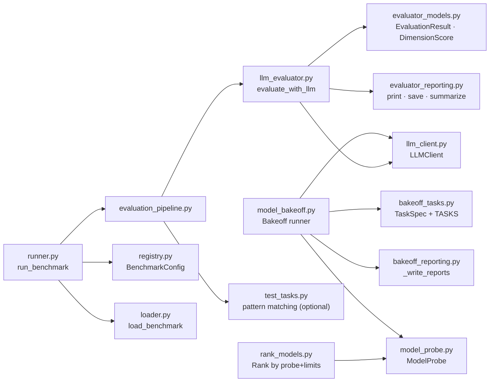

# Benchmark pipeline, LLM-as-judge and bakeoff

> Modules: `tools.agents.benchmarks.*` · `tools.llm.model_bakeoff` · `tools.llm.bakeoff_tasks` · `tools.llm.bakeoff_reporting` · `tools.llm.rank_models`

## Overview

The benchmark infrastructure in `agentic-tools` serves two related but distinct purposes:

1. **Model bakeoff** (`tools/llm/model_bakeoff.py`) — a repeatable capability comparison that
   runs a fixed task set across discovered models and recommends environment variable values for
   `DEEP_RESEARCH_SMALL_MODEL` and `DEEP_RESEARCH_HEAVY_MODEL`.

2. **Benchmark runner + LLM-as-judge** (`tools/agents/benchmarks/`) — a general-purpose
   evaluation framework that executes benchmark tasks (HumanEval, SWE-bench, custom) against a
   model and scores the output on a five-dimension rubric using a second LLM as the judge.

The two systems share `LLMClient` as their inference backend and `ModelProbe` for availability
checking, but they operate independently.

---

## Model bakeoff

### Purpose

The bakeoff answers the question: *"Given the models available in this environment right now,
which one should be assigned to the `SMALL` (fast/cheap) and `HEAVY` (quality/capable) tiers?"*

It is designed to run from PowerShell on Windows without WSL, using whatever models are already
available locally or via configured cloud endpoints.

### Running a bakeoff

```bash
# Default: discover local ONNX + Ollama + AI Toolkit + OpenAI models
python -m tools.llm.model_bakeoff

# Explicit models
python -m tools.llm.model_bakeoff --models local:phi4 gh:gpt-4o-mini gh:llama-4-scout

# Specific providers
python -m tools.llm.model_bakeoff --providers local_onnx,github_models,ollama

# Enable remote providers
python -m tools.llm.model_bakeoff --providers openai,gemini --allow-remote

# Save alignment recommendations to env file
python -m tools.llm.model_bakeoff --write-env runs/alignment.env --out-dir reports/bakeoff

# Dry run: probe and select models but don't run prompts
python -m tools.llm.model_bakeoff --dry-run --verbose

# Limit models tested
python -m tools.llm.model_bakeoff --max-models 8 --max-models-per-provider 3

# Force fresh probe (ignore cache)
python -m tools.llm.model_bakeoff --force-probe
```

### CLI options

| Flag | Default | Description |
|------|---------|-------------|
| `--providers` | `local_onnx,ollama,ai_toolkit,openai` | Comma-separated provider names |
| `--models` | (empty) | Explicit model IDs; skips discovery |
| `--max-models-per-provider` | `6` | Cap on models selected per provider |
| `--max-models` | `24` | Global cap on runnable models tested |
| `--temperature` | `0.1` | Generation temperature for all task calls |
| `--max-tokens` | `900` | Max tokens per prompt call |
| `--out-dir` | `reports/model-bakeoff` | Output directory for JSON + Markdown reports |
| `--write-env` | (empty) | Optional `.env` file path for alignment recommendations |
| `--force-probe` | off | Force fresh ModelProbe checks |
| `--include-openai-local` | off | Include `OPENAI_BASE_URL` models |
| `--allow-remote` | off | Set `PROMPTEVAL_ALLOW_REMOTE=1` |
| `--dry-run` | off | Probe/select only; do not run prompts |
| `--verbose` / `-v` | off | Debug-level discovery/probe logs |

### Bakeoff task set

Tasks are defined as `TaskSpec` dataclasses in `tools/llm/bakeoff_tasks.py`. Each task specifies
a prompt, expected response format, required keys (for JSON responses), required terms (for text
responses), and a scoring weight.

| Task ID | Title | Format | Weight |
|---------|-------|--------|--------|
| `workflow_strategy` | Workflow Pattern Selection | JSON | 1.0 |
| `architecture` | Architecture Plan | JSON | 1.1 |
| `implementation_plan` | Implementation Plan | JSON | 1.0 |
| `code_task` | Coding Practicality | Text + code | 0.9 |

**System prompt used for all bakeoff tasks**:
> "You are a pragmatic senior AI/software architect. Provide concise, technically precise outputs."

### Scoring formula

Each task is scored out of 100 points:

```
score = 0

if response is non-empty:             +20 pts
if JSON expected and valid:           +30 pts
if required JSON keys present:        +30 pts × (keys_present / keys_expected)
if required terms present:            +20 pts × (terms_present / terms_expected)

latency penalty: -min(elapsed_s, 120) × 0.15

score = clamp(score, 0.0, 100.0)
```

**Model overall score** (combines task performance with latency):

```
task_score = weighted average of per-task scores
success_rate = successful_tasks / total_tasks
overall_score = clamp(task_score + (success_rate × 10.0) - (avg_latency × 0.2), 0.0, 100.0)
```

Results are sorted descending by `(overall_score, task_score, success_rate, -avg_latency)`.

### Alignment recommendation

After ranking, `_recommend_alignment()` selects:

- **Heavy model**: rank 1 (highest overall score)
- **Small model**: rank 1 by `(task_score - avg_latency × 0.8)` — favors speed with acceptable
  quality for interactive workflows

Output written to `--write-env` file:

```env
# Generated by tools/llm/model_bakeoff.py
DEEP_RESEARCH_SMALL_MODEL=gh:gpt-4o-mini
DEEP_RESEARCH_HEAVY_MODEL=local:phi4
AGENTIC_MODEL_TIER_2=gh:gpt-4o-mini
AGENTIC_MODEL_TIER_3=local:phi4
AGENTIC_MODEL_TIER_4=local:phi4
```

### Bakeoff report formats

Two files are written per run, suffixed with a UTC timestamp (`YYYYMMDD-HHMMSSz`):

- `model_bakeoff_<ts>.json` — full results with per-task details, probe report, discovery data
- `model_bakeoff_<ts>.md` — human-readable ranking table + alignment block

**Markdown report example**:

```markdown
# Model Bakeoff Report

- Generated: `2026-05-02T14:23:00Z`
- Models tested: `12`
- Runnable models: `8`

## Recommended Alignment

```env
DEEP_RESEARCH_SMALL_MODEL=gh:gpt-4o-mini
DEEP_RESEARCH_HEAVY_MODEL=local:phi4
```

## Ranking

| Rank | Model | Provider | Overall | Task Score | Success | Avg Latency (s) |
| --- | --- | --- | ---: | ---: | ---: | ---: |
| 1 | `local:phi4` | `local` | 87.34 | 72.10 | 100.00% | 4.211 |
| 2 | `gh:gpt-4o-mini` | `github` | 81.20 | 68.50 | 100.00% | 1.033 |
```

---

## Model ranking (`rank_models.py`)

`rank_models.py` combines probe output with provider limit check data to produce a prioritized
model ranking JSON file. It is a post-processing step separate from the bakeoff.

```bash
python -m tools.llm.rank_models \
  --probe-file runs/probe_output.json \
  --limits-file runs/provider_limits.json \
  --out runs/model_ranking.json
```

For the full probe, limit-check, and ranking workflow — including the provider score table
generated from `rank_models.py` — see
[Provider rate limits and model ranking](provider-limits.md#ranking-algorithm).

---

## LLM-as-Judge Evaluator

### Overview

`tools/agents/benchmarks/llm_evaluator.py` implements a structured evaluation protocol where a
second LLM (the "judge") scores the output of a model against a gold standard. This is benchmark-
agnostic: the same evaluator works for code generation, architecture design, or any task with a
gold-standard dictionary.

### Scoring Rubric

Scores are on a 0.0–10.0 scale per dimension:

| Score | Label | Meaning |
|-------|-------|---------|
| 10.0 | Perfect | Flawless execution, all requirements met, exceeds expectations |
| 9.0 | Excellent | Near-perfect, trivial gaps only, production-ready |
| 8.0 | Very Good | Strong output, 1–2 minor issues, high quality |
| 7.0 | Good | Solid work, meets most requirements, some improvements possible |
| 6.0 | Adequate | Acceptable output, notable gaps but fundamentally correct |
| 5.0 | Fair | Partially correct, significant gaps, needs improvement |
| 4.0 | Below Average | Multiple issues, incomplete, misses key requirements |
| 3.0 | Poor | Major deficiencies, barely usable |
| 2.0 | Very Poor | Fundamental problems, largely incorrect |
| 1.0 | Extremely Poor | Minimal effort, almost unusable |
| 0.0 | Failed | Did not produce relevant output or completely wrong |

### Evaluation Dimensions

Five weighted dimensions contribute to the overall score:

| Dimension | Weight | Description |
|-----------|--------|-------------|
| `completeness` | 0.25 | Does the output address all requirements? |
| `correctness` | 0.25 | Is it technically correct, following best practices? |
| `quality` | 0.20 | Is it well-structured, clear, and maintainable? |
| `specificity` | 0.15 | Does it provide specific, actionable details? |
| `alignment` | 0.15 | Does it align with the gold standard expectations? |

**Overall score** = Σ(dimension_score × weight). Maximum 10.0.

**Grade assignment**:

| Range | Grade |
|-------|-------|
| 9.0–10.0 | A+ |
| 8.0–8.9 | A |
| 7.0–7.9 | B |
| 6.0–6.9 | C |
| 5.0–5.9 | D |
| < 5.0 | F |

### Using the Evaluator

```python
from tools.agents.benchmarks.llm_evaluator import evaluate_with_llm, EvaluationResult

gold_standard = {
    "required_components": ["authentication", "rate_limiting", "error_handling"],
    "key_decisions": ["JWT tokens", "Redis for sessions", "exponential backoff"],
    "expected_output": "FastAPI service with full auth pipeline",
}

result: EvaluationResult = evaluate_with_llm(
    task_id="auth_service_design",
    task_prompt="Design a secure authentication service for a multi-tenant SaaS platform.",
    generated_output=model_response,
    gold_standard=gold_standard,
    model="gh:gpt-4o-mini",          # model that produced generated_output
    benchmark_id="architecture_bench",
    evaluator_model="gh:gpt-4o",     # judge model (defaults to same as model)
    verbose=True,
)

print(f"Score: {result.overall_score:.1f}/10.0  Grade: {result.grade}")
print(f"Strengths: {result.strengths}")
print(f"Weaknesses: {result.weaknesses}")
for dim_name, dim in result.dimension_scores.items():
    print(f"  {dim_name}: {dim.score:.1f} (weight {dim.weight}) — {dim.reasoning[:80]}")
```

### Evaluation Prompt Structure

`build_evaluation_prompt()` constructs a prompt containing:

1. **Task Prompt** — the original task given to the model under evaluation
2. **Gold Standard Expectations** — summary of `required_components`, `required_patterns`,
   `key_decisions`, `expected_output`, `api_endpoints`, `database_tables`, `test_cases`, and any
   additional gold standard keys
3. **Generated Output** — the model output to be scored
4. **Evaluation Dimensions** — the five weighted dimensions with descriptions
5. **Scoring Rubric** — the 0.0–10.0 scale with labels
6. **Output Format** — instructs the judge to return a strict JSON object

**Required JSON output structure from the judge**:

```json
{
  "dimension_scores": {
    "completeness": {
      "score": 8.5,
      "reasoning": "All major auth components addressed, OAuth flow missing",
      "evidence": ["'JWT token validation' mentioned", "'rate limiting' implemented"]
    },
    "correctness": { "score": 9.0, "reasoning": "...", "evidence": [...] },
    "quality":      { "score": 7.5, "reasoning": "...", "evidence": [...] },
    "specificity":  { "score": 6.5, "reasoning": "...", "evidence": [...] },
    "alignment":    { "score": 8.0, "reasoning": "...", "evidence": [...] }
  },
  "strengths": ["Comprehensive JWT implementation", "Good error handling patterns"],
  "weaknesses": ["Missing OAuth2 flow", "No mention of token refresh strategy"],
  "improvement_suggestions": ["Add OAuth2 provider integration", "Document token TTLs"],
  "key_findings": ["Strong security posture", "Production-ready except for OAuth gap"]
}
```

### Response Parsing

`parse_evaluation_response()` handles the judge's output robustly:

1. Strip markdown code fences if present
2. Attempt direct `json.loads()`
3. Regex search for `{...}` if direct parse fails
4. Return an empty-structure dict on parse failure, setting `parse_error: True`

This ensures a score of 0.0 is returned rather than crashing when the judge produces malformed
output.

### EvaluationResult Dataclass

```python
@dataclass
class EvaluationResult:
    task_id: str
    model: str                                  # model under evaluation
    benchmark_id: str
    timestamp: str
    dimension_scores: dict[str, DimensionScore] # per-dimension results
    overall_score: float                        # 0.0–10.0
    grade: str                                  # "A+", "A", "B", ..., "F"
    task_prompt: str
    generated_output: str
    gold_standard_summary: str
    duration_seconds: float
    evaluator_model: str                        # judge model used
    strengths: list[str]
    weaknesses: list[str]
    improvement_suggestions: list[str]
    key_findings: list[str]
```

---

## Benchmark Runner

### Architecture

```
BenchmarkRegistry          BenchmarkConfig (preset or custom)
       │                            │
       └──── load_benchmark() ──────┘
                    │
                    ▼
           BenchmarkTask list
                    │
          for each task × model:
                    │
            LLMClient.generate_text()
                    │
                    ▼
        evaluate_task_output_llm()
                    │
                    ▼
           EvaluationResult
                    │
              save_evaluation_report()
```

### Quick Start

```bash
# Interactive mode (prompts for benchmark, model, limit)
python -m tools.agents.benchmarks.runner

# Direct mode
python -m tools.agents.benchmarks.runner \
  --benchmark humaneval \
  --model gh:gpt-4o-mini \
  --limit 10

# Preset configurations
python -m tools.agents.benchmarks.runner --preset quick-test
python -m tools.agents.benchmarks.runner --preset full-eval

# List available benchmarks, models, presets
python -m tools.agents.benchmarks.runner --list-benchmarks
python -m tools.agents.benchmarks.runner --list-models
python -m tools.agents.benchmarks.runner --list-presets

# Clear benchmark data cache
python -m tools.agents.benchmarks.runner --clear-cache
```

### `run_benchmark(config)` API

```python
from tools.agents.benchmarks.runner import run_benchmark
from tools.agents.benchmarks.registry import BenchmarkConfig

config = BenchmarkConfig(
    benchmark_id="humaneval",
    model="gh:gpt-4o-mini",
    limit=20,                        # tasks to run
    output_dir="reports/eval",
    evaluator_model="gh:gpt-4o",     # judge model
    verbose=True,
)

results = run_benchmark(config)

print(results["summary"]["avg_score"])    # 0.0–10.0
print(results["summary"]["pass_rate"])    # fraction scoring >= 6.0
print(results["summary"]["total_tasks"])
```

### Evaluation Pipeline

`evaluation_pipeline.evaluate_task_output_llm()` is the bridge between the runner and the LLM
judge. It:

1. Looks up the gold standard for the task from `TEST_TASKS` (if available)
2. Falls back to `task.expected_output` and `task.test_cases` if no gold standard is registered
3. Calls `evaluate_with_llm()` with the resolved gold standard
4. Prints a score line or full report depending on `verbose`
5. Saves the evaluation report to `output_dir` if provided
6. Falls back to legacy pattern-matching evaluation if the LLM evaluator is unavailable

```python
from tools.agents.benchmarks.evaluation_pipeline import evaluate_task_output_llm

result_dict = evaluate_task_output_llm(
    task=benchmark_task,
    output=generated_code,
    model="gh:gpt-4o-mini",
    benchmark_id="humaneval",
    verbose=False,
    output_dir=Path("reports/eval"),
    evaluator_model="gh:gpt-4o",
)
```

---

## Research Gating

The `agentic-v2-eval` package enforces quality gates on research outputs before they are accepted
into the research library:

| Gate | Threshold | Description |
|------|-----------|-------------|
| `coverage_score` | ≥ 0.80 | Fraction of required topics covered |
| `source_quality_score` | ≥ 0.80 | Proportion of Tier A/B sources cited |

These thresholds are applied in `agentic-v2-eval` using `EvaluationResult.overall_score` as an
input alongside domain-specific coverage metrics. A research output that passes the LLM judge
with an overall score but fails a coverage gate is rejected and routed back to the agent for
revision.

```python
# Example gate check (in agentic-v2-eval)
if (
    result.overall_score >= 6.0          # minimum "Adequate" grade
    and coverage_score >= 0.80
    and source_quality_score >= 0.80
):
    accept_research_output(result)
else:
    request_revision(result, coverage_gaps)
```

---

## Reporting

### `save_evaluation_report`

Saves an individual `EvaluationResult` as both JSON and Markdown to `output_dir`:

```
output_dir/
├── task_<task_id>_eval.json    # full result dict
└── task_<task_id>_eval.md      # human-readable report
```

### `summarize_batch_results`

Aggregates a list of `EvaluationResult` into a `BatchEvaluationSummary`:

```python
from tools.agents.benchmarks.llm_evaluator import summarize_batch_results

summary = summarize_batch_results(results)

print(summary.total_tasks)       # int
print(summary.avg_overall_score) # float 0.0–10.0
print(summary.pass_rate)         # fraction with overall_score >= 6.0
print(summary.grade_distribution) # {"A+": 2, "A": 5, "B": 8, ...}
print(summary.top_model)         # model with highest avg score
```

### `print_evaluation_report`

Prints a formatted evaluation report to stdout:

```python
from tools.agents.benchmarks.llm_evaluator import print_evaluation_report

print_evaluation_report(result, verbose=True)
```

Outputs:
- Dimension scores table with reasoning snippets
- Strengths and weaknesses lists
- Improvement suggestions
- Key findings

---

## Module Dependency Map



---

## Testing

All benchmark tests in `tools/tests/` are mocked — no live inference or judge calls.

| Test file | Coverage |
|-----------|----------|
| `test_llm_evaluator.py` | `build_evaluation_prompt`, `parse_evaluation_response`, `evaluate_with_llm` |
| `test_evaluation_pipeline.py` | `evaluate_task_output_llm`, `get_gold_standard_for_task` |
| `test_benchmark_pipeline.py` | `run_benchmark`, config loading, preset resolution |
| `test_workflow_pipeline.py` | `extract_workflow_data`, `save_workflow_phases_md` |

```bash
# Run benchmark tests only
python -m pytest tools/tests/test_llm_evaluator.py tools/tests/test_evaluation_pipeline.py -v
```

---

## Common Patterns

### Run bakeoff and apply recommendations

```bash
python -m tools.llm.model_bakeoff \
  --providers local_onnx,ollama,github_models \
  --write-env .env.alignment \
  --out-dir reports/bakeoff

# Apply to environment
export $(cat .env.alignment | xargs)
```

### Evaluate a single model output programmatically

```python
from tools.agents.benchmarks.llm_evaluator import evaluate_with_llm
from tools.llm.llm_client import LLMClient
import os

os.environ["PROMPTEVAL_ALLOW_REMOTE"] = "1"

prompt = "Write a Python function that validates an email address using a regex."
output = LLMClient.generate_text("gh:gpt-4o-mini", prompt)

result = evaluate_with_llm(
    task_id="email_validator",
    task_prompt=prompt,
    generated_output=output,
    gold_standard={
        "required_components": ["regex pattern", "return bool", "handle edge cases"],
        "expected_output": "Python function returning True/False",
    },
    model="gh:gpt-4o-mini",
    benchmark_id="coding_tasks",
    evaluator_model="gh:gpt-4o",
)

print(f"{result.grade}: {result.overall_score:.1f}/10.0")
```

### Run a batch evaluation with summary

```python
from pathlib import Path
from tools.agents.benchmarks.llm_evaluator import summarize_batch_results, save_evaluation_report

results = []
for task_id, prompt, output, gold in task_triples:
    result = evaluate_with_llm(
        task_id=task_id, task_prompt=prompt,
        generated_output=output, gold_standard=gold,
        model="gh:gpt-4o-mini", benchmark_id="my_bench",
    )
    results.append(result)
    save_evaluation_report(result, Path("reports/my_bench"))

summary = summarize_batch_results(results)
print(f"Avg score: {summary.avg_overall_score:.2f}  Pass rate: {summary.pass_rate:.1%}")
```
